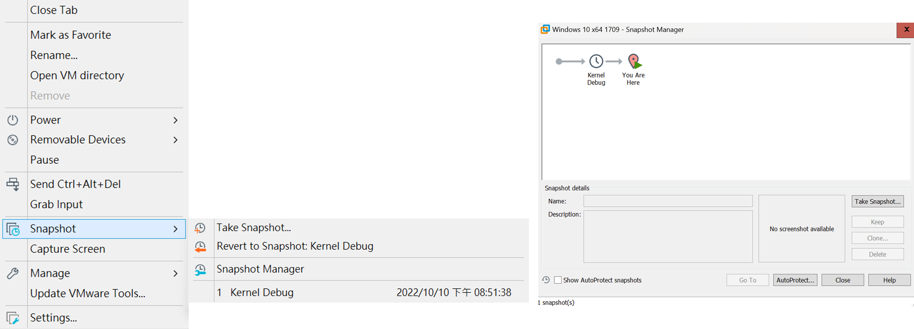

# 【第 02 話】開發、測試與除錯環境建置

## 文章大綱
建立環境是第零關，好的環境能讓研究的過程更加順利。為了減少大家在照著文章一步一步做時所踩到的坑，這篇將介紹這個系列的文章所使用的環境和工具。

這篇將會從開發、測試與 Debug（除錯）三個面向建立一個適合分析與研究的環境。建議大家使用跟我相同的環境，一致的環境可以確保之後文章的 PoC 執行正確。


## 開發環境
許多實作範例和攻擊腳本都會需要寫程式，主要使用的語言是 C/C++。

在開發 Windows 系統的程式我使用的是 [Visual Studio 2022 Community](https://visualstudio.microsoft.com/zh-hant/vs/whatsnew/)，SDK（Software Development Kit）版本為 10.0.22621.0。

另外由於需要開發驅動程式，所以還要安裝 WDK（Windows Driver Kit），使用的版本為 [Windows 11 22H2 的 WDK](https://learn.microsoft.com/zh-tw/windows-hardware/drivers/download-the-wdk)。

## 測試環境
在尋找漏洞和撰寫攻擊腳本的過程常常會需要實際執行看看結果是否正確，有一個設定完善且工具齊全的環境對於資安的研究會更得心應手。

我的虛擬機是 [VMware Workstation 17 Pro](https://www.vmware.com/tw/products/workstation-pro/workstation-pro-evaluation.html)，不鼓勵使用盜版，但還是輕輕放個連結在這 [PurpleVibe32/vmwk17key.txt](https://gist.github.com/PurpleVibe32/30a802c3c8ec902e1487024cdea26251)。

作業系統的版本使用 Windows 10 1709，會選擇這個版本主要是因為我的習慣，GitHub 上找到的許多專案也是用這個版本。

在成功載入作業系統後，可以用 [shutup10](https://www.oo-software.com/en/shutup10) 這個工具把一些 Windows 預設的機制關閉，例如 Defender、自動更新等等。我自己是把所有選項開啟，不過這個步驟不會影響太多，可以自己斟酌使用。


## Debug 環境
Debug 環境的建立方法跟工具都很多種，這邊介紹我覺得最快速方便的。

首先下載 [WinDbg Preview](https://apps.microsoft.com/store/detail/windbg-preview/9PGJGD53TN86?hl=zh-tw&gl=tw)，要 Debug Windows Kernel 直接使用微軟給的工具最穩。

接著按照以下步驟做就可以建立好 Debug 環境。
1. 下載 [VirtualKD-Redux](https://github.com/4d61726b/VirtualKD-Redux/releases/)
2. 把 target32／target64 複製到 VM 中
3. 在虛擬機執行 vminstall.exe
4. 在本機執行 vmmon64.exe
5. 重新開機 VM 按 F8 可以選擇 boot options

第 4 步在本機執行 vmmon64.exe 時可以看到以下執行結果，上面顯示正在運行的虛擬機，底下的選項勾選 WinDbg Preview，注意 vmmon64.exe 要繼續執行別關閉。


第 5 步選擇 boot options 時在 `Disable Driver Signature Enforcement` 選項按 Enter，發現 WinDbg 跳出來就對了。


WinDbg 需要 Symbol 才能找到一些結構，所以在有網路的情況下輸入以下指令來下載 Symbol 資訊。

```
.sympath c:\symbols*http://msdl.microsoft.com/download/symbols
.symfix+ c:\symbols
.sympath cache*c:\symbols
.reload /f
```


在 x64 Windows Vista 後由於有 [Driver Signing](https://learn.microsoft.com/zh-tw/windows-hardware/drivers/install/driver-signing) 的機制，在預設情況下驅動程式要有繳錢購買微軟的數位簽章才能載入 Kernel。但如果只是要自己研究，可以透過上述的方式建立環境，載入測試簽章的驅動程式。

## 建立快照
在建立好環境後記得建立快照（Snapshot），在每次開始一個研究時都可以有一個乾淨、熟悉的環境使用。



至於以上提到的工具的使用方式會在後面的文章說明，這篇先做到這就功德圓滿了。

## 其他工具
除了環境的建置所需的工具外，當然還會有各種分析的工具，後續的文章將會一一介紹。如果大家想在建立快照前把所有工具都放好，這邊先列舉之後文章會用到的工具。
- [Sysinternals](https://learn.microsoft.com/en-us/sysinternals/)
- [DriverView](https://www.nirsoft.net/utils/driverview.html)
- [KmdManager](https://driver-development-tools-pack.software.informer.com/1.3/)
- [zodiacon/DriverMon](https://github.com/zodiacon/DriverMon/releases/tag/0.31beta)
- [IDA Pro 7.5](https://hex-rays.com/ida-pro/)
- [WinDbg Preview](https://apps.microsoft.com/store/detail/windbg-preview/9PGJGD53TN86)
- [nc64.exe](https://github.com/int0x33/nc.exe/blob/master/nc64.exe)
- [Wireshark](https://www.wireshark.org/download.html)
- [Kernel_Driver_Fuzzer.exe](https://github.com/k0keoyo/kDriver-Fuzzer/blob/master/Release/Kernel_Driver_Fuzzer.exe)

## 參考資料
- [4d61726b/VirtualKD-Redux](https://github.com/4d61726b/VirtualKD-Redux)
- [Part 10: Kernel Exploitation -> Stack Overflow](https://fuzzysecurity.com/tutorials/expDev/14.html)
- [Exploit Development: Windows Kernel Exploitation - Debugging Environment and Stack Overflow](https://connormcgarr.github.io/Kernel-Exploitation-1/)
- [An Introduction to Windows Kernel Debugging](https://malware.news/t/an-introduction-to-windows-kernel-debugging/19285)