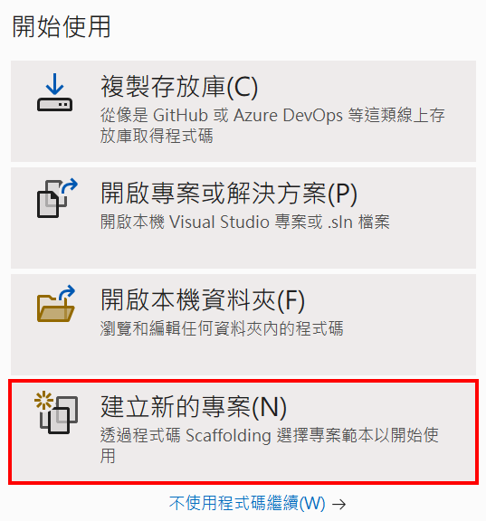
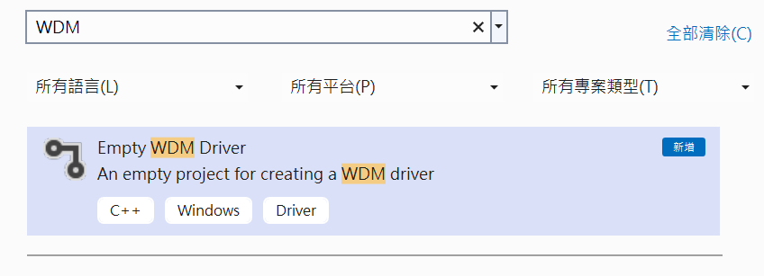
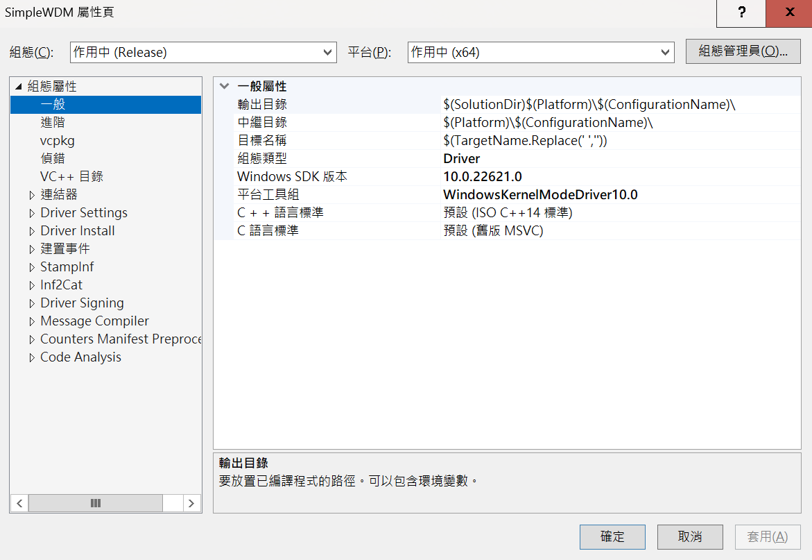
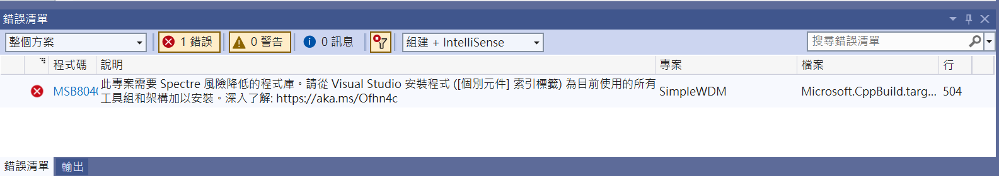
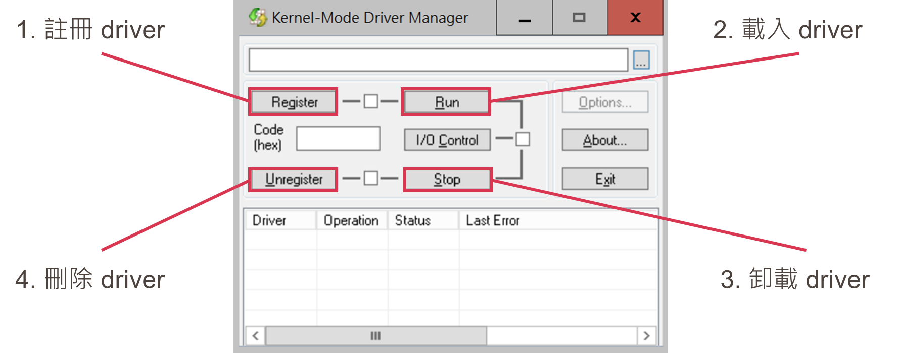
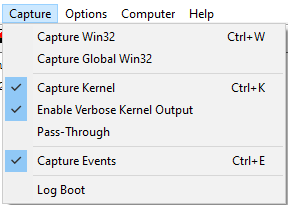
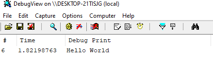

# 【第 03 話】簡單的 WDM 驅動程式

## 文章大綱
在[【第 02 話】開發、測試與除錯環境建置](/asset/第%2002%20話)建立好開發與測試環境後，這篇要帶大家寫一個簡單的 WDM 驅動程式，堪稱驅動界的 Hello World。接著介紹載入驅動程式的方式，並且觀察驅動程式的行為。


## 建立專案
執行 Visual Studio 點選`建立新的專案`。



上方搜尋 WDM，開啟 `Empty WDM Driver`。



專案名稱和路徑隨意，我取名為 SimpleWDM，不過建議路徑中不要有中文，因為 Windows 常常會在路徑名稱上坑人。

開啟專案後，對方案總管中的專案點右鍵，`屬性`=>`組態屬性`=>`一般`，確認其中的 `Windows SDK 版本`和`平台工具組` 是否正確。在玩別人的專案時，常常會需要重新設定這幾個選項，不然沒有對應的 SDK 就編譯不了。




## 寫程式
對方案總管中的專案點右鍵，`加入`=>`新增項目`，建立一個 .c 檔。

這篇的實作十分簡單，就是在驅動程式的 `DriverEntry` 呼叫 `DbgPrint` 輸出 `Hello World`。另外還需要把 `DriverUnload` 的函數指標給 `DriverObject->DriverUnload` 才能正常卸載驅動程式。
```c
#include <ntddk.h>

void DriverUnload(PDRIVER_OBJECT db)
{
    UNREFERENCED_PARAMETER(db);
}

extern NTSTATUS DriverEntry(PDRIVER_OBJECT DriverObject, PUNICODE_STRING RegistryPath)
{
    UNREFERENCED_PARAMETER(DriverObject);
    UNREFERENCED_PARAMETER(RegistryPath);
    
    // 要設定卸載函數驅動程式才能順利卸載
    DriverObject->DriverUnload = DriverUnload;
    
    // 用 DbgPrint 印出 Hello World，可以在 DbgView 工具中觀察
    DbgPrint("Hello World\n");

    return STATUS_SUCCESS;
}
```

如果遇到如下圖錯誤，在方案總管中的專案點右鍵，`屬性`=>`組態屬性`=>`C/C++`=>`程式碼產生`，把 `Spectre Mitigation` 改成 `Disabled`。



在方案總管中的專案點右鍵後`建置`，編譯成功應該可以拿到 [SimpleWDM.sys](https://github.com/zeze-zeze/2023iThome/blob/master/SimpleWDM/bin/SimpleWDM.sys)。完整的專案也放在我的 GitHub [zeze-zeze/2023iThome](https://github.com/zeze-zeze/2023iThome/tree/master/SimpleWDM)。


## 載入驅動程式
開啟 VM，記得要在本機開啟 vmmon64.exe，並在 `boot options` 按 F8 選擇 `Disable Driver Signature Enforcement`。

把編譯產生的 SimpleWDM.sys 放入 VM 後，在有 Administrator 權限的 cmd 輸入以下指令載入驅動程式。
```
sc create SimpleWDM type= kernel binPath= <SimpleWDM.sys 的路徑>
sc start SimpleWDM
sc stop SimpleWDM
sc delete SimpleWDM
```

或者使用 [KmdManager](https://driver-development-tools-pack.software.informer.com/1.3/)，其中的四個按鈕分別對應上方四個指令。
- `Register` 對應 `sc create ...`
- `Run` 對應 `sc start ...`
- `Stop` 對應 `sc stop ...`
- `Unregister` 對應 `sc delete ...`



開啟 [Sysinternals](https://learn.microsoft.com/en-us/sysinternals/) 中的 DbgView64.exe，上方 `Capture` 至少要選擇下圖這三個選項，才能夠看到 `DbgPrint` 輸出的字串。



接著在載入 SimpleWDM.sys 時觀察，可以看到在我們載入驅動程式時輸出的 `Hello World`。




## 參考資料
- [DbgPrint 函式 (wdm.h)](https://learn.microsoft.com/zh-tw/windows-hardware/drivers/ddi/wdm/nf-wdm-dbgprint)
- [How does DbgView capture kernel debugging messages sent by DbgPrintEx function?](https://stackoverflow.com/questions/50902427/how-does-dbgview-capture-kernel-debugging-messages-sent-by-dbgprintex-function)