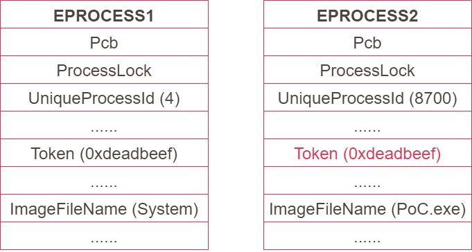

# 【第 04 話】WinDbg 竄改 EPROCESS Token

## 文章大綱
在[【第 02 話】開發、測試與除錯環境建置](/asset/第%2002%20話)建立好除錯環境後，這篇要練習使用 WinDbg 來改 Kernel 記憶體。順便說明在之後寫攻擊腳本時常會用到的提權技巧，將當前 Process 的 EPROCESS Token 竄改成 System 的 EPROCESS Token。

## EPROCESS
EPROCESS 是 Windows 操作系統中的一個資料結構，每個 Process 在 Kernel 層都有個對應的 EPROCESS 結構。EPROCESS 只能從 Kernel 層存取，裡面存放 Process 的相關資訊，包含 Process 的 Context（上下文）、記憶體、Thread、存取權限等。

這篇的目標是 EPROCESS 中的 Token。根據作業系統版本的不同，Token 在 EPROCESS 中的 Offset 也不太一樣。


## 竄改 TOKEN 提權
在 Process 執行各種操作，例如嘗試呼叫 [OpenProcess](https://learn.microsoft.com/en-us/windows/win32/api/processthreadsapi/nf-processthreadsapi-openprocess) 取得其他 Process 的 Handle 前，作業系統會先檢查 EPROCESS 中 Token 的權限，如果權限不足則請求會被拒絕。

在了解這個前提之後，接著要做的事情就是把一個低權限的 EPROCESS Token 竄改成一個高權限的 EPROCESS Token，這樣就等同於讓原本只有低權限的 Process 提權。

下圖左邊是一個高權限的 Process，ImageFileName 為 System；右邊則是一個低權限的 Process，ImageFileName 為 PoC.exe。Token 理論上應該要是一個可存取的位址，不過為了舉例而用 0xdeadbeef 與 0x87878787 表示。


只要將低權限的 EPROCESS Token 竄改成高權限的 EPROCESS Token，就可以將這個 Process 提權。這招也是在 Kernel Exploit 中常用到的技巧。




## 操作 WinDbg
現在練習使用 WinDbg 實作竄改 EPROCESS Token。開啟 VM，記得要在本機開啟 vmmon64.exe，並在 boot options 按 F8 選擇 `Disable Driver Signature Enforcement`。

在開機後，首先開啟一個 cmd，輸入 `whoami`，輸出的權限是當前使用者。接著點選本機 vmmon64.exe 的 `Instant break`，這時 VM 應該會卡住，並且 WinDbg 會輸出一些東西並且可以讓我們打指令。


### 找 System 的 EPROCESS Token
在 WinDbg 輸入 `!process 0 0 System`，其中 [!process](https://learn.microsoft.com/en-us/windows-hardware/drivers/debugger/-process) 指令的第一個 `0` 代表顯示所有運行中的 Process，第二個 `0` 代表 Flags，第三個 `System` 是 ImageName。輸入指令後應該大致會取得以下輸出，其中我們要用的是 EPROCESS 位址 `ffff918ac5c70040`，這個值可能跟大家實作的不一樣。

```
kd> !process 0 0 system
PROCESS ffff918ac5c70040
    SessionId: none  Cid: 0004    Peb: 00000000  ParentCid: 0000
    DirBase: 001ad002  ObjectTable: ffffcd878a004b00  HandleCount: 1828.
    Image: System
```

接著輸入指令 `dt nt!_EPROCESS ffff918ac5c70040`，[dt](https://learn.microsoft.com/en-us/windows-hardware/drivers/debugger/dt--display-type-) 代表 Display Type，`nt!_EPROCESS` 是要顯示的型別，後面接一個 EPROCESS 的位址。可以看到在 Windows 10 1709 中 Token 的 Offset 是 0x358。
```
kd> dt nt!_EPROCESS ffff918ac5c70040
   +0x000 Pcb              : _KPROCESS
   +0x2d8 ProcessLock      : _EX_PUSH_LOCK
   ...
   +0x358 Token            : _EX_FAST_REF
   ...
```

點擊在輸出中的 Token，會印出以下內容，其中 `0xffffcd878a006137` 就是我們要竄改的目標。
```
kd> dx -id 0,0,ffff918ac5c70040 -r1 (*((ntkrnlmp!_EX_FAST_REF *)0xffff918ac5c70398))
(*((ntkrnlmp!_EX_FAST_REF *)0xffff918ac5c70398))                 [Type: _EX_FAST_REF]
    [+0x000] Object           : 0xffffcd878a006137 [Type: void *]
    [+0x000 ( 3: 0)] RefCnt           : 0x7 [Type: unsigned __int64]
    [+0x000] Value            : 0xffffcd878a006137 [Type: unsigned __int64]
```

### 竄改 cmd 的 EPROCESS Token
依樣畫葫蘆尋找 cmd 的 EPROCESS 位址 `ffff918aca3774c0`。
```
kd> !process 0 0 cmd.exe
PROCESS ffff918aca3774c0
    SessionId: 1  Cid: 08fc    Peb: 7e901a000  ParentCid: 0d80
    DirBase: 5e63c002  ObjectTable: ffffcd878ed905c0  HandleCount:  75.
    Image: cmd.exe
```

我們在上一步已經得知 Token 的 Offset 為 0x358，要把這個位址的值竄改成 System 的 EPROCESS Token `0xffffcd878a006137`。輸入以下指令，[eq](https://learn.microsoft.com/en-us/windows-hardware/drivers/debugger/e--ea--eb--ed--ed--ef--ep--eq--eu--ew--eza--ezu--enter-values-) 中的 `e` 代表 Enter，`q` 代表 `qword` 即 8 bytes，後面分別輸入要改的位址 `ffff918aca3774c0+358` 與要寫入的值 `0xffffcd878a006137`。
```
kd> eq ffff918aca3774c0+358 0xffffcd878a006137
```

這時已經竄改完 cmd 的 Token，讓 cmd 有了 System 權限。要停止 Debug 可以輸入 [g](https://learn.microsoft.com/en-us/windows-hardware/drivers/debugger/g--go-)，代表 `Go`，也就是繼續執行。

現在作業系統可以繼續執行，再一次輸入 `whoami` 會發現權限變成 `system` 了。
```
>whoami
nt authority\system
```


## 參考資料
- [struct EPROCESS](https://www.nirsoft.net/kernel_struct/vista/EPROCESS.html)
- [x64 Kernel Privilege Escalation](https://mcdcyber.wordpress.com/2011/03/07/x64-kernel-privilege-escalation/)
- [!process](https://learn.microsoft.com/en-us/windows-hardware/drivers/debugger/-process)
- [dt (Display Type)](https://learn.microsoft.com/en-us/windows-hardware/drivers/debugger/dt--display-type-)
- [e, ea, eb, ed, eD, ef, ep, eq, eu, ew, eza (Enter Values)](https://learn.microsoft.com/en-us/windows-hardware/drivers/debugger/e--ea--eb--ed--ed--ef--ep--eq--eu--ew--eza--ezu--enter-values-)
- [g (Go)](https://learn.microsoft.com/en-us/windows-hardware/drivers/debugger/g--go-)