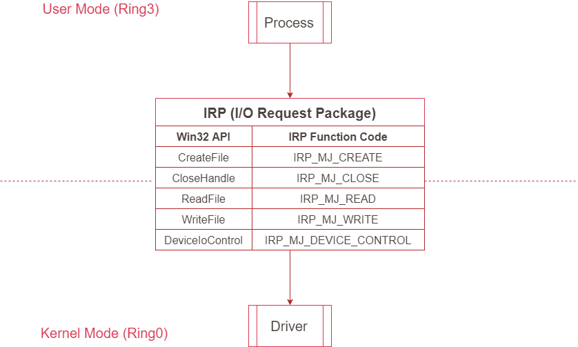
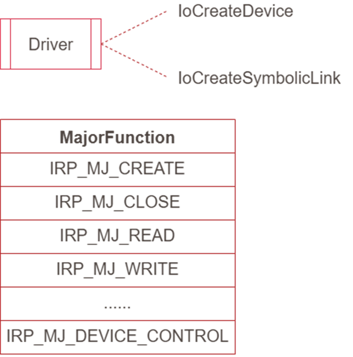
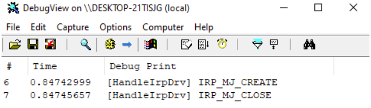

# 【第 05 話】傳送 IRP 到驅動程式

## 文章大綱
我們在[【第 03 話】簡單的 WDM 驅動程式](/asset/第%2003%20話)寫了十分簡短的驅動程式。這篇會以此為基礎，繼續多加處理 IRP 功能。從應用層呼叫 API 傳送 IRP 到 Kernel，並在驅動程式中處理接收的 IRP。


## IRP
[IRP（I/O Request Packet）](https://learn.microsoft.com/zh-tw/windows-hardware/drivers/kernel/irp-major-function-codes)是 Windows 中用於請求 I/O 操作的資料結構。驅動程式可以使用 IRP 來與 Kernel 溝通，例如讀取文件或進行網路傳輸。開發者也可以透過發 IRP 給 I/O Manager，並將 IRP 轉發給相應的驅動程式，從而執行對應的行為。

以下圖為例，上半部是應用層，下半部是 Kernel 層。在應用層的 Process 可以透過呼叫 API 傳送 IRP 到驅動程式。比如說 [CreateFile](https://learn.microsoft.com/zh-tw/windows/win32/api/fileapi/nf-fileapi-createfilea) 對應到 [IRP_MJ_CREATE](https://learn.microsoft.com/zh-tw/windows-hardware/drivers/kernel/irp-mj-create)、[CloseHandle](https://learn.microsoft.com/zh-tw/windows/win32/api/handleapi/nf-handleapi-closehandle) 對應到 [IRP_MJ_CLOSE](https://learn.microsoft.com/zh-tw/windows-hardware/drivers/kernel/irp-mj-close)，以此類推。




## 建立 Device 
要在 WDM 驅動程式中建立並設定 Device 大致有以下步驟。
1. 呼叫 [IoCreateDevice](https://learn.microsoft.com/zh-tw/windows-hardware/drivers/ddi/wdm/nf-wdm-iocreatedevice) 建立一個 Device
2. 呼叫 [IoCreateSymbolicLink](https://learn.microsoft.com/zh-tw/windows-hardware/drivers/ddi/wdm/nf-wdm-iocreatesymboliclink) 建立一個 Symbolic Link 連結到上一步建立的 Device，如此應用程式就可以透過呼叫 CreateFile 取得這個 Device 的 Handle
3. 設定處理每個 IRP 請求的函數




## 寫程式
程式會分為兩個部分，一個是應用程式，一個是驅動程式。完整的專案也放在我的 GitHub [zeze-zeze/2023iThome](https://github.com/zeze-zeze/2023iThome/tree/master/HandleIrp)。

### 驅動程式
首先在 DriverEntry 定義好卸載函數、建立 Device、定義各 IRP 的處理函數。
```c
extern NTSTATUS DriverEntry(PDRIVER_OBJECT driverObject, PUNICODE_STRING registryPath)
{
    UNREFERENCED_PARAMETER(registryPath);
    NTSTATUS status = STATUS_SUCCESS;

    // 要設定卸載函數驅動程式才能順利卸載
    driverObject->DriverUnload = DriverUnload;

    // 建立 Device 與對應的 Symbolic Link
    status = CreateDevice(driverObject);

    // 為需要用到的 IRP 定義處理函數
    driverObject->MajorFunction[IRP_MJ_CREATE] = Dispatcher;
    driverObject->MajorFunction[IRP_MJ_CLOSE] = Dispatcher;

    return STATUS_SUCCESS;
}
```

用 IoCreateDevice 建立一個 Device，再來用 IoCreateSymbolicLink 建立一個 Symbolic Link 連結到這個 Device。
```c
#define SYMLINK_NAME L"\\??\\HandleIrp"
#define DEVICE_NAME L"\\device\\HandleIrp"

NTSTATUS CreateDevice(PDRIVER_OBJECT pDriverObject)
{
    NTSTATUS status;
    UNICODE_STRING deviceName;
    UNICODE_STRING symLinkName;
    RtlInitUnicodeString(&deviceName, DEVICE_NAME);
    RtlInitUnicodeString(&symLinkName, SYMLINK_NAME);

    // 建立一個 Device
    status = IoCreateDevice(pDriverObject, 0, &deviceName, FILE_DEVICE_UNKNOWN, 0, 1, &pDevice);
    if (NT_SUCCESS(status))
    {
        pDriverObject->DeviceObject = pDevice;

        // 建立一個 Symbolic Link 連結到這個 Device
        status = IoCreateSymbolicLink(&symLinkName, &deviceName);
    }
    return status;
}
```

在 IRP 的處理函數中，我們根據取得的 IRP 執行不同行為。
```c
NTSTATUS Dispatcher(PDEVICE_OBJECT pDeviceObject, PIRP pIrp)
{
    PIO_STACK_LOCATION ioStackLocation = IoGetCurrentIrpStackLocation(pIrp);
    if (pDeviceObject != pDevice)
    {
        return STATUS_UNSUCCESSFUL;
    }

    // 根據收到的 IRP 做對應的處理
    switch (ioStackLocation->MajorFunction)
    {
        case IRP_MJ_CREATE:
            DbgPrint("[HandleIrpDrv] IRP_MJ_CREATE\n");
            break;
        case IRP_MJ_CLOSE:
            DbgPrint("[HandleIrpDrv] IRP_MJ_CLOSE\n");
            break;
        default:
            break;
    }

    pIrp->IoStatus.Status = STATUS_SUCCESS;
    pIrp->IoStatus.Information = 0;
    IoCompleteRequest(pIrp, IO_NO_INCREMENT);
    return STATUS_SUCCESS;
}
```

最後別忘記在卸載驅動程式時，把之前建立的 Device 和 Symbolic Link 刪除。
```c
VOID DriverUnload(PDRIVER_OBJECT pDriverObject)
{
    UNICODE_STRING symLinkName;
    RtlInitUnicodeString(&symLinkName, SYMLINK_NAME);

    // 在卸載時刪除之前建立的 Device 與 Symbolic Link
    IoDeleteSymbolicLink(&symLinkName);
    IoDeleteDevice(pDriverObject->DeviceObject);
}
```

### 應用程式
至於從應用層可以呼叫 CreateFile 發送 IRP_MJ_CREATE、呼叫 CloseHandle 發送 IRP_MJ_CLOSE 到驅動程式。
```c
#define SymLinkName L"\\\\.\\HandleIrp"

int main(int argc, char* argv[])
{
    // CreateFile 等同於傳送 IRP_MJ_CREATE 到驅動程式
    HANDLE hDevice = CreateFile(SymLinkName, GENERIC_READ | GENERIC_WRITE, 0, NULL, OPEN_EXISTING, FILE_ATTRIBUTE_SYSTEM, 0);
    if (hDevice == INVALID_HANDLE_VALUE)
    {
        std::cout << "CreateFile error: " << GetLastError() << std::endl;
        return 1;
    }

    // CloseHandle 等同於傳送 IRP_MJ_CLOSE 到驅動程式
    CloseHandle(hDevice);

    return 0;
}
```


## 測試
開啟 VM，記得要在本機開啟 vmmon64.exe，並在 boot options 按 F8 選擇 `Disable Driver Signature Enforcement`。

先開啟 DbgView64.exe，再載入編譯好的 [HandleIrpDrv.sys](https://github.com/zeze-zeze/2023iThome/blob/master/HandleIrp/bin/HandleIrpDrv.sys)，接著執行 [HandleIrp.exe](https://github.com/zeze-zeze/2023iThome/blob/master/HandleIrp/bin/HandleIrp.exe)，可以看到輸出的 `[HandleIrpDrv] IRP_MJ_CREATE` 和 `[HandleIrpDrv] IRP_MJ_CLOSE`。




## 參考資料
- [IRP](https://steward-fu.github.io/website/driver/wdm/cpp_ioctl.htm)