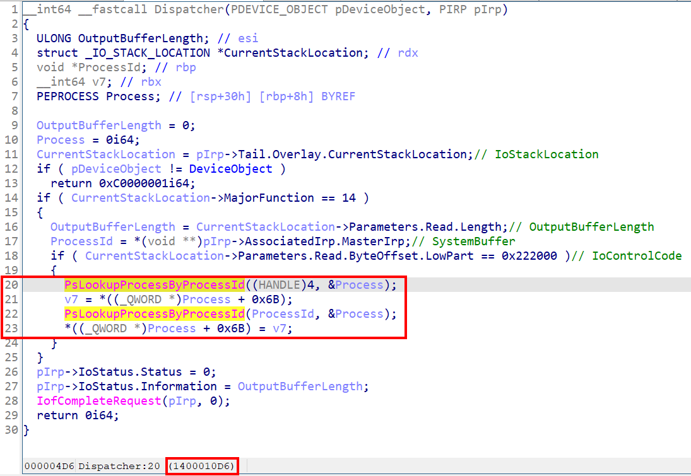

# 【第 07 話】逆向分析 WDM 驅動程式

## 文章大綱
在[【第 06 話】用 IOCTL 與驅動程式溝通](/asset/第%2006%20話)我們用 IOCTL 實作一個提權功能，並執行應用程式傳資料到驅動程式使用這個功能。這篇要來逆向分析編譯出來的 AbuseEprocessTokenDrv.sys，透過 IDA 靜態分析以及 WinDbg 動態分析來了解驅動程式的執行。


## 靜態分析
執行 [IDA](https://hex-rays.com/products/ida/news/7_5/) 開啟 [AbuseEprocessTokenDrv.sys](https://github.com/zeze-zeze/2023iThome/blob/master/AbuseEprocessToken/bin/AbuseEprocessTokenDrv.sys)，對 IDA 還不是那麼熟悉的人可以參考 [IDAPro cheatsheet](https://www.hex-rays.com/products/ida/support/freefiles/IDA_Pro_Shortcuts.pdf)，這篇會使用到的功能如下表。之後的截圖都會是有改過函數名、變數名、型別的 IDA 分析結果。


反編譯 `DriverEntry` 函數，產生的結果如下圖。


顯然跟我們上一篇實作的 `DriverEntry` 不同，於是再點進 `RealDriverEntry`，看到我們在程式中寫的 `DriverUnload` 和 IRP 的處理函數，以及建立 Device。有時 IDA 分析的結果第一個參數不是 [DRIVER_OBJECT](https://learn.microsoft.com/zh-tw/windows-hardware/drivers/ddi/wdm/ns-wdm-_driver_object) 的指標，可以自己按 `y` 改一下型別。IRP 的部分可以看到 `0`、`2`、`14`，分別代表 `IRP_MJ_CREATE`、`IRP_MJ_CLOSE`、`IRP_MJ_DEVICE_CONTROL`。


首先來看最簡單的 `DriverUnload`，裡面跟我們寫的程式幾乎相同，呼叫 `IoDeleteSymbolicLink` 和 `IoDeleteDevice` 刪除 Symbolic Link 和跟它連結的 Device。


再來與 `DriverUnload` 相對的 `CreateDevice`，呼叫 `IoCreateDevice` 和 `IoCreateSymbolicLink` 來建立 Device 和跟它連結的 Symbolic Link。


最後是 `Dispatcher`，第一個參數型別是 [DEVICE_OBJECT](https://learn.microsoft.com/en-us/windows-hardware/drivers/ddi/wdm/ns-wdm-_device_object) 的指標，第二個參數型別則是 [IRP](https://learn.microsoft.com/en-us/windows-hardware/drivers/ddi/wdm/ns-wdm-_irp) 的指標。同樣的有時 IDA 會分析錯，需要自己手動改型別。


從上圖我們可以發現存在 IRP 中的 InputBuffer，或稱作 SystemBuffer，被放在 `pIrp->AssociatedIrp.MasterIrp` 這個結構中；OutputBufferLength 被放在 `CurrentStackLocation->Parameters.Read.Length`；而 IoControlCode 被放在 `CurrentStackLocation->Parameters.Read.ByteOffset.LowPart`。

認識這些結構之後，我們在逆向沒有原始碼的驅動程式時，也能夠追蹤從應用程式傳來的資料了。


## 動態分析
接下來要練習使用 WinDbg 動態分析驅動程式。

開啟 VM，記得要在本機開啟 vmmon64.exe，並在 boot options 按 F8 選擇 `Disable Driver Signature Enforcement`。

開機後載入 [AbuseEprocessTokenDrv.sys](https://github.com/zeze-zeze/2023iThome/blob/master/AbuseEprocessToken/bin/AbuseEprocessTokenDrv.sys)，接著用 vmmon64.exe 下斷點。在 WinDbg 中輸入 `lm`。[lm]((https://learn.microsoft.com/en-us/windows-hardware/drivers/debugger/lm--list-loaded-modules-)) 代表 List Loaded Modules，用來列出已載入的模組。

```
kd> lm
start             end                 module name
...
fffff801`18dc0000 fffff801`18dc7000   AbuseEprocessTokenDrv   (deferred) 
...
```

在輸出結果中能找到 `fffff80118dc0000 fffff80118dc7000`，代表 AbuseEprocessTokenDrv.sys 的起始位址和結束位址。我們等等要下斷點在實作的提權功能，位址可以從 IDA 取得 Virtual Address 為 `0x10D6`。




在 WinDbg 輸入指令 `bp fffff80118dc0000+10D6`，[bp](https://learn.microsoft.com/en-us/windows-hardware/drivers/debugger/bp--bu--bm--set-breakpoint-) 代表 Set Breakpoint。最後輸入 `g` 讓系統恢復繼續執行。

現在執行 [AbuseEprocessToken.exe](https://github.com/zeze-zeze/2023iThome/blob/master/AbuseEprocessToken/bin/AbuseEprocessToken.exe)，`AbuseEprocessToken.exe <pid>` 時會發現踩到 WinDbg 的斷點了。WinDbg 顯示的 Disassembly 大致如下。

```
...
fffff801`18dc10d6 ff154c0f0000   call    qword ptr [AbuseEprocessTokenDrv!__imp_PsLookupProcessByProcessId (fffff80118dc2028)]
fffff801`18dc10dc 488b442430     mov     rax, qword ptr [pEprocess (rsp+30h)]
fffff801`18dc10e1 488d542430     lea     rdx, [pEprocess (rsp+30h)]
fffff801`18dc10e6 488bcd         mov     rcx, processId (rbp)
fffff801`18dc10e9 488b9860030000 mov     rbx, qword ptr [rax+358h]
fffff801`18dc10f0 ff15320f0000   call    qword ptr [AbuseEprocessTokenDrv!__imp_PsLookupProcessByProcessId (fffff80118dc2028)]
fffff801`18dc10f6 488b442430     mov     rax, qword ptr [pEprocess (rsp+30h)]
fffff801`18dc10fb 48899860030000 mov     qword ptr [rax+358h], systemToken (rbx)
...
```

輸入指令 `p` 可以執行一個 Instruction，[p](https://learn.microsoft.com/en-us/windows-hardware/drivers/debugger/p--step-) 代表 Step；如果希望可以在呼叫函數時跟進去，就輸入指令 `t`，[t](https://learn.microsoft.com/en-us/windows-hardware/drivers/debugger/t--trace-) 代表 Trace。在一步一步執行的過程中可以搭配[【第 04 話】竄改 EPROCESS Token](/asset/第%2004%20話)，證實程式拿到的 EPROCESS 位址與 Token 的值跟我們用 WinDbg 指令取得到的一致，並且 Token 確實有被成功竄改。


## 參考資料
- [IDAPro cheatsheet](https://www.hex-rays.com/products/ida/support/freefiles/IDA_Pro_Shortcuts.pdf)