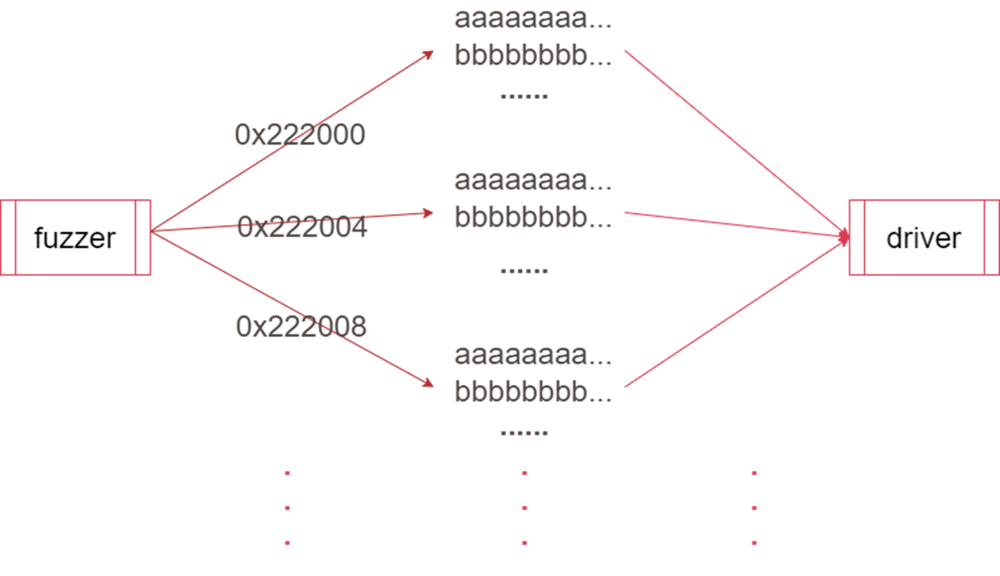
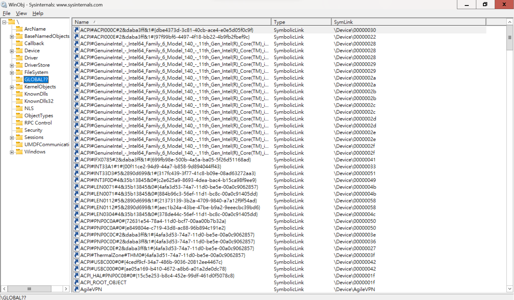
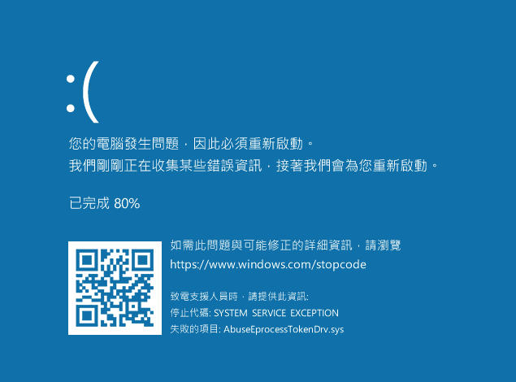

# 【第 15 話】簡單的 Kernel Fuzzer

## 文章大綱
這篇要來介紹針對 WDM 驅動程式的簡單 Kernel Fuzzer，目標是用 Fuzzer 找到在[【第 06 話】用 IOCTL 與驅動程式溝通](/asset/第%2006%20話)實作的 AbuseEprocessTokenDrv.sys。


## 介紹 Fuzzer
Fuzzing（模糊測試）是一種在軟體安全中常使用的技術，透過自動化產生和輸入測試資料，找尋程式的漏洞。

這個自動化的工具被稱為 Fuzzer，最基本的行為就是產生輸入、將輸入送給執行的程式並接收回傳結果，目的是要讓程式崩潰，找到可能存在的漏洞。

對於攻擊者而言，Fuzzer 是一個用於找新漏洞時使用的工具；對於開發者來說，Fuzzer 也是個在開發流程中用來確保產品的安全性的工具。


## 針對 WDM 驅動程式的 Fuzzer
首先複習我們已經使用過許多次的函數 [DeviceIoControl](https://learn.microsoft.com/zh-tw/windows/win32/api/ioapiset/nf-ioapiset-deviceiocontrol)，很明顯我們只需要一個 Device Handle `hDevice` 就可以將資料傳給 WDM 驅動程式。至於要使用程式中的哪個功能則是 IoControlCode `dwIoControlCode`負責的，而輸入 `lpInBuffer`、輸入長度 `nInBufferSize`、輸出 `lpOutBuffer`、輸出長度 `nOutBufferSize` 則是依照程式而定。

```c
BOOL DeviceIoControl(
  [in]                HANDLE       hDevice,
  [in]                DWORD        dwIoControlCode,
  [in, optional]      LPVOID       lpInBuffer,
  [in]                DWORD        nInBufferSize,
  [out, optional]     LPVOID       lpOutBuffer,
  [in]                DWORD        nOutBufferSize,
  [out, optional]     LPDWORD      lpBytesReturned,
  [in, out, optional] LPOVERLAPPED lpOverlapped
);
```

基於這個想法，我們可以實作一個 Fuzzer。只需要使用者輸入 Symbolic Link Name 和 IoControlCode 的範圍，Fuzzer 就可以自動取得 Device Handle 並且戳各個 IoControlCode，而輸入輸出則是 Fuzzer 產生，試圖找出程式中的記憶體漏洞。



這個想法早在十年前就被提出來，並且實作成工具 [koutto/ioctlbf](https://github.com/koutto/ioctlbf)。後來在 2018 又有人擴充 ioctlbf，新增 log 功能、列舉驅動、填 NULL Buffer 等功能在 [k0keoyo/kDriver-Fuzzer](https://github.com/k0keoyo/kDriver-Fuzzer)。


## 取得 Symbolic Link Name
除了使用 IDA 逆向分析取得 Symbolic Link Name 外，也可以使用 SysInternals 中的 Winobj.exe，點擊 `GLOBAL??`，裡面會列舉所有 Symbolic Link Name 以及對應的 Device。




## 測試
這篇要練習使用 kDriver-Fuzzer 來 Fuzz 我們在[【第 06 話】用 IOCTL 與驅動程式溝通](/asset/第%2006%20話)實作的 [AbuseEprocessTokenDrv.sys](https://github.com/zeze-zeze/2023iThome/blob/master/AbuseEprocessToken/bin/AbuseEprocessTokenDrv.sys)。

開啟 VM，記得要在本機開啟 vmmon64.exe，並在 boot options 按 F8 選擇 `Disable Driver Signature Enforcement`。

載入 AbuseEprocessTokenDrv.sys 之後，將 [Kernel_Driver_Fuzzer.exe](https://github.com/k0keoyo/kDriver-Fuzzer/blob/master/Release/Kernel_Driver_Fuzzer.exe) 也複製進 VM，在 cmd 輸入指令 `Kernel_Driver_Fuzzer.exe -d AbuseEprocessToken -i 222000 -l`，很快就可以看到由於程式沒驗證輸入而導致的漏洞被我們 Fuzz 到了。



在系統重開機後，可以在 Fuzzing 的同層目錄中看到一個 log 檔案，內容如下，裡面會記錄具體輸入了什麼給驅動程式才導致系統崩潰。具體的漏洞成因可以看[【第 08 話】攻擊自己寫的驅動程式－Null Pointer Dereference](/asset/第%2008%20話)。

```
Detect IOCTL CODE: 0x00222000
Input Buff: 0x41 fill buffer
Input Buff Size: 0
Output Buff: 0x41 fill buffer
Output Buff Size: 0
```

## 參考資料
- [模糊測試概念總覽](https://ithelp.ithome.com.tw/articles/10287619)
- [Synology Security Development Lifecycle](https://cyber.ithome.com.tw/2023/session-page/1810)
- [koutto/ioctlbf](https://github.com/koutto/ioctlbf)
- [k0keoyo/kDriver-Fuzzer](https://github.com/k0keoyo/kDriver-Fuzzer)