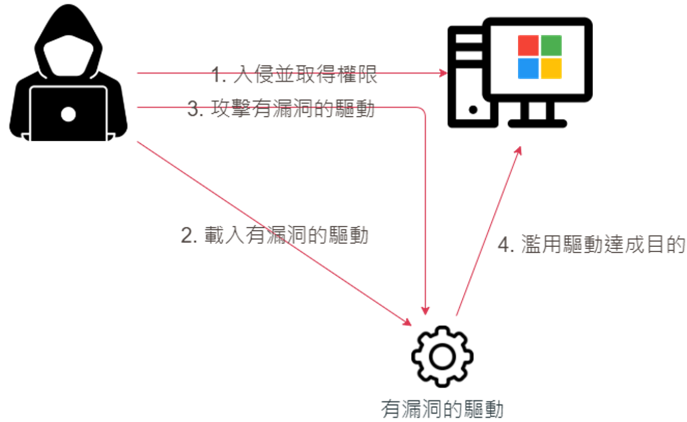
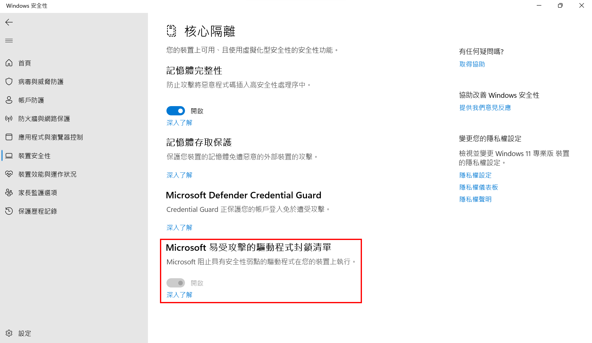
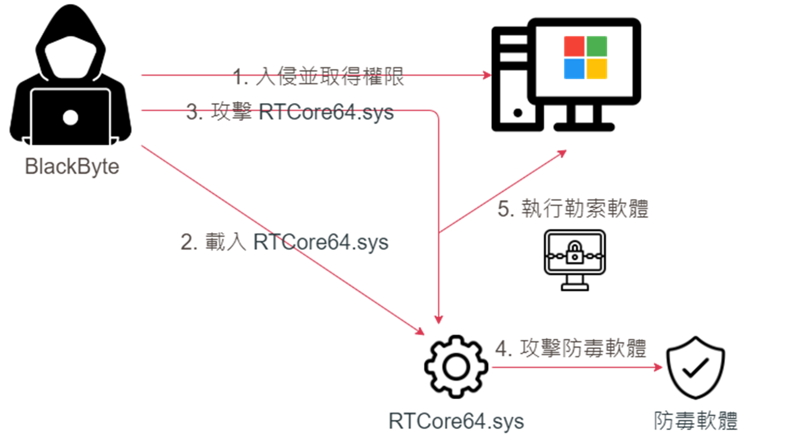
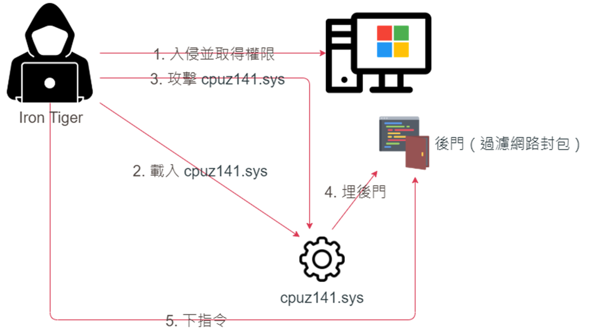
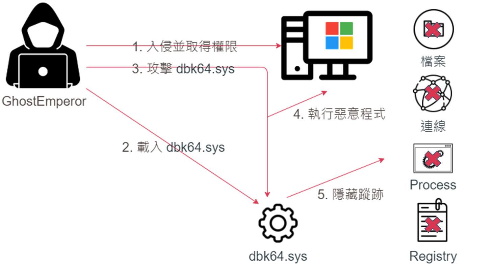
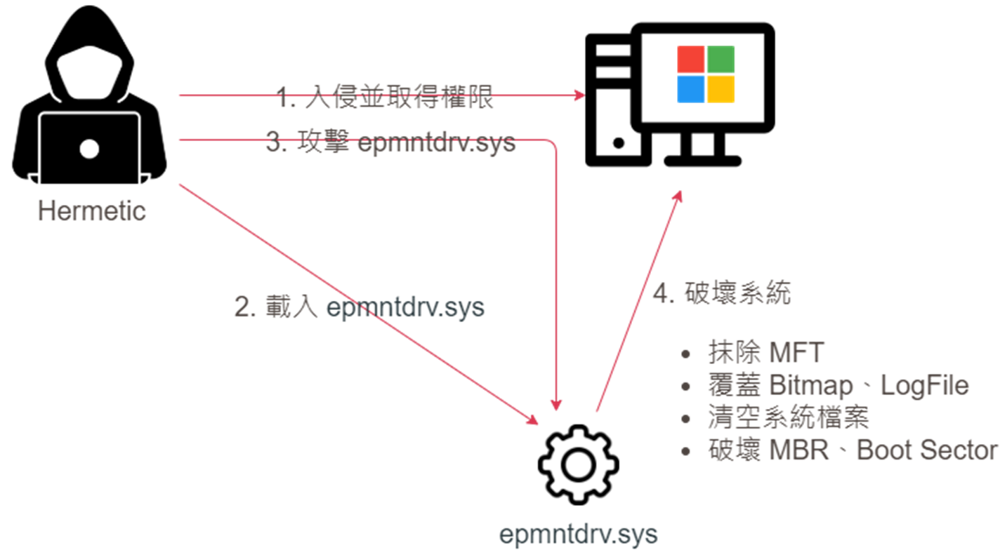

# 【第 20 話】BYOVD 攻擊

## 文章大綱
從[【第 09 話】CVE-2023-1643 研究－Null Pointer Dereference](/asset/第%2009%20話) 到[【第 19 話】CVE-2023-1489 研究－任意 wrmsr 到任意執行](/asset/第%2019%20話)我們講解了許多漏洞類型，這些其實都是在現實世界常被惡意程式濫用的漏洞。因此這篇要來介紹 BYOVD 攻擊，說明惡意程式是如何濫用有漏洞的驅動程式來達到什麼目的。

## 介紹 BYOVD
BYOVD（Bring Your Own Vulnerable Driver），也稱作 BYOD（Bring Your Own Driver）或 BYOVKD（Bring Your Own Vulnerable Kernel Driver），這類攻擊是攻擊者在系統中載入一個有漏洞的驅動程式，再透過驅動程式的漏洞來取得 Kernel 執行權限達成目的，例如關閉防毒軟體、安裝 Rootkit。

## 數位簽章
Windows 的[數位簽章](https://learn.microsoft.com/zh-tw/windows-hardware/drivers/install/driver-signing)是一個確保驅動程式安全性的機制。在 Windows Vista x64 之後驅動程式需要經過簽章才能載入系統。

因為數位簽章的存在，才會有 BYOVD 攻擊的出現。畢竟如果能像 Linux 一樣只要有 root 就可以載入驅動程式，就不需要特地找一個有簽章又有漏洞的驅動程式了。

新版 Windows 中在 `Windows 安全性`中的`裝置安全性`，裡面可以看到`核心隔離`，點進去看有一項叫 `Microsoft 易受攻擊的驅動程式封鎖清單`。這針對的就是常被用於 BYOVD 攻擊的驅動程式所做的黑名單，只要開啟這項保護，在黑名單的驅動程式就算有簽章也會被擋住而無法載入。

## 實際案例
### BlackByte
攻擊公開於 2022 年 10 月，濫用在[【第 14 話】CVE-2019-16098 研究－任意讀寫虛擬記憶體](/asset/第%2014%20話)介紹的 [RTCore64.sys](https://github.com/zeze-zeze/2023iThome/blob/master/CVE-2019-16098/bin/RTCore64.sys)，利用它的任意讀寫虛擬記憶體的漏洞來讓防毒軟體失效，然後執行勒索軟體。

### Iron Tiger
Iron Tiger 又稱作 APT27、LuckyMouse，攻擊公開於 2021 年 4 月，濫用 CPUID 的 cpuz141.sys 漏洞 [CVE-2017-15303](https://cve.mitre.org/cgi-bin/cvename.cgi?name=CVE-2017-15303)，漏洞原理是跟[【第 18 話】CVE-2023-1679 研究－任意讀寫物理記憶體](/asset/第%2018%20話)相似的任意物理記憶體讀寫漏洞，目的是埋後門與 C2（Command and Control Server）連線。

### GhostEmperor
攻擊公開於 2021 年 9 月，主要針對馬來西亞、泰國、越南、印尼等地區，濫用 [CheatEngine](https://github.com/cheat-engine/cheat-engine) 的 dbk64.sys 的任意讀寫記憶體與任意執行 Shellcode 的**功能**，漏洞原理類似[【第 11 話】Capcom.sys 研究－任意程式執行](/asset/第%2011%20話)，目的是隱藏惡意程式相關的檔案、Process、Registry、連線等等蹤跡。

### Hermetic
攻擊公開於 2022 年 3 月，值得注意的是這場攻擊是俄羅斯軍隊入侵烏克蘭的前一天針對烏克蘭的網路攻擊，它濫用 Hermetica Digital Ltd. 的 epmntdrv.sys 的磁碟讀寫**功能**，目的是要破壞系統，讓系統無法運作與復原。

## 參考資料
- [潛入核心：惡意程式與驅動程式的狼狽為奸](https://s.itho.me/ccms_slides/2023/5/18/b37bcba9-bc6e-4cdd-a5d0-de48c15570ac.pdf)
- [Driver-Based Attacks: Past and Present](https://www.rapid7.com/blog/post/2021/12/13/driver-based-attacks-past-and-present/)
- [Untangling KNOTWEED: European private-sector offensive actor using 0-day exploits](http://winsec.se/?cat=2224)
- [BlackByte Ransomware Abuses Vulnerable Windows Driver to Disable Security Solutions](https://vulners.com/thn/THN:84211C45EE1D7E261589B98DC7EC46B7)
- [BYOVD攻撃 (まとめ)](https://malware-log.hatenablog.com/entry/BYOVD_Attack)
- [Signed kernel drivers – Unguarded gateway to Windows’ core](https://www.welivesecurity.com/2022/01/11/signed-kernel-drivers-unguarded-gateway-windows-core/)
- [Enter Dustman: New Wiper Takes After ZeroCleare, Likely Targets Organizations in Region](https://malware.news/t/enter-dustman-new-wiper-takes-after-zerocleare-likely-targets-organizations-in-region/36286)
- [shareef12/cpuz](https://github.com/shareef12/cpuz)