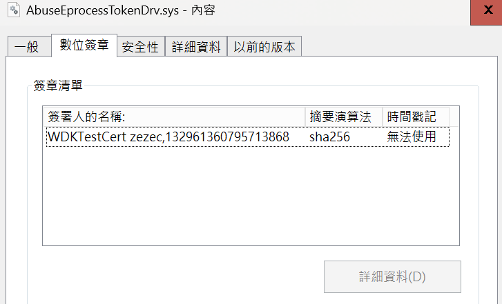
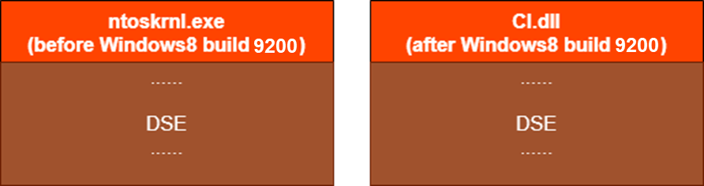
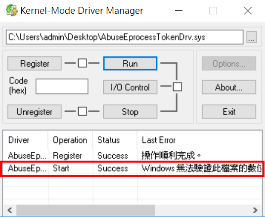
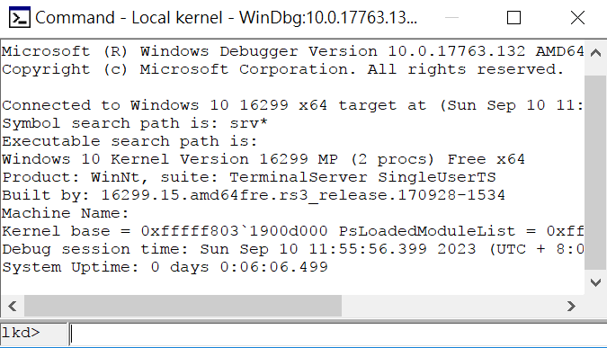

# 【第 21 話】驅動程式數位簽章

## 文章大綱
在[【第 20 話】BYOVD 攻擊](/asset/第%2020%20話)認識了 BYOVD 的原理與目的，如果有像是[【第 13 話】CVE-2020-17382 研究－Buffer Overflow（下）](/asset/第%2013%20話)或[【第 19 話】CVE-2023-1489 研究－任意 wrmsr 到任意執行](/asset/第%2019%20話)的漏洞還可以理解為什麼攻擊者可以利用它們達到 Kernel 任意執行，但只有[【第 14 話】CVE-2019-16098 研究－任意讀寫虛擬記憶體](/asset/第%2014%20話)或[【第 18 話】CVE-2023-1679 研究－任意讀寫物理記憶體](/asset/第%2018%20話)等任意讀寫漏洞的話要如何達到任意執行呢？

這篇要介紹驅動程式數位簽章的機制，說明 DSE 的運作並操作 WinDbg 在 Local Debug 環境下修改 DSE 讓載入簽章的驅動程式。


## PatchGuard
PatchGuard 又稱為 KPP（Kernel Patch Protection），在 x64 Windows XP、Server 2003 以上預設開啟，用途是保護 Windows Kernel 不被惡意程式攻擊和篡改。透過監視和驗證 Windows Kernel 的完整性避免攻擊者利用 Kernel 漏洞寫入惡意程式或修改重要的 Kernel 結構。

微軟沒有官方文件說明 PatchGuard 會偵測的 Kernel 結構，以下是被研究出來 PatchGuard 會偵測地方。不過不同版本的系統會偵測的範圍不盡相同，微軟也會更新內容，所以下面幾點大致參考一下。

* 系統服務描述表 SSDT（System Service Descriptor Table）
* 中斷描述表 IDT（Interrupt Descriptor Table）
* 全域描述表 GDT（Global Descriptor Table）
* System Images Processor
* MSR（Model Specific Register）
* Kernel 本身、硬體抽象層 HAL、NDIS Kernel Library


## 驅動程式強制簽章
驅動程式強制簽章（Driver Signature Enforcement）在 x64 Windows Vista 之後，微軟規定驅動程式的載入必須要有合法的簽章。

觀察我們之前在[【第 06 話】IOCTL 與驅動程式溝通－實作竄改 EPROCESS TOKEN](/asset/第%2006%20話) 實作的 [AbuseEprocessTokenDrv.sys](https://github.com/zeze-zeze/2023iThome/blob/master/AbuseEprocessToken/bin/AbuseEprocessTokenDrv.sys)，簽章顯示 WDKTestCert，意思是 WDK 幫我們產的測試簽章。



之前實作這個驅動程式可以被正常載入的原因是系統有開啟測試模式（Test Mode），測試模式是其中一個合法關閉 PatchGuard 的方法，只要開啟測試模式，就算沒有正式的簽章也可以載入。

在[【第 02 話】開發、測試與除錯環境建置](/asset/第%2002%20話)介紹的 [VirtualKD-Redux](https://github.com/4d61726b/VirtualKD-Redux/releases/) 就有幫我們開啟測試模式，這也是為什麼我們自己編譯的驅動程式可以載入。


## WinDbg 竄改 DSE
### 介紹 DSE
Windows Kernel 中有個操控是否開啟驅動程式強制簽章的 flag DSE。在 Windows 8 以前，DSE 被放在 ntoskrnl.exe 中；在 Windows 8 以後，DSE 則是被放在 CI.dll 中。




系統會根據 DSE 的值決定是否啟用驅動程式強制簽章。
- 0：關閉驅動程式強制簽章
- 6：預設的驅動程式強制簽章
- 8：測試模式

### 竄改 DSE
開啟 VM，用管理員權限打開 cmd 後輸入指令 `bcdedit -debug on`，並且在 VM 中安裝 WinDbg，然後重新啟動。

啟動後嘗試用 KMD 載入未被簽章的 [AbuseEprocessTokenDrv.sys](https://github.com/zeze-zeze/2023iThome/blob/master/AbuseEprocessToken/bin/AbuseEprocessTokenDrv.sys)，會發現驅動程式無法被成功載入。



用管理員權限開啟 VM 中的 WinDbg，點擊 `File => Kernel Debug => Local`，這時應該會出現一個可以輸入指令的框框如下圖。



接著要印出 DSE 的值，輸入指令 `dq ci!g_CiOptions` 印出 DSE 的值，在預設環境下這個值應該是 6。
```
kd> dq ci!g_CiOptions
fffff800`2dc1cd10  00000000`00000006 00000000`00000000
```

修改 DSE 的位址把值從 6 改為 0。
```
eq fffff800`2dc1cd10 0
```

做完之後再試著載入一次未簽章的驅動程式，就可以正常載入了。不過要注意的是 DSE 是會被 PatchGuard 偵測的，所以如果不把值改回來，過一段時間就會 BSOD。


## 參考資料
- [Ring0 Rootkit－在 Windows Kernel 與病毒共存](https://hitcon.org/2022/agenda/117f12aa-6166-4083-b317-8b994dbf7a96)
- [hfiref0x/Stryker](https://github.com/hfiref0x/Stryker)
- [核心修補程式保護](https://zh.wikipedia.org/zh-tw/%E5%86%85%E6%A0%B8%E8%A1%A5%E4%B8%81%E4%BF%9D%E6%8A%A4)