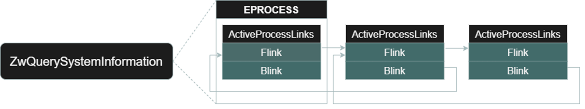
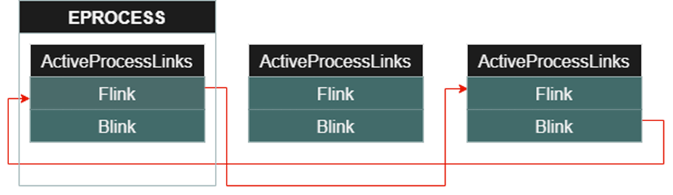
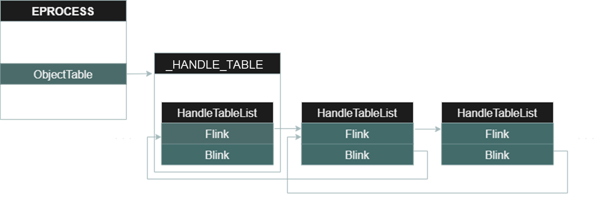
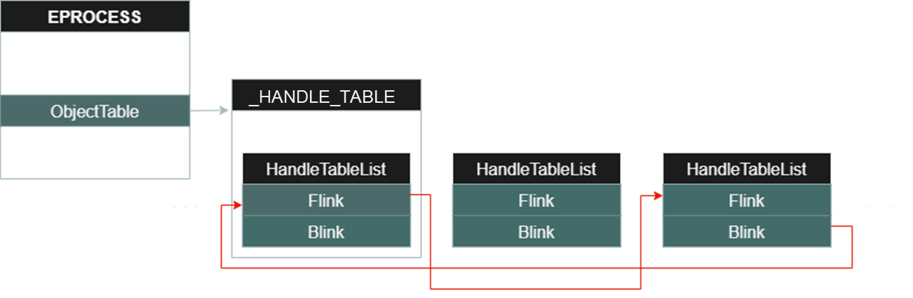
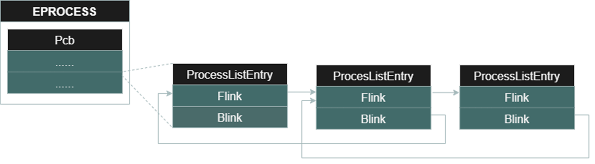
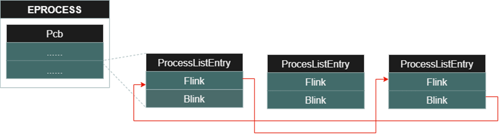
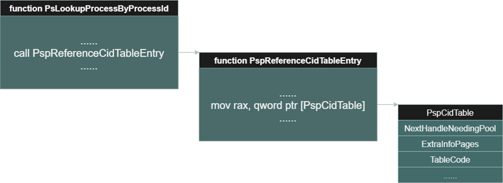
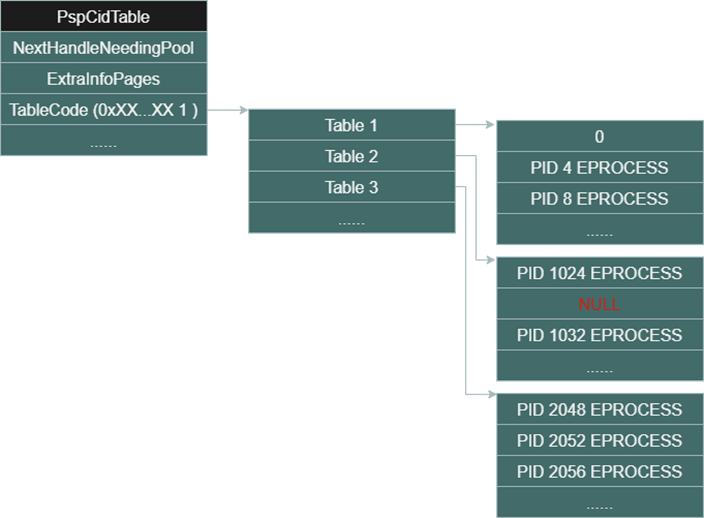
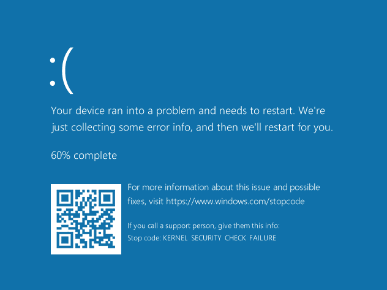

# 【第 23 話】DKOM 隱藏 Process（上）

## 文章大綱
在[【第 20 話】BYOVD 攻擊](/asset/第%2020%20話)中有提到惡意程式會利用 BYOVD 攻擊隱藏蹤跡，其中包含隱藏 Process。這篇會先介紹透過 DKOM 技術隱藏 Process 的原理。

## DKOM
DKOM（Direct Kernel Object Manipulation）這個技術是攻擊者直接操作 Windows Kernel Object，而不被作業系统的安全機制如 PatchGuard 檢測。這類的攻擊手法常被實作成 Rootkit，用來躲避防毒軟體的偵測。

## 隱藏 Process 原理
為了隱藏 Process 又確保系統的穩定，不會被 PatchGuard 偵測而崩潰，共有 4 件事要做。

- ActiveProcessLinks 斷鏈
- HandleTableList 斷鏈
- ProcessListEntry 斷鏈
- PspCidTable 清零

### ActiveProcessLinks 斷鏈
在[【第 10 話】寫 Shellcode 竄改 EPROCESS Token](/asset/第%2010%20話) 介紹了 ActiveProcessLinks，其中有說 ActiveProcessLinks 是一個 [Doubly Linked List](https://en.wikipedia.org/wiki/Doubly_linked_list) 結構。

一般程式如工作管理員（Task Manager）會使用 [ZwQueryInformationProcess](https://learn.microsoft.com/en-us/windows/win32/procthread/zwqueryinformationprocess) 列舉系統運行的 Process，其中 ZwQueryInformationProcess 的實作原理就是用 ActiveProcessLinks 找出所有 Process。

我們要做的是將 ActiveProcessLinks 斷鏈，概念就是把要隱藏的 Process 的 EPROCESS ActiveProcessLinks 的 Flink 跟 Blink 改成 NULL，再把前後的 EPROCESS ActiveProcessLinks 接起來。

### HandleTableList 斷鏈
在 EPROCESS 中有一個成員叫 ObjectTable，Windows 10 1709 中在 Offset 0x418。ObjectTable 是個指標，指向 [HANDLE_TABLE](https://www.nirsoft.net/kernel_struct/vista/HANDLE_TABLE.html) 結構，顧名思義就是存放 Process 開啟的 Handle 的表。其中有個成員叫 HandleTableList，它也是一個 Doubly Linked List。

跟 ActiveProcessLinks 相似，我們要做的是把目標 Process 的 EPROCESS ObjectTable 指向的  `HANDLE_TABLE` 裡的 HandleTableList 斷鏈。

### ProcessListEntry 斷鏈
在 EPROCESS 中有一個成員叫 Pcb，是 EPROCESS 的第一個成員，也就是 Offset 0x0。Pcb 本身是個 [KPROCESS](https://www.nirsoft.net/kernel_struct/vista/KPROCESS.html)，裡面包含一個 ProcessListEntry 成員，又是一個 Doubly Linked List。

跟 ActiveProcessLinks 和 HandleTableList 相似，我們要做的是把目標 Process 的 EPROCESS Pcb 中的 ProcessListEntry 斷鏈。

### PspCidTable 清零
在 Kernel 中有 PspCidTable 這張表，其中 [ZwOpenProcess](https://learn.microsoft.com/zh-tw/windows-hardware/drivers/ddi/ntddk/nf-ntddk-zwopenprocess) 和 [PsLookupProcessByProcessId](https://learn.microsoft.com/zh-tw/windows-hardware/drivers/ddi/ntifs/nf-ntifs-pslookupprocessbyprocessid) 兩個 API 都是用 PspCidTable 找到對應的 EPROCESS。

如果反組譯 `PsLookupProcessByProcessId`，會發現它呼叫了 `PspReferenceCidTableEntry` 函數，跟進去可以看到一行 Instruction `mov rax, qword ptr [PspCidTable]`，這時我們就成功取得 PspCidTable 的位址了。

PspCidTable 跟 ObjectTable 指向的結構相同，都是 `HANDLE_TABLE`。不過這次的目標不是 HandleTableList，而是 TableCode。

TableCode 的最後 2 bits 代表這個 Table 是幾級指標。下圖的 TableCode 就是一個二級指標，二級指標中存的是許多一級指標，一級指標中存的則是目標值。每個一級指標中都存 256 個 EPROCESS，由於在 Windows 系統 pid 都是 4 的倍數，所以第一個一級指標就會有 pid 0～1024 的 EPROCESS，第二個一級指標則會有 pid 1024～2048 的 EPROCESS，以此類推。

我們的要做的是把要隱藏的 Process 所對應的欄位清零，也就是改成 NULL，讓它消失在 PspCidTable 中。

## 繞過 PatchGuard
大家看完可能會有個疑問，ActiveProcessLinks 斷鏈可以避免 `ZwQueryInformationProcess` 的列舉，而 PspCidTable 清零則可以繞過 `ZwOpenProcess`、`PsLookupProcessByProcessId` 的偵測，那為什麼要 HandleTableList 斷鏈和 ProcessListEntry 斷鏈呢？

原因很簡單，就是為了繞過 PatchGuard。前面講的只要有一個沒做，就會導致系統的不穩定，然後過一段時間出現如下 BSOD，不過一段時間可能也要幾個小時。

## 參考資料
- [Manipulating ActiveProcessLinks to Hide Processes in Userland](https://www.ired.team/miscellaneous-reversing-forensics/windows-kernel-internals/manipulating-activeprocesslinks-to-unlink-processes-in-userland)
- [[原创]某地牛逼哄哄的内部辅X,通过进程断链让DWM复活](https://bbs.kanxue.com/thread-270932.htm)
- [zeze-zeze/GhostProcess](https://github.com/zeze-zeze/GhostProcess)
- [GHOST PROCESS - HIDE PROCESS IN KERNEL EVADING PATCHGUARD](https://vxcon.hk/)
- [EPROCESS](https://www.nirsoft.net/kernel_struct/vista/EPROCESS.html)