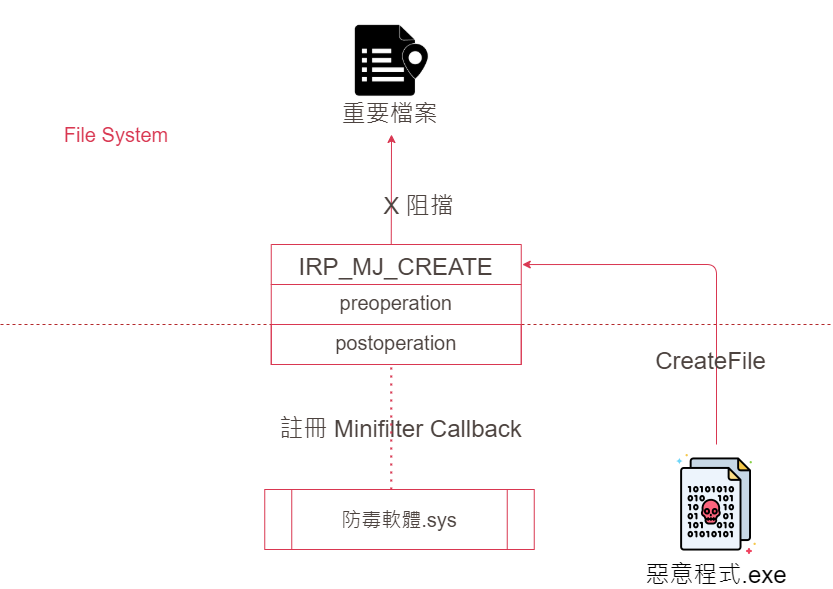
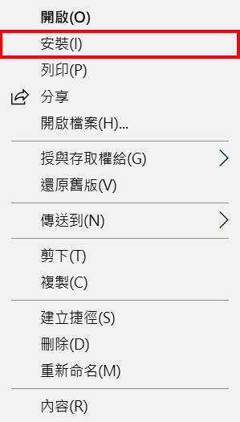

# 【第 27 話】Minifilter 保護檔案

## 文章大綱
這篇要介紹有別於 WDM 驅動程式的架構 Minifilter，說明它的原理以及要如何使用 Minifilter，實作一個非常簡單的保護檔案功能，從 Kernel 保護檔案不被開啟。


## Minifilter
Minifilter 是一個讓驅動程式過濾檔案系統的機制，在 Windows Vista 之後開始支援。它可以讓開發者在檔案系統層對檔案和 I/O 操作進行監視、過濾、修改。這類型的驅動程式通常用於防毒軟體、效能優化和資料保護等功能。

使用的概念其實跟[【第 26 話】Kernel Callback 隱藏 Registry](/asset/第%2026%20話) 提到的 Kernel Callback 有點像，在 Minifilter 可以為不同的 IRP 註冊 Callback，然後也有 Preoperation 和 Postoperation 在事件發生的前後做處理。
```
IRP_MJ_CREATE
IRP_MJ_CREATE_NAMED_PIPE
IRP_MJ_CLOSE
...
IRP_MJ_VOLUME_MOUNT
IRP_MJ_VOLUME_DISMOUNT
```

## 保護檔案
防毒軟體可以利用 Minifilter 保護檔案，例如有個惡意程式想開啟某個系統中的重要檔案，防毒軟體的 Minifilter 就可以透過註冊的 `IRP_MJ_CREATE` Callback 攔截這個操作。




## .inf 檔案
.inf 檔案是放 Driver 的註冊資訊。Visual Studio 預設建立 Minifilter 專案會有範例 .inf 檔，有標 TODO 的都可以根據自己需求改，例如其中的 Class、ClassGuid、LoadOrderGroup、anufacturer、Instance1.Altitude。不過在 Minifilter 的 .inf 中必須要改的只有 Instance1.Altitude，跟 Callback 的執行順序有關。

在 Windows 中可以對 .inf 檔按右鍵點選安裝，將驅動程式的相關資訊告訴系統。




## 寫程式
程式主要參考 [JKornev/hidden](https://github.com/JKornev/hidden)，我簡化與改寫它的實作並加了一些註解，完整的專案也放在我的 GitHub [zeze-zeze/2023iThome](https://github.com/zeze-zeze/2023iThome/tree/master/ProtectFile)。

首先用 [FltRegisterFilter](https://learn.microsoft.com/en-us/windows-hardware/drivers/ddi/fltkernel/nf-fltkernel-fltregisterfilter) 註冊一個 Minifilter 驅動程式，然後用 [FltStartFiltering](https://learn.microsoft.com/en-us/windows-hardware/drivers/ddi/fltkernel/nf-fltkernel-fltstartfiltering) 啟用功能。

```c
extern NTSTATUS DriverEntry(_In_ PDRIVER_OBJECT DriverObject, _In_ PUNICODE_STRING RegistryPath)
{
    NTSTATUS status;
    UNREFERENCED_PARAMETER(RegistryPath);
    
    // 用 FltRegisterFilter 註冊一個 Minifilter 驅動程式
    status = FltRegisterFilter(DriverObject, &FilterRegistration, &gFilterHandle);
    FLT_ASSERT(NT_SUCCESS(status));
    if (NT_SUCCESS(status))
    {
        // 用 FltStartFiltering 啟用功能
        status = FltStartFiltering(gFilterHandle);

        if (!NT_SUCCESS(status))
        {
            FltUnregisterFilter(gFilterHandle);
        }
    }
    return status;
}
```

在 `IRP_MJ_CREATE` 的 Preoperation 中，當有檔案開啟時，先檢查開啟的 Handle 是不是檔案類型，然後從 Callback 提供的 `PFLT_CALLBACK_DATA` 取得檔案路徑，最後比對檔案路徑中有沒有 ithome，有的話就回傳 Access Denied。

```c
FLT_PREOP_CALLBACK_STATUS ProtectFilePreOperation(_Inout_ PFLT_CALLBACK_DATA Data, _In_ PCFLT_RELATED_OBJECTS FltObjects,
                                                  _Flt_CompletionContext_Outptr_ PVOID *CompletionContext)
{
    UNREFERENCED_PARAMETER(FltObjects);
    UNREFERENCED_PARAMETER(CompletionContext);

    // 檢查開啟 Handle 的類型是不是檔案
    if (!(FILE_DIRECTORY_FILE & (Data->Iopb->Parameters.Create.Options & 0x00FFFFFF)))
    {
        // 從 Callback 提供的 Data 取得檔案路徑
        WCHAR buffer[0x101] = {0};
        USHORT length =
            Data->Iopb->TargetFileObject->FileName.Length > 0x100 ? 0x100 : Data->Iopb->TargetFileObject->FileName.Length;
        wcsncpy(buffer, Data->Iopb->TargetFileObject->FileName.Buffer, length);
        
        // 比對檔案路徑中有沒有 ithome，有的話就 Access Denied
        if (wcsstr(buffer, L"ithome"))
        {
            Data->IoStatus.Status = STATUS_ACCESS_DENIED;
            return FLT_PREOP_COMPLETE;
        }
    }
    return FLT_PREOP_SUCCESS_NO_CALLBACK;
}
```


## 測試
開啟 VM，記得要在本機開啟 vmmon64.exe，並在 boot options 按 F8 選擇 `Disable Driver Signature Enforcement`。

1. 建立一個檔案名稱包含 `ithome` 字串的檔案
2. 安裝 [ProtectFile.inf](https://github.com/zeze-zeze/2023iThome/blob/master/ProtectFile/bin/ProtectFile.inf)
3. 載入 [ProtectFile.sys](https://github.com/zeze-zeze/2023iThome/blob/master/ProtectFile/bin/ProtectFile.sys)
4. 這時嘗試開啟檔案，會發現檔案無法被開啟


## 參考資料
- [JKornev/hidden](https://github.com/JKornev/hidden)
- [Windows File System Minifilter Driver Development Tutorial](https://www.apriorit.com/dev-blog/675-driver-windows-minifilter-driver-development-tutorial)
- [microsoft/Windows-driver-samples - filesys/miniFilter](https://github.com/microsoft/Windows-driver-samples/tree/main/filesys/miniFilter)
- [How to Develop a Windows File System Minifilter Driver: Complete Tutorial](https://www.apriorit.com/dev-blog/675-driver-windows-minifilter-driver-development-tutorial)