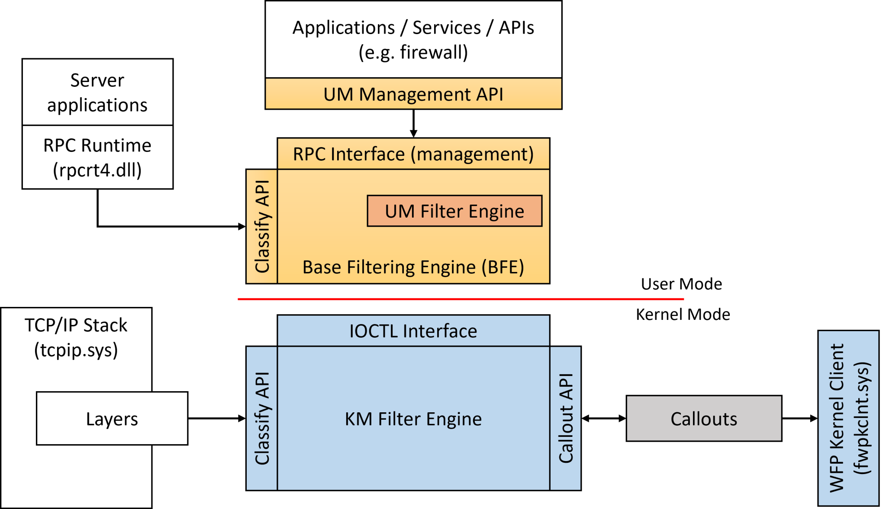
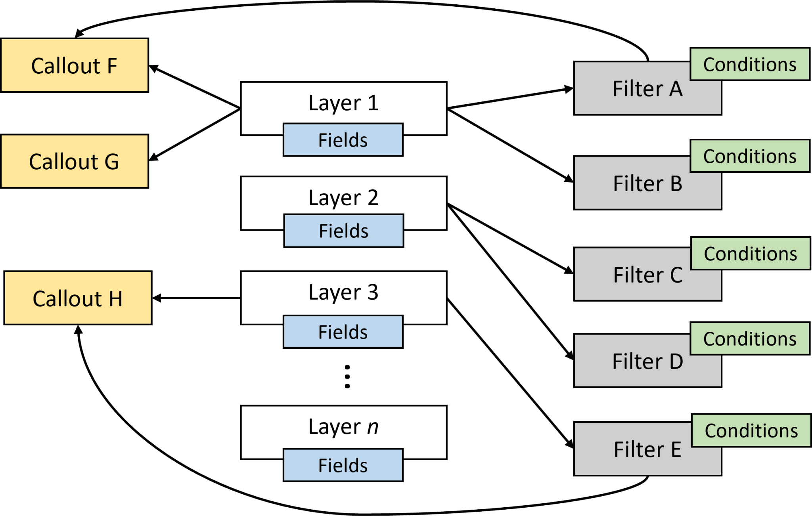
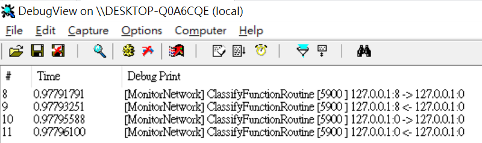

# 【第 29 話】WFP 監控流量

## 文章大綱
這篇要介紹用來監控、過濾、修改網路封包的 WFP，說明它的原理以及要如何使用 WFP 實作監控 ipv4 網路行為的功能，從 Kernel 印出 ipv4 傳入與傳出的流量資訊。


## WFP
WFP（Windows Filtering Platform）在 Windows Vista 和 Windows Server 2008 開始支援。它是一種過濾網路封包的框架，使用者可以利用 WFP 監控、過濾、修改網路封包的傳輸。

除了寫驅動程式使用 WFP 外，應用層其實也有 Windows API 可以用，不過這篇會比較注重在 Kernel 層的應用。

在應用層，是透過實作在 bfe.dll 的 BFE（Base Filtering Engine）提供介面使用。一些服務如 Windows 防火牆就是利用應用層的 Management API 操作 WFP Object。

在 Kernel 層，使用者可以設定 Callout 在 Layers 如 ipv4、ipv6 等。同時設定 Filter，當滿足某個條件時就處理那個封包。TCP/IP 驅動程式則會對 WFP Filter Engine 發請求，決定啟用哪些 Filter。



WFP 也提供各種 Layer 讓驅動程式可以在封包被解析到某個階段時執行一些操作，比如說這篇後面要寫的程式就是在 `FWPM_LAYER_INBOUND_TRANSPORT_V4`、`FWPM_LAYER_OUTBOUND_TRANSPORT_V4` 這兩個 Layer 印出封包的資訊。其他的 Layer 可以參考 [Management filtering layer identifiers](https://learn.microsoft.com/en-us/windows-hardware/drivers/network/management-filtering-layer-identifiers)。

## 監控流量
防毒軟體、防火牆或是一些會需要監控網路流量的軟體會使用 WFP 實作功能，因為它們要在封包傳送前後作處理，可能是要確認流量是否惡意，也可能是需要為封包加工、記錄 Log 等等。

Callout 是 WFP 中的一個重要的概念，我們用它處理特定類型的封包或流量。使用者可以自己定義 Callout，然後註冊到 WFP 中來監控、過濾、修改封包。在 Callout 中設定 Filter 與一組條件，當這些條件與傳入或傳出的封包匹配時，會有 Callback 函數讓使用者可以處理這些封包。



## 寫程式
程式主要參考 [geun-yeong/wfp-example](https://github.com/geun-yeong/wfp-example)，我簡化與改寫它的實作並加了一些註解，完整的專案也放在我的 GitHub [zeze-zeze/2023iThome](https://github.com/zeze-zeze/2023iThome/tree/master/MonitorNetwork)。

首先開啟 Filter Engine，然後加入一個我們定義的 Provider。
```c
// 用 FwpmEngineOpen 開啟 Filter Engine
status = FwpmEngineOpen(NULL, RPC_C_AUTHN_DEFAULT, NULL, NULL, &kmfe_handle);

// 加入一個 Provider
status = FwpmTransactionBegin(kmfe_handle, 0);
wfpkm_provider.serviceName = (wchar_t*)L"MonitorNetwork";
wfpkm_provider.displayData.name = (wchar_t*)L"MonitorNetworkProvider";
wfpkm_provider.displayData.description = (wchar_t*)L"The provider object for MonitorNetwork";
wfpkm_provider.providerKey = WFPKM_PROVIDER_KEY;

status = FwpmProviderAdd(kmfe_handle, &wfpkm_provider, NULL);
```

再來是建立和註冊一個 Callout Object 並設定 Callback 函數，然後將 Callout Object、Filter Object 加至系統。在這個步驟我們會指定當收到 ipv4 封包時才會進到 Callback 函數。
```c
// 建立和註冊一個 Callout Object 並設定 Callback 函數
NTSTATUS status = FwpmTransactionBegin(kmfe_handle, 0);
fwps_callout.classifyFn = ClassifyFunctionRoutine;
fwps_callout.notifyFn = NotifyFunctionRoutine;
fwps_callout.flowDeleteFn = FlowDeleteFunctionRoutine;
do
{
    status = ExUuidCreate(&fwps_callout.calloutKey);
} while (status == STATUS_RETRY);

status = FwpsCalloutRegister(wfpkm_device, &fwps_callout, &fwps_callout_id);

// 將 Callout Object 加至系統
fwpm_callout.calloutKey = fwps_callout.calloutKey;
fwpm_callout.displayData.name = (wchar_t*)L"MonitorNetworkCallout";
fwpm_callout.displayData.description = (wchar_t*)L"The callout object for MonitorNetwork";
fwpm_callout.providerKey = (GUID*)&WFPKM_PROVIDER_KEY;
fwpm_callout.applicableLayer = *layer_key;
status = FwpmCalloutAdd(kmfe_handle, &fwpm_callout, NULL, &fwpm_callout_id);

// 將 Filter Object 加至系統
fwpm_filter.displayData.name = (wchar_t*)L"MonitorNetworkFilter";
fwpm_filter.displayData.description = (wchar_t*)L"The filter object for MonitorNetwork";
fwpm_filter.layerKey = *layer_key;
fwpm_filter.action.type = FWP_ACTION_CALLOUT_UNKNOWN;
fwpm_filter.action.calloutKey = fwps_callout.calloutKey;

status = FwpmFilterAdd(kmfe_handle, &fwpm_filter, NULL, &fwpm_filter_id);
```

最後是在收到匹配的封包時要做的處理，實作在 `Callout.classifyFn` 中，取得傳入與傳出的 IP、Port，並用 `DbgPrint` 印出來，達到類似監控的效果。

```c
VOID NTAPI ClassifyFunctionRoutine(_In_ const FWPS_INCOMING_VALUES0* fixed_values,
                                   _In_ const FWPS_INCOMING_METADATA_VALUES0* meta_values, _Inout_opt_ VOID* layer_data,
                                   _In_opt_ const VOID* classify_context, _In_ const FWPS_FILTER3* filter,
                                   _In_ UINT64 flow_context, _Inout_ FWPS_CLASSIFY_OUT0* classify_out)
{
    UINT32 pid = (meta_values->processId == 0) ? PtrToUint(PsGetCurrentProcessId()) : (UINT32)meta_values->processId;
    CHAR _local_ipstr[64], *local_ipstr = NULL, _remote_ipstr[64], *remote_ipstr = NULL;
    UINT16 local_port = 0, remote_port = 0;
    PCSTR direction = NULL;

    switch (fixed_values->layerId)
    {
        case FWPS_LAYER_INBOUND_TRANSPORT_V4:
            // 取得傳入 ipv4 的 IP 跟 Port
            local_ipstr = ConvertIpv4ToString(
                fixed_values->incomingValue[FWPS_FIELD_INBOUND_TRANSPORT_V4_IP_LOCAL_ADDRESS].value.uint32, _local_ipstr,
                64);
            remote_ipstr = ConvertIpv4ToString(
                fixed_values->incomingValue[FWPS_FIELD_INBOUND_TRANSPORT_V4_IP_REMOTE_ADDRESS].value.uint32, _remote_ipstr,
                64);
            local_port = fixed_values->incomingValue[FWPS_FIELD_INBOUND_TRANSPORT_V4_IP_LOCAL_PORT].value.uint16;
            remote_port = fixed_values->incomingValue[FWPS_FIELD_INBOUND_TRANSPORT_V4_IP_REMOTE_PORT].value.uint16;
            direction = "<-";
            break;
        case FWPS_LAYER_OUTBOUND_TRANSPORT_V4:
            // 取得傳出 ipv4 的 IP 跟 Port
            local_ipstr = ConvertIpv4ToString(
                fixed_values->incomingValue[FWPS_FIELD_OUTBOUND_TRANSPORT_V4_IP_LOCAL_ADDRESS].value.uint32, _local_ipstr,
                64);
            remote_ipstr = ConvertIpv4ToString(
                fixed_values->incomingValue[FWPS_FIELD_OUTBOUND_TRANSPORT_V4_IP_REMOTE_ADDRESS].value.uint32, _remote_ipstr,
                64);
            local_port = fixed_values->incomingValue[FWPS_FIELD_OUTBOUND_TRANSPORT_V4_IP_LOCAL_PORT].value.uint16;
            remote_port = fixed_values->incomingValue[FWPS_FIELD_OUTBOUND_TRANSPORT_V4_IP_REMOTE_PORT].value.uint16;
            direction = "->";
            break;
    }

    // 將封包的 IP、Port 印出來
    DbgPrint("[MonitorNetwork] " __FUNCTION__ " [%-5u] %s:%u %s %s:%u\n", pid, local_ipstr, local_port, direction,
             remote_ipstr, remote_port);
}
```


## 測試
開啟 VM，記得要在本機開啟 vmmon64.exe，並在 boot options 按 F8 選擇 `Disable Driver Signature Enforcement`。

1. 開啟 DbgView.exe，建議過濾 `MonitorNetwork` 讓印出的東西簡潔一些
2. 載入 [MonitorNetwork.sys](https://github.com/zeze-zeze/2023iThome/blob/master/MonitorNetwork/bin/MonitorNetwork.sys)
3. 嘗試做一些網路行為如 `ping 127.0.0.1` 然後觀察 DbgView.exe 的記錄，會發現傳入與傳出的 IP、Port




## 參考資料
- [henrypp/simplewall](https://github.com/henrypp/simplewall)
- [microsoft/Windows-driver-samples - network/trans/WFPSampler](https://github.com/microsoft/Windows-driver-samples/tree/main/network/trans/WFPSampler)
- [geun-yeong/wfp-example](https://github.com/geun-yeong/wfp-example)
- [WFP practical guide](https://www.komodia.com/wfp-practical-guide)
- [Using Windows Filtering Platform](https://github.com/MicrosoftDocs/win32/blob/docs/desktop-src/FWP/using-windows-filtering-platform.md)
- [Introduction to the Windows Filtering Platform](https://scorpiosoftware.net/2022/12/25/introduction-to-the-windows-filtering-platform/)